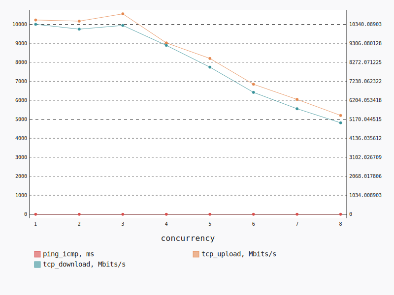
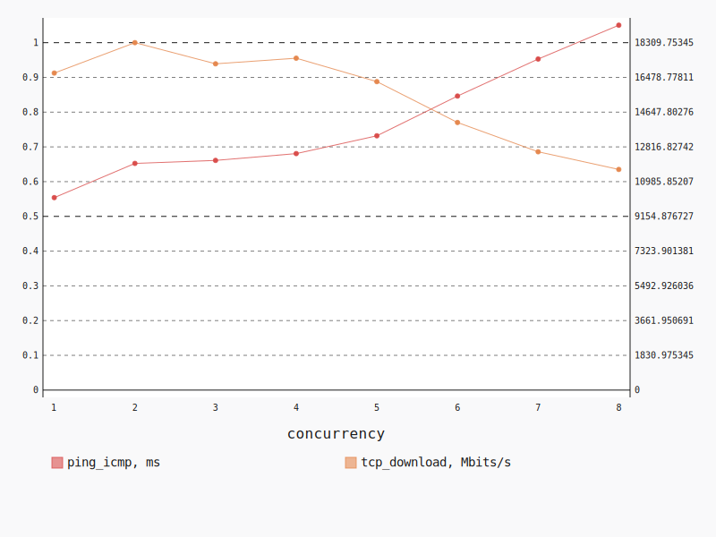
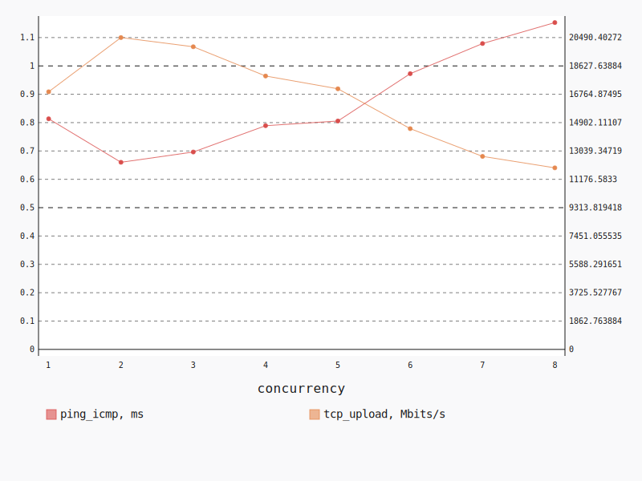

.. _openstack_l2_dense:

OpenStack L2 Dense
******************

In this scenario Shaker launches several pairs of instances on a single compute
node. Instances are plugged into the same tenant network. The traffic goes
within the tenant network (L2 domain).

**Scenario**:

.. code-block:: yaml

    deployment:
      accommodation:
      - pair
      - double_room
      - density: 8
      - compute_nodes: 1
      template: l2.hot
    description: In this scenario Shaker launches several pairs of instances on a single
      compute node. Instances are plugged into the same tenant network. The traffic goes
      within the tenant network (L2 domain).
    execution:
      progression: linear
      tests:
      - class: flent
        method: tcp_download
        title: Download
      - class: flent
        method: tcp_upload
        title: Upload
      - class: flent
        method: tcp_bidirectional
        title: Bi-directional
    file_name: /root/shaker/lib/python2.7/site-packages/shaker/scenarios/openstack/dense_l2.yaml
    title: OpenStack L2 Dense

Bi-directional
==============

**Test Specification**:

.. code-block:: yaml

    class: flent
    method: tcp_bidirectional
    title: Bi-directional

**Stats**:

===========  =============  =====================  ===================
concurrency  ping_icmp, ms  tcp_download, Mbits/s  tcp_upload, Mbits/s
===========  =============  =====================  ===================
          1           1.07               10340.09             10228.56
          2           1.13               10077.45             10167.84
          3           1.11               10280.54             10552.42
          4           1.35                9194.41              9022.38
          5           1.53                8009.15              8204.26
          6           1.82                6637.18              6844.58
          7           1.98                5745.03              6047.26
          8           2.29                4979.29              5203.84
===========  =============  =====================  ===================

Concurrency 1
-------------

**Stats**:

========  =============  =====================  ===================
node      ping_icmp, ms  tcp_download, Mbits/s  tcp_upload, Mbits/s
========  =============  =====================  ===================
cmp-001            1.07               10340.09             10228.56
========  =============  =====================  ===================

Concurrency 2
-------------

**Stats**:

========  =============  =====================  ===================
node      ping_icmp, ms  tcp_download, Mbits/s  tcp_upload, Mbits/s
========  =============  =====================  ===================
cmp-001            1.06               10720.93             10467.61
cmp-001            1.21                9433.98              9868.07
========  =============  =====================  ===================

Concurrency 3
-------------

**Stats**:

========  =============  =====================  ===================
node      ping_icmp, ms  tcp_download, Mbits/s  tcp_upload, Mbits/s
========  =============  =====================  ===================
cmp-001            1.42                8188.71              8595.16
cmp-001            0.92               11335.38             11439.74
cmp-001            1.00               11317.53             11622.35
========  =============  =====================  ===================

Concurrency 4
-------------

**Stats**:

========  =============  =====================  ===================
node      ping_icmp, ms  tcp_download, Mbits/s  tcp_upload, Mbits/s
========  =============  =====================  ===================
cmp-001            1.71                7620.66              7847.84
cmp-001            1.05               10587.26             10688.51
cmp-001            1.23               10071.32              9475.41
cmp-001            1.43                8498.40              8077.75
========  =============  =====================  ===================

Concurrency 5
-------------

**Stats**:

========  =============  =====================  ===================
node      ping_icmp, ms  tcp_download, Mbits/s  tcp_upload, Mbits/s
========  =============  =====================  ===================
cmp-001            1.41                8648.05              9056.57
cmp-001            1.28                8342.26              7949.76
cmp-001            2.03                6145.90              6458.44
cmp-001            1.37                8728.84              8613.91
cmp-001            1.55                8180.70              8942.60
========  =============  =====================  ===================

Concurrency 6
-------------

**Stats**:

========  =============  =====================  ===================
node      ping_icmp, ms  tcp_download, Mbits/s  tcp_upload, Mbits/s
========  =============  =====================  ===================
cmp-001            2.09                5501.92              5840.38
cmp-001            1.89                6193.54              6391.90
cmp-001            1.70                7653.13              7409.51
cmp-001            1.71                6498.89              7219.10
cmp-001            1.80                6663.84              6931.97
cmp-001            1.73                7311.79              7274.61
========  =============  =====================  ===================

Concurrency 7
-------------

**Stats**:

========  =============  =====================  ===================
node      ping_icmp, ms  tcp_download, Mbits/s  tcp_upload, Mbits/s
========  =============  =====================  ===================
cmp-001            1.91                5885.13              6674.54
cmp-001            1.87                5947.06              6246.95
cmp-001            2.33                4843.59              5095.51
cmp-001            2.03                5801.34              5892.01
cmp-001            1.96                5906.66              5877.83
cmp-001            1.87                6122.11              6299.89
cmp-001            1.86                5709.33              6244.12
========  =============  =====================  ===================

Concurrency 8
-------------

**Stats**:

========  =============  =====================  ===================
node      ping_icmp, ms  tcp_download, Mbits/s  tcp_upload, Mbits/s
========  =============  =====================  ===================
cmp-001            2.77                4360.61              4511.64
cmp-001            1.93                5467.24              5315.41
cmp-001            1.99                5353.48              5772.05
cmp-001            2.39                4807.00              5352.73
cmp-001            2.56                4265.04              4595.58
cmp-001            2.34                4854.85              5257.23
cmp-001            2.16                5252.41              5278.70
cmp-001            2.19                5473.68              5547.36
========  =============  =====================  ===================

Download
========

**Test Specification**:

.. code-block:: yaml

    class: flent
    method: tcp_download
    title: Download

**Stats**:

===========  =============  =====================
concurrency  ping_icmp, ms  tcp_download, Mbits/s
===========  =============  =====================
          1           0.55               16708.52
          2           0.65               18309.75
          3           0.66               17195.69
          4           0.68               17491.38
          5           0.73               16256.92
          6           0.85               14103.16
          7           0.95               12559.14
          8           1.05               11627.98
===========  =============  =====================

Concurrency 1
-------------

**Stats**:

========  =============  =====================
node      ping_icmp, ms  tcp_download, Mbits/s
========  =============  =====================
cmp-001            0.55               16708.52
========  =============  =====================

Concurrency 2
-------------

**Stats**:

========  =============  =====================
node      ping_icmp, ms  tcp_download, Mbits/s
========  =============  =====================
cmp-001            0.67               17774.08
cmp-001            0.63               18845.42
========  =============  =====================

Concurrency 3
-------------

**Stats**:

========  =============  =====================
node      ping_icmp, ms  tcp_download, Mbits/s
========  =============  =====================
cmp-001            0.65               16226.25
cmp-001            0.72               15620.82
cmp-001            0.61               19740.00
========  =============  =====================

Concurrency 4
-------------

**Stats**:

========  =============  =====================
node      ping_icmp, ms  tcp_download, Mbits/s
========  =============  =====================
cmp-001            0.58               19602.72
cmp-001            0.84               14894.94
cmp-001            0.74               15466.72
cmp-001            0.57               20001.14
========  =============  =====================

Concurrency 5
-------------

**Stats**:

========  =============  =====================
node      ping_icmp, ms  tcp_download, Mbits/s
========  =============  =====================
cmp-001            0.72               13927.78
cmp-001            0.76               15701.78
cmp-001            0.59               19931.93
cmp-001            0.79               16634.84
cmp-001            0.80               15088.26
========  =============  =====================

Concurrency 6
-------------

**Stats**:

========  =============  =====================
node      ping_icmp, ms  tcp_download, Mbits/s
========  =============  =====================
cmp-001            1.06               13101.37
cmp-001            0.83               14384.21
cmp-001            0.92               13017.72
cmp-001            0.74               15531.82
cmp-001            0.69               14926.01
cmp-001            0.85               13657.81
========  =============  =====================

Concurrency 7
-------------

**Stats**:

========  =============  =====================
node      ping_icmp, ms  tcp_download, Mbits/s
========  =============  =====================
cmp-001            1.03               11769.61
cmp-001            1.05               11775.57
cmp-001            0.93               12921.85
cmp-001            0.78               13531.90
cmp-001            0.93               13220.29
cmp-001            0.93               12982.13
cmp-001            1.02               11712.63
========  =============  =====================

Concurrency 8
-------------

**Stats**:

========  =============  =====================
node      ping_icmp, ms  tcp_download, Mbits/s
========  =============  =====================
cmp-001            0.90               12288.63
cmp-001            1.10               11428.95
cmp-001            1.17               11209.33
cmp-001            0.94               11990.66
cmp-001            1.22               10984.05
cmp-001            0.93               12653.80
cmp-001            1.13               11286.09
cmp-001            1.00               11182.27
========  =============  =====================

Upload
======

**Test Specification**:

.. code-block:: yaml

    class: flent
    method: tcp_upload
    title: Upload

**Stats**:

===========  =============  ===================
concurrency  ping_icmp, ms  tcp_upload, Mbits/s
===========  =============  ===================
          1           0.81             16927.76
          2           0.66             20490.40
          3           0.70             19886.77
          4           0.79             17964.29
          5           0.81             17124.23
          6           0.97             14505.22
          7           1.08             12682.99
          8           1.15             11930.12
===========  =============  ===================

Concurrency 1
-------------

**Stats**:

========  =============  ===================
node      ping_icmp, ms  tcp_upload, Mbits/s
========  =============  ===================
cmp-001            0.81             16927.76
========  =============  ===================

Concurrency 2
-------------

**Stats**:

========  =============  ===================
node      ping_icmp, ms  tcp_upload, Mbits/s
========  =============  ===================
cmp-001            0.68             20505.88
cmp-001            0.64             20474.92
========  =============  ===================

Concurrency 3
-------------

**Stats**:

========  =============  ===================
node      ping_icmp, ms  tcp_upload, Mbits/s
========  =============  ===================
cmp-001            0.85             15933.06
cmp-001            0.60             22036.32
cmp-001            0.64             21690.94
========  =============  ===================

Concurrency 4
-------------

**Stats**:

========  =============  ===================
node      ping_icmp, ms  tcp_upload, Mbits/s
========  =============  ===================
cmp-001            0.70             20236.71
cmp-001            0.66             20590.02
cmp-001            0.91             15545.03
cmp-001            0.90             15485.41
========  =============  ===================

Concurrency 5
-------------

**Stats**:

========  =============  ===================
node      ping_icmp, ms  tcp_upload, Mbits/s
========  =============  ===================
cmp-001            0.72             19117.27
cmp-001            0.88             15109.76
cmp-001            0.75             18808.45
cmp-001            0.90             15004.08
cmp-001            0.78             17581.58
========  =============  ===================

Concurrency 6
-------------

**Stats**:

========  =============  ===================
node      ping_icmp, ms  tcp_upload, Mbits/s
========  =============  ===================
cmp-001            0.99             13692.67
cmp-001            1.10             12484.54
cmp-001            0.82             17128.68
cmp-001            1.06             12849.66
cmp-001            0.80             17411.00
cmp-001            1.06             13464.76
========  =============  ===================

Concurrency 7
-------------

**Stats**:

========  =============  ===================
node      ping_icmp, ms  tcp_upload, Mbits/s
========  =============  ===================
cmp-001            1.02             13550.31
cmp-001            1.10             12356.62
cmp-001            1.15             11849.04
cmp-001            1.06             12815.86
cmp-001            0.99             13795.18
cmp-001            1.08             12682.71
cmp-001            1.16             11731.21
========  =============  ===================

Concurrency 8
-------------

**Stats**:

========  =============  ===================
node      ping_icmp, ms  tcp_upload, Mbits/s
========  =============  ===================
cmp-001            1.19             11848.72
cmp-001            1.12             12179.80
cmp-001            1.16             11914.10
cmp-001            1.15             12313.84
cmp-001            1.05             12462.45
cmp-001            1.33             10890.24
cmp-001            1.19             11320.38
cmp-001            1.05             12511.41
========  =============  ===================

