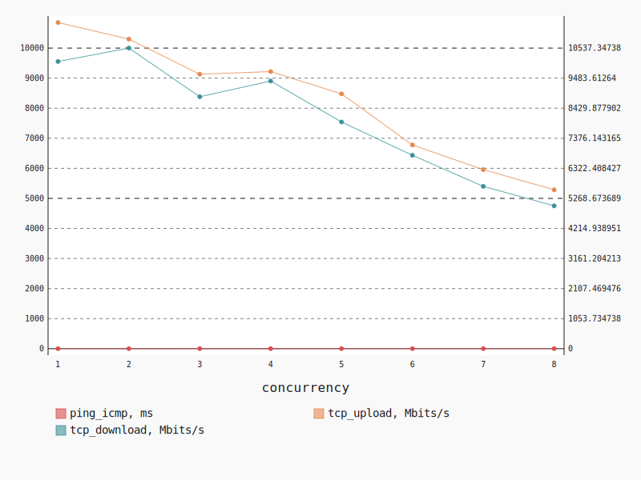
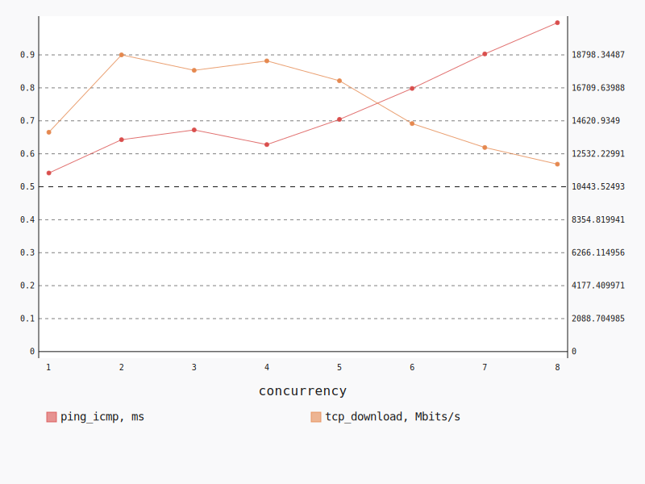
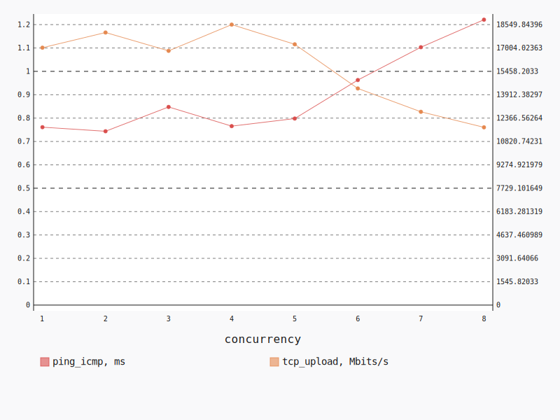

.. _openstack_l2_dense:

OpenStack L2 Dense
******************

In this scenario Shaker launches several pairs of instances on a single compute
node. Instances are plugged into the same tenant network. The traffic goes
within the tenant network (L2 domain).

**Scenario**:

.. code-block:: yaml

    deployment:
      accommodation:
      - pair
      - double_room
      - density: 8
      - compute_nodes: 1
      template: l2.hot
    description: In this scenario Shaker launches several pairs of instances on a single
      compute node. Instances are plugged into the same tenant network. The traffic goes
      within the tenant network (L2 domain).
    execution:
      progression: linear
      tests:
      - class: flent
        method: tcp_download
        title: Download
      - class: flent
        method: tcp_upload
        title: Upload
      - class: flent
        method: tcp_bidirectional
        title: Bi-directional
    file_name: /root/shaker/lib/python2.7/site-packages/shaker/scenarios/openstack/dense_l2.yaml
    title: OpenStack L2 Dense

Bi-directional
==============

**Test Specification**:

.. code-block:: yaml

    class: flent
    method: tcp_bidirectional
    title: Bi-directional

**Stats**:

===========  =============  =====================  ===================
concurrency  ping_icmp, ms  tcp_download, Mbits/s  tcp_upload, Mbits/s
===========  =============  =====================  ===================
          1           1.06               10067.24             10850.35
          2           1.11               10537.35             10297.97
          3           1.35                8831.46              9130.98
          4           1.24                9383.18              9218.85
          5           1.50                7946.82              8476.50
          6           1.89                6778.56              6776.15
          7           2.05                5690.78              5957.07
          8           2.30                5006.49              5284.77
===========  =============  =====================  ===================

Concurrency 1
-------------

**Stats**:

========  =============  =====================  ===================
node      ping_icmp, ms  tcp_download, Mbits/s  tcp_upload, Mbits/s
========  =============  =====================  ===================
cmp-006            1.06               10067.24             10850.35
========  =============  =====================  ===================

Concurrency 2
-------------

**Stats**:

========  =============  =====================  ===================
node      ping_icmp, ms  tcp_download, Mbits/s  tcp_upload, Mbits/s
========  =============  =====================  ===================
cmp-006            0.97               11597.24             10918.55
cmp-006            1.25                9477.45              9677.39
========  =============  =====================  ===================

Concurrency 3
-------------

**Stats**:

========  =============  =====================  ===================
node      ping_icmp, ms  tcp_download, Mbits/s  tcp_upload, Mbits/s
========  =============  =====================  ===================
cmp-006            1.26                8911.18              8954.27
cmp-006            1.49                9009.09              9200.59
cmp-006            1.30                8574.11              9238.08
========  =============  =====================  ===================

Concurrency 4
-------------

**Stats**:

========  =============  =====================  ===================
node      ping_icmp, ms  tcp_download, Mbits/s  tcp_upload, Mbits/s
========  =============  =====================  ===================
cmp-006            1.48                7809.84              7889.82
cmp-006            0.97               11512.51             11138.64
cmp-006            1.19                9404.89              9093.90
cmp-006            1.33                8805.51              8753.02
========  =============  =====================  ===================

Concurrency 5
-------------

**Stats**:

========  =============  =====================  ===================
node      ping_icmp, ms  tcp_download, Mbits/s  tcp_upload, Mbits/s
========  =============  =====================  ===================
cmp-006            1.21                8637.39              9240.26
cmp-006            1.41                8501.34              8936.36
cmp-006            1.58                7894.59              8727.54
cmp-006            1.38                8592.48              8952.48
cmp-006            1.92                6108.31              6525.85
========  =============  =====================  ===================

Concurrency 6
-------------

**Stats**:

========  =============  =====================  ===================
node      ping_icmp, ms  tcp_download, Mbits/s  tcp_upload, Mbits/s
========  =============  =====================  ===================
cmp-006            2.02                6196.81              6429.66
cmp-006            2.16                5695.74              5950.16
cmp-006            1.94                6257.44              6334.29
cmp-006            1.66                8105.84              7446.18
cmp-006            1.98                6223.60              6904.29
cmp-006            1.59                8191.92              7592.29
========  =============  =====================  ===================

Concurrency 7
-------------

**Stats**:

========  =============  =====================  ===================
node      ping_icmp, ms  tcp_download, Mbits/s  tcp_upload, Mbits/s
========  =============  =====================  ===================
cmp-006            1.86                5784.19              5952.31
cmp-006            2.29                4746.19              5099.31
cmp-006            1.94                6208.26              6093.52
cmp-006            1.96                5767.57              5913.97
cmp-006            2.16                5796.42              5954.74
cmp-006            2.01                5879.34              6611.57
cmp-006            2.15                5653.48              6074.04
========  =============  =====================  ===================

Concurrency 8
-------------

**Stats**:

========  =============  =====================  ===================
node      ping_icmp, ms  tcp_download, Mbits/s  tcp_upload, Mbits/s
========  =============  =====================  ===================
cmp-006            2.29                5297.39              5536.96
cmp-006            2.22                5275.46              5400.36
cmp-006            2.00                5117.36              5541.51
cmp-006            2.64                4416.94              4676.66
cmp-006            2.08                5197.57              5485.77
cmp-006            2.15                5111.97              5582.67
cmp-006            2.85                4397.31              4552.61
cmp-006            2.20                5237.95              5501.63
========  =============  =====================  ===================

Download
========

**Test Specification**:

.. code-block:: yaml

    class: flent
    method: tcp_download
    title: Download

**Stats**:

===========  =============  =====================
concurrency  ping_icmp, ms  tcp_download, Mbits/s
===========  =============  =====================
          1           0.54               13896.79
          2           0.64               18798.34
          3           0.67               17820.37
          4           0.63               18417.69
          5           0.70               17158.42
          6           0.80               14445.22
          7           0.90               12930.55
          8           1.00               11874.07
===========  =============  =====================

Concurrency 1
-------------

**Stats**:

========  =============  =====================
node      ping_icmp, ms  tcp_download, Mbits/s
========  =============  =====================
cmp-006            0.54               13896.79
========  =============  =====================

Concurrency 2
-------------

**Stats**:

========  =============  =====================
node      ping_icmp, ms  tcp_download, Mbits/s
========  =============  =====================
cmp-006            0.63               18537.11
cmp-006            0.65               19059.58
========  =============  =====================

Concurrency 3
-------------

**Stats**:

========  =============  =====================
node      ping_icmp, ms  tcp_download, Mbits/s
========  =============  =====================
cmp-006            0.58               20186.94
cmp-006            0.68               17966.45
cmp-006            0.76               15307.72
========  =============  =====================

Concurrency 4
-------------

**Stats**:

========  =============  =====================
node      ping_icmp, ms  tcp_download, Mbits/s
========  =============  =====================
cmp-006            0.62               18231.03
cmp-006            0.62               18631.96
cmp-006            0.61               18836.91
cmp-006            0.66               17970.85
========  =============  =====================

Concurrency 5
-------------

**Stats**:

========  =============  =====================
node      ping_icmp, ms  tcp_download, Mbits/s
========  =============  =====================
cmp-006            0.61               19688.97
cmp-006            0.69               16804.85
cmp-006            0.85               13325.40
cmp-006            0.64               19016.83
cmp-006            0.73               16956.05
========  =============  =====================

Concurrency 6
-------------

**Stats**:

========  =============  =====================
node      ping_icmp, ms  tcp_download, Mbits/s
========  =============  =====================
cmp-006            0.68               14777.07
cmp-006            0.72               15864.58
cmp-006            0.88               12888.70
cmp-006            0.84               14651.66
cmp-006            0.74               15712.09
cmp-006            0.93               12777.19
========  =============  =====================

Concurrency 7
-------------

**Stats**:

========  =============  =====================
node      ping_icmp, ms  tcp_download, Mbits/s
========  =============  =====================
cmp-006            1.06               12360.69
cmp-006            0.80               13199.43
cmp-006            0.87               12888.84
cmp-006            0.77               13633.11
cmp-006            1.09               11692.25
cmp-006            0.84               13907.15
cmp-006            0.89               12832.37
========  =============  =====================

Concurrency 8
-------------

**Stats**:

========  =============  =====================
node      ping_icmp, ms  tcp_download, Mbits/s
========  =============  =====================
cmp-006            0.90               12501.93
cmp-006            0.91               12069.45
cmp-006            1.22               11144.57
cmp-006            1.00               11940.28
cmp-006            0.95               11874.68
cmp-006            0.92               11691.67
cmp-006            1.00               12554.90
cmp-006            1.09               11215.08
========  =============  =====================

Upload
======

**Test Specification**:

.. code-block:: yaml

    class: flent
    method: tcp_upload
    title: Upload

**Stats**:

===========  =============  ===================
concurrency  ping_icmp, ms  tcp_upload, Mbits/s
===========  =============  ===================
          1           0.76             17022.61
          2           0.74             18026.94
          3           0.85             16814.69
          4           0.77             18549.84
          5           0.80             17247.04
          6           0.96             14326.73
          7           1.10             12783.14
          8           1.22             11755.44
===========  =============  ===================

Concurrency 1
-------------

**Stats**:

========  =============  ===================
node      ping_icmp, ms  tcp_upload, Mbits/s
========  =============  ===================
cmp-006            0.76             17022.61
========  =============  ===================

Concurrency 2
-------------

**Stats**:

========  =============  ===================
node      ping_icmp, ms  tcp_upload, Mbits/s
========  =============  ===================
cmp-006            0.79             16557.11
cmp-006            0.70             19496.77
========  =============  ===================

Concurrency 3
-------------

**Stats**:

========  =============  ===================
node      ping_icmp, ms  tcp_upload, Mbits/s
========  =============  ===================
cmp-006            0.88             17101.89
cmp-006            0.88             15359.02
cmp-006            0.78             17983.17
========  =============  ===================

Concurrency 4
-------------

**Stats**:

========  =============  ===================
node      ping_icmp, ms  tcp_upload, Mbits/s
========  =============  ===================
cmp-006            0.77             19017.60
cmp-006            0.63             21514.44
cmp-006            0.90             15072.14
cmp-006            0.77             18595.19
========  =============  ===================

Concurrency 5
-------------

**Stats**:

========  =============  ===================
node      ping_icmp, ms  tcp_upload, Mbits/s
========  =============  ===================
cmp-006            1.00             13095.36
cmp-006            0.76             17729.19
cmp-006            0.77             18496.23
cmp-006            0.73             18283.64
cmp-006            0.73             18630.75
========  =============  ===================

Concurrency 6
-------------

**Stats**:

========  =============  ===================
node      ping_icmp, ms  tcp_upload, Mbits/s
========  =============  ===================
cmp-006            1.03             13187.68
cmp-006            1.03             13434.07
cmp-006            0.87             15786.19
cmp-006            0.93             14028.02
cmp-006            0.91             15653.65
cmp-006            1.00             13870.76
========  =============  ===================

Concurrency 7
-------------

**Stats**:

========  =============  ===================
node      ping_icmp, ms  tcp_upload, Mbits/s
========  =============  ===================
cmp-006            0.99             13873.76
cmp-006            1.07             13586.17
cmp-006            1.08             12732.17
cmp-006            1.14             12759.95
cmp-006            1.15             11908.55
cmp-006            1.09             12742.92
cmp-006            1.20             11878.49
========  =============  ===================

Concurrency 8
-------------

**Stats**:

========  =============  ===================
node      ping_icmp, ms  tcp_upload, Mbits/s
========  =============  ===================
cmp-006            1.09             12232.69
cmp-006            1.41             10866.99
cmp-006            1.49             10685.60
cmp-006            1.15             12306.60
cmp-006            1.16             12161.95
cmp-006            1.16             12135.71
cmp-006            1.17             11714.68
cmp-006            1.15             11939.33
========  =============  ===================

