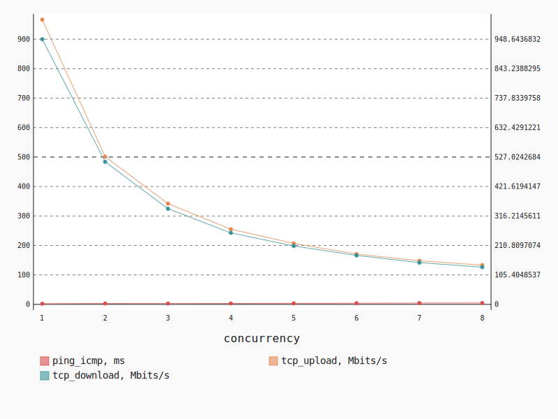
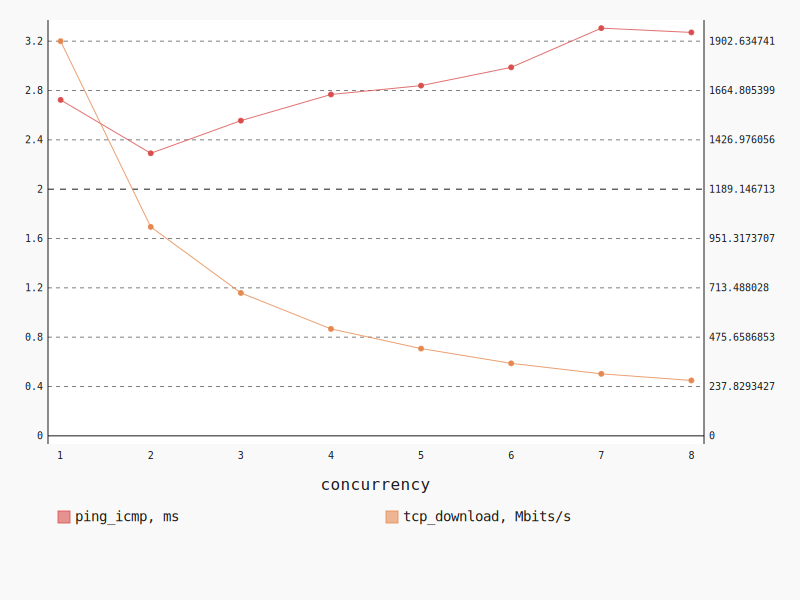
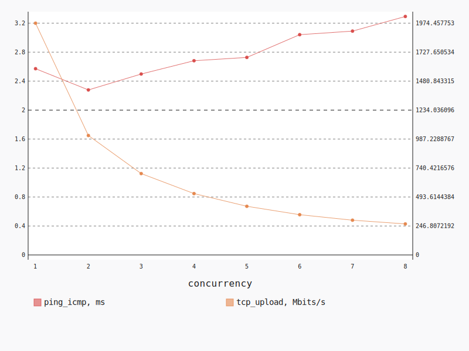

.. _openstack_l3_east_west_dense:

OpenStack L3 East-West Dense
****************************

In this scenario Shaker launches pairs of instances on the same compute node.
Instances are connected to different tenant networks connected to one router.
The traffic goes from one network to the other (L3 east-west).

**Scenario**:

.. code-block:: yaml

    deployment:
      accommodation:
      - pair
      - double_room
      - density: 8
      - compute_nodes: 1
      template: l3_east_west.hot
    description: In this scenario Shaker launches pairs of instances on the same compute
      node. Instances are connected to different tenant networks connected to one router.
      The traffic goes from one network to the other (L3 east-west).
    execution:
      progression: linear
      tests:
      - class: flent
        method: tcp_download
        title: Download
      - class: flent
        method: tcp_upload
        title: Upload
      - class: flent
        method: tcp_bidirectional
        title: Bi-directional
    file_name: /root/shaker/lib/python2.7/site-packages/shaker/scenarios/openstack/dense_l3_east_west.yaml
    title: OpenStack L3 East-West Dense

Bi-directional
==============

**Test Specification**:

.. code-block:: yaml

    class: flent
    method: tcp_bidirectional
    title: Bi-directional

**Stats**:

===========  =============  =====================  ===================
concurrency  ping_icmp, ms  tcp_download, Mbits/s  tcp_upload, Mbits/s
===========  =============  =====================  ===================
          1           2.34                 948.64               966.39
          2           3.04                 510.11               501.42
          3           2.84                 342.11               341.95
          4           3.15                 255.80               255.13
          5           3.52                 208.99               206.85
          6           3.86                 175.11               170.77
          7           4.49                 149.42               147.86
          8           4.78                 133.05               133.16
===========  =============  =====================  ===================

Concurrency 1
-------------

**Stats**:

========  =============  =====================  ===================
node      ping_icmp, ms  tcp_download, Mbits/s  tcp_upload, Mbits/s
========  =============  =====================  ===================
cmp-008            2.34                 948.64               966.39
========  =============  =====================  ===================

Concurrency 2
-------------

**Stats**:

========  =============  =====================  ===================
node      ping_icmp, ms  tcp_download, Mbits/s  tcp_upload, Mbits/s
========  =============  =====================  ===================
cmp-008            3.43                 514.75               495.00
cmp-008            2.64                 505.47               507.84
========  =============  =====================  ===================

Concurrency 3
-------------

**Stats**:

========  =============  =====================  ===================
node      ping_icmp, ms  tcp_download, Mbits/s  tcp_upload, Mbits/s
========  =============  =====================  ===================
cmp-008            2.90                 341.13               347.14
cmp-008            2.78                 341.82               338.56
cmp-008            2.84                 343.39               340.15
========  =============  =====================  ===================

Concurrency 4
-------------

**Stats**:

========  =============  =====================  ===================
node      ping_icmp, ms  tcp_download, Mbits/s  tcp_upload, Mbits/s
========  =============  =====================  ===================
cmp-008            3.07                 256.47               255.88
cmp-008            3.02                 260.10               267.66
cmp-008            3.44                 234.21               230.25
cmp-008            3.06                 272.41               266.73
========  =============  =====================  ===================

Concurrency 5
-------------

**Stats**:

========  =============  =====================  ===================
node      ping_icmp, ms  tcp_download, Mbits/s  tcp_upload, Mbits/s
========  =============  =====================  ===================
cmp-008            3.49                 207.04               201.99
cmp-008            3.44                 207.33               208.21
cmp-008            3.31                 216.99               211.18
cmp-008            3.77                 213.74               203.05
cmp-008            3.58                 199.84               209.80
========  =============  =====================  ===================

Concurrency 6
-------------

**Stats**:

========  =============  =====================  ===================
node      ping_icmp, ms  tcp_download, Mbits/s  tcp_upload, Mbits/s
========  =============  =====================  ===================
cmp-008            3.98                 169.70               167.69
cmp-008            3.73                 185.79               178.12
cmp-008            3.88                 174.95               167.30
cmp-008            3.82                 172.03               163.42
cmp-008            3.88                 176.22               175.01
cmp-008            3.86                 171.95               173.10
========  =============  =====================  ===================

Concurrency 7
-------------

**Stats**:

========  =============  =====================  ===================
node      ping_icmp, ms  tcp_download, Mbits/s  tcp_upload, Mbits/s
========  =============  =====================  ===================
cmp-008            4.38                 149.14               134.89
cmp-008            4.36                 149.54               153.76
cmp-008            4.41                 142.88               150.62
cmp-008            4.44                 161.42               147.98
cmp-008            4.59                 149.47               142.97
cmp-008            4.77                 145.27               156.49
cmp-008            4.49                 148.24               148.31
========  =============  =====================  ===================

Concurrency 8
-------------

**Stats**:

========  =============  =====================  ===================
node      ping_icmp, ms  tcp_download, Mbits/s  tcp_upload, Mbits/s
========  =============  =====================  ===================
cmp-008            4.74                 130.92               134.01
cmp-008            4.77                 124.76               127.58
cmp-008            4.82                 145.92               130.17
cmp-008            4.70                 129.09               130.84
cmp-008            4.65                 142.48               141.45
cmp-008            4.92                 129.16               138.17
cmp-008            4.91                 127.67               128.01
cmp-008            4.70                 134.37               135.07
========  =============  =====================  ===================

Download
========

**Test Specification**:

.. code-block:: yaml

    class: flent
    method: tcp_download
    title: Download

**Stats**:

===========  =============  =====================
concurrency  ping_icmp, ms  tcp_download, Mbits/s
===========  =============  =====================
          1           2.72                1902.63
          2           2.29                1007.35
          3           2.56                 688.92
          4           2.77                 515.50
          5           2.84                 420.67
          6           2.99                 349.48
          7           3.31                 298.98
          8           3.27                 266.98
===========  =============  =====================

Concurrency 1
-------------

**Stats**:

========  =============  =====================
node      ping_icmp, ms  tcp_download, Mbits/s
========  =============  =====================
cmp-008            2.72                1902.63
========  =============  =====================

Concurrency 2
-------------

**Stats**:

========  =============  =====================
node      ping_icmp, ms  tcp_download, Mbits/s
========  =============  =====================
cmp-008            2.38                1004.14
cmp-008            2.20                1010.57
========  =============  =====================

Concurrency 3
-------------

**Stats**:

========  =============  =====================
node      ping_icmp, ms  tcp_download, Mbits/s
========  =============  =====================
cmp-008            2.47                 692.33
cmp-008            2.56                 689.55
cmp-008            2.63                 684.88
========  =============  =====================

Concurrency 4
-------------

**Stats**:

========  =============  =====================
node      ping_icmp, ms  tcp_download, Mbits/s
========  =============  =====================
cmp-008            2.73                 511.58
cmp-008            2.69                 524.11
cmp-008            2.96                 526.21
cmp-008            2.69                 500.09
========  =============  =====================

Concurrency 5
-------------

**Stats**:

========  =============  =====================
node      ping_icmp, ms  tcp_download, Mbits/s
========  =============  =====================
cmp-008            2.82                 425.39
cmp-008            2.81                 418.70
cmp-008            2.94                 415.38
cmp-008            2.78                 408.41
cmp-008            2.84                 435.45
========  =============  =====================

Concurrency 6
-------------

**Stats**:

========  =============  =====================
node      ping_icmp, ms  tcp_download, Mbits/s
========  =============  =====================
cmp-008            3.06                 352.21
cmp-008            3.05                 351.87
cmp-008            2.88                 340.83
cmp-008            2.96                 347.05
cmp-008            3.03                 375.07
cmp-008            2.95                 329.82
========  =============  =====================

Concurrency 7
-------------

**Stats**:

========  =============  =====================
node      ping_icmp, ms  tcp_download, Mbits/s
========  =============  =====================
cmp-008            3.33                 296.71
cmp-008            3.24                 295.84
cmp-008            3.19                 312.81
cmp-008            3.36                 290.16
cmp-008            3.33                 291.42
cmp-008            3.37                 289.29
cmp-008            3.32                 316.60
========  =============  =====================

Concurrency 8
-------------

**Stats**:

========  =============  =====================
node      ping_icmp, ms  tcp_download, Mbits/s
========  =============  =====================
cmp-008            3.26                 256.36
cmp-008            3.27                 292.34
cmp-008            3.25                 270.81
cmp-008            3.21                 266.04
cmp-008            3.20                 272.19
cmp-008            3.30                 262.46
cmp-008            3.31                 256.64
cmp-008            3.37                 258.98
========  =============  =====================

Upload
======

**Test Specification**:

.. code-block:: yaml

    class: flent
    method: tcp_upload
    title: Upload

**Stats**:

===========  =============  ===================
concurrency  ping_icmp, ms  tcp_upload, Mbits/s
===========  =============  ===================
          1           2.57              1974.46
          2           2.28              1017.64
          3           2.50               693.40
          4           2.68               522.88
          5           2.73               414.64
          6           3.04               343.02
          7           3.09               296.20
          8           3.29               264.54
===========  =============  ===================

Concurrency 1
-------------

**Stats**:

========  =============  ===================
node      ping_icmp, ms  tcp_upload, Mbits/s
========  =============  ===================
cmp-008            2.57              1974.46
========  =============  ===================

Concurrency 2
-------------

**Stats**:

========  =============  ===================
node      ping_icmp, ms  tcp_upload, Mbits/s
========  =============  ===================
cmp-008            2.31              1003.74
cmp-008            2.25              1031.54
========  =============  ===================

Concurrency 3
-------------

**Stats**:

========  =============  ===================
node      ping_icmp, ms  tcp_upload, Mbits/s
========  =============  ===================
cmp-008            2.51               705.23
cmp-008            2.43               673.18
cmp-008            2.55               701.80
========  =============  ===================

Concurrency 4
-------------

**Stats**:

========  =============  ===================
node      ping_icmp, ms  tcp_upload, Mbits/s
========  =============  ===================
cmp-008            2.71               524.92
cmp-008            2.69               505.53
cmp-008            2.69               518.51
cmp-008            2.63               542.54
========  =============  ===================

Concurrency 5
-------------

**Stats**:

========  =============  ===================
node      ping_icmp, ms  tcp_upload, Mbits/s
========  =============  ===================
cmp-008            2.70               411.06
cmp-008            2.86               411.96
cmp-008            2.64               404.95
cmp-008            2.71               434.70
cmp-008            2.73               410.55
========  =============  ===================

Concurrency 6
-------------

**Stats**:

========  =============  ===================
node      ping_icmp, ms  tcp_upload, Mbits/s
========  =============  ===================
cmp-008            3.05               345.59
cmp-008            2.95               347.60
cmp-008            3.06               332.03
cmp-008            2.98               354.35
cmp-008            3.13               349.31
cmp-008            3.08               329.27
========  =============  ===================

Concurrency 7
-------------

**Stats**:

========  =============  ===================
node      ping_icmp, ms  tcp_upload, Mbits/s
========  =============  ===================
cmp-008            3.04               292.95
cmp-008            3.05               302.82
cmp-008            3.07               293.24
cmp-008            3.10               298.65
cmp-008            3.17               289.24
cmp-008            3.10               296.16
cmp-008            3.10               300.35
========  =============  ===================

Concurrency 8
-------------

**Stats**:

========  =============  ===================
node      ping_icmp, ms  tcp_upload, Mbits/s
========  =============  ===================
cmp-008            3.33               260.64
cmp-008            3.21               265.79
cmp-008            3.32               266.12
cmp-008            3.27               264.54
cmp-008            3.27               263.71
cmp-008            3.30               258.88
cmp-008            3.31               273.04
cmp-008            3.36               263.61
========  =============  ===================

