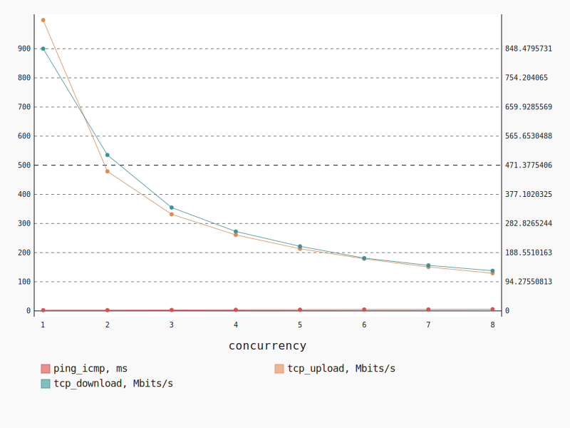
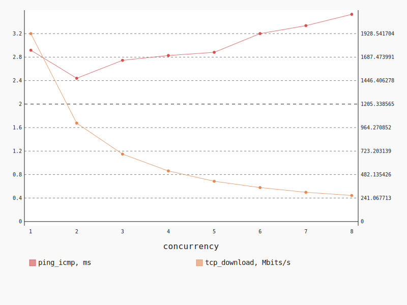
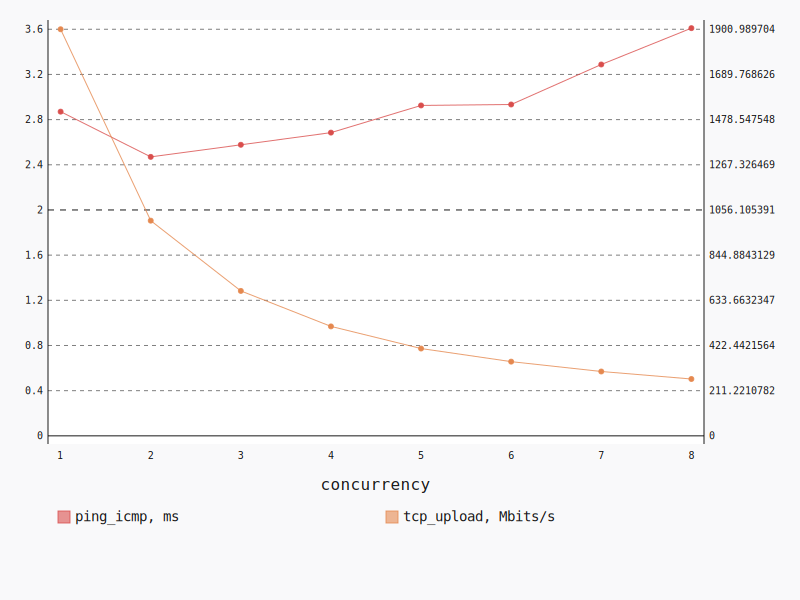

.. _openstack_l3_east_west_dense:

OpenStack L3 East-West Dense
****************************

In this scenario Shaker launches pairs of instances on the same compute node.
Instances are connected to different tenant networks connected to one router.
The traffic goes from one network to the other (L3 east-west).

**Scenario**:

.. code-block:: yaml

    deployment:
      accommodation:
      - pair
      - double_room
      - density: 8
      - compute_nodes: 1
      template: l3_east_west.hot
    description: In this scenario Shaker launches pairs of instances on the same compute
      node. Instances are connected to different tenant networks connected to one router.
      The traffic goes from one network to the other (L3 east-west).
    execution:
      progression: linear
      tests:
      - class: flent
        method: tcp_download
        title: Download
      - class: flent
        method: tcp_upload
        title: Upload
      - class: flent
        method: tcp_bidirectional
        title: Bi-directional
    file_name: /root/shaker/lib/python2.7/site-packages/shaker/scenarios/openstack/dense_l3_east_west.yaml
    title: OpenStack L3 East-West Dense

Bi-directional
==============

**Test Specification**:

.. code-block:: yaml

    class: flent
    method: tcp_bidirectional
    title: Bi-directional

**Stats**:

===========  =============  =====================  ===================
concurrency  ping_icmp, ms  tcp_download, Mbits/s  tcp_upload, Mbits/s
===========  =============  =====================  ===================
          1           2.54                 848.48               998.25
          2           2.74                 504.53               478.94
          3           3.24                 334.51               331.68
          4           3.82                 257.04               260.85
          5           4.12                 208.97               213.31
          6           4.79                 170.86               178.91
          7           5.06                 147.44               150.72
          8           5.82                 129.90               129.35
===========  =============  =====================  ===================

Concurrency 1
-------------

**Stats**:

========  =============  =====================  ===================
node      ping_icmp, ms  tcp_download, Mbits/s  tcp_upload, Mbits/s
========  =============  =====================  ===================
cmp-012            2.54                 848.48               998.25
========  =============  =====================  ===================

Concurrency 2
-------------

**Stats**:

========  =============  =====================  ===================
node      ping_icmp, ms  tcp_download, Mbits/s  tcp_upload, Mbits/s
========  =============  =====================  ===================
cmp-012            2.84                 488.98               477.21
cmp-012            2.63                 520.08               480.67
========  =============  =====================  ===================

Concurrency 3
-------------

**Stats**:

========  =============  =====================  ===================
node      ping_icmp, ms  tcp_download, Mbits/s  tcp_upload, Mbits/s
========  =============  =====================  ===================
cmp-012            3.21                 332.02               334.18
cmp-012            3.41                 336.18               326.94
cmp-012            3.11                 335.33               333.90
========  =============  =====================  ===================

Concurrency 4
-------------

**Stats**:

========  =============  =====================  ===================
node      ping_icmp, ms  tcp_download, Mbits/s  tcp_upload, Mbits/s
========  =============  =====================  ===================
cmp-012            3.97                 255.40               253.09
cmp-012            3.72                 242.44               268.83
cmp-012            3.96                 273.00               257.58
cmp-012            3.62                 257.33               263.88
========  =============  =====================  ===================

Concurrency 5
-------------

**Stats**:

========  =============  =====================  ===================
node      ping_icmp, ms  tcp_download, Mbits/s  tcp_upload, Mbits/s
========  =============  =====================  ===================
cmp-012            4.31                 207.60               208.42
cmp-012            4.00                 214.60               205.65
cmp-012            4.20                 200.30               217.63
cmp-012            4.04                 210.72               220.28
cmp-012            4.05                 211.64               214.55
========  =============  =====================  ===================

Concurrency 6
-------------

**Stats**:

========  =============  =====================  ===================
node      ping_icmp, ms  tcp_download, Mbits/s  tcp_upload, Mbits/s
========  =============  =====================  ===================
cmp-012            4.80                 168.03               174.49
cmp-012            4.80                 167.56               182.59
cmp-012            4.80                 169.55               180.83
cmp-012            4.81                 167.25               186.20
cmp-012            4.70                 173.60               174.79
cmp-012            4.81                 179.17               174.52
========  =============  =====================  ===================

Concurrency 7
-------------

**Stats**:

========  =============  =====================  ===================
node      ping_icmp, ms  tcp_download, Mbits/s  tcp_upload, Mbits/s
========  =============  =====================  ===================
cmp-012            5.07                 160.16               156.54
cmp-012            5.03                 147.01               148.11
cmp-012            5.04                 155.09               146.00
cmp-012            5.12                 134.52               147.64
cmp-012            5.05                 143.03               156.42
cmp-012            5.02                 156.34               157.53
cmp-012            5.09                 135.95               142.78
========  =============  =====================  ===================

Concurrency 8
-------------

**Stats**:

========  =============  =====================  ===================
node      ping_icmp, ms  tcp_download, Mbits/s  tcp_upload, Mbits/s
========  =============  =====================  ===================
cmp-012            5.94                 141.43               135.68
cmp-012            5.94                 134.01               126.25
cmp-012            5.73                 123.43               133.32
cmp-012            5.82                 132.49               118.05
cmp-012            5.76                 131.72               123.51
cmp-012            5.69                 129.09               135.10
cmp-012            5.75                 122.68               130.88
cmp-012            5.94                 124.29               131.99
========  =============  =====================  ===================

Download
========

**Test Specification**:

.. code-block:: yaml

    class: flent
    method: tcp_download
    title: Download

**Stats**:

===========  =============  =====================
concurrency  ping_icmp, ms  tcp_download, Mbits/s
===========  =============  =====================
          1           2.92                1928.54
          2           2.44                1009.93
          3           2.75                 692.36
          4           2.83                 519.50
          5           2.88                 413.41
          6           3.20                 348.67
          7           3.34                 300.32
          8           3.53                 267.53
===========  =============  =====================

Concurrency 1
-------------

**Stats**:

========  =============  =====================
node      ping_icmp, ms  tcp_download, Mbits/s
========  =============  =====================
cmp-012            2.92                1928.54
========  =============  =====================

Concurrency 2
-------------

**Stats**:

========  =============  =====================
node      ping_icmp, ms  tcp_download, Mbits/s
========  =============  =====================
cmp-012            2.58                 982.50
cmp-012            2.30                1037.37
========  =============  =====================

Concurrency 3
-------------

**Stats**:

========  =============  =====================
node      ping_icmp, ms  tcp_download, Mbits/s
========  =============  =====================
cmp-012            2.69                 671.69
cmp-012            2.78                 670.40
cmp-012            2.77                 734.99
========  =============  =====================

Concurrency 4
-------------

**Stats**:

========  =============  =====================
node      ping_icmp, ms  tcp_download, Mbits/s
========  =============  =====================
cmp-012            2.81                 517.08
cmp-012            2.95                 512.09
cmp-012            2.78                 530.15
cmp-012            2.77                 518.67
========  =============  =====================

Concurrency 5
-------------

**Stats**:

========  =============  =====================
node      ping_icmp, ms  tcp_download, Mbits/s
========  =============  =====================
cmp-012            2.74                 409.79
cmp-012            2.95                 405.31
cmp-012            2.85                 413.52
cmp-012            3.12                 422.64
cmp-012            2.74                 415.78
========  =============  =====================

Concurrency 6
-------------

**Stats**:

========  =============  =====================
node      ping_icmp, ms  tcp_download, Mbits/s
========  =============  =====================
cmp-012            3.28                 360.47
cmp-012            3.23                 340.52
cmp-012            3.12                 357.45
cmp-012            3.35                 347.11
cmp-012            3.08                 339.08
cmp-012            3.14                 347.38
========  =============  =====================

Concurrency 7
-------------

**Stats**:

========  =============  =====================
node      ping_icmp, ms  tcp_download, Mbits/s
========  =============  =====================
cmp-012            3.37                 306.32
cmp-012            3.43                 307.61
cmp-012            3.23                 273.15
cmp-012            3.35                 336.18
cmp-012            3.34                 286.60
cmp-012            3.30                 293.11
cmp-012            3.34                 299.25
========  =============  =====================

Concurrency 8
-------------

**Stats**:

========  =============  =====================
node      ping_icmp, ms  tcp_download, Mbits/s
========  =============  =====================
cmp-012            3.62                 262.19
cmp-012            3.64                 258.60
cmp-012            3.57                 289.95
cmp-012            3.51                 267.26
cmp-012            3.44                 259.23
cmp-012            3.41                 279.12
cmp-012            3.60                 256.57
cmp-012            3.44                 267.29
========  =============  =====================

Upload
======

**Test Specification**:

.. code-block:: yaml

    class: flent
    method: tcp_upload
    title: Upload

**Stats**:

===========  =============  ===================
concurrency  ping_icmp, ms  tcp_upload, Mbits/s
===========  =============  ===================
          1           2.87              1900.99
          2           2.47              1006.05
          3           2.58               677.57
          4           2.68               511.71
          5           2.93               408.20
          6           2.93               346.92
          7           3.29               300.85
          8           3.61               265.78
===========  =============  ===================

Concurrency 1
-------------

**Stats**:

========  =============  ===================
node      ping_icmp, ms  tcp_upload, Mbits/s
========  =============  ===================
cmp-012            2.87              1900.99
========  =============  ===================

Concurrency 2
-------------

**Stats**:

========  =============  ===================
node      ping_icmp, ms  tcp_upload, Mbits/s
========  =============  ===================
cmp-012            2.50              1004.75
cmp-012            2.44              1007.35
========  =============  ===================

Concurrency 3
-------------

**Stats**:

========  =============  ===================
node      ping_icmp, ms  tcp_upload, Mbits/s
========  =============  ===================
cmp-012            2.48               671.84
cmp-012            2.60               675.75
cmp-012            2.65               685.12
========  =============  ===================

Concurrency 4
-------------

**Stats**:

========  =============  ===================
node      ping_icmp, ms  tcp_upload, Mbits/s
========  =============  ===================
cmp-012            2.75               508.92
cmp-012            2.71               494.66
cmp-012            2.66               524.60
cmp-012            2.62               518.66
========  =============  ===================

Concurrency 5
-------------

**Stats**:

========  =============  ===================
node      ping_icmp, ms  tcp_upload, Mbits/s
========  =============  ===================
cmp-012            2.84               402.84
cmp-012            2.99               381.02
cmp-012            2.91               405.75
cmp-012            3.04               437.37
cmp-012            2.86               414.00
========  =============  ===================

Concurrency 6
-------------

**Stats**:

========  =============  ===================
node      ping_icmp, ms  tcp_upload, Mbits/s
========  =============  ===================
cmp-012            2.91               351.04
cmp-012            2.96               360.78
cmp-012            2.91               335.75
cmp-012            2.91               343.44
cmp-012            2.82               351.32
cmp-012            3.10               339.20
========  =============  ===================

Concurrency 7
-------------

**Stats**:

========  =============  ===================
node      ping_icmp, ms  tcp_upload, Mbits/s
========  =============  ===================
cmp-012            3.33               308.58
cmp-012            3.27               306.52
cmp-012            3.24               292.40
cmp-012            3.36               284.82
cmp-012            3.25               318.07
cmp-012            3.28               297.16
cmp-012            3.29               298.39
========  =============  ===================

Concurrency 8
-------------

**Stats**:

========  =============  ===================
node      ping_icmp, ms  tcp_upload, Mbits/s
========  =============  ===================
cmp-012            3.61               262.87
cmp-012            3.68               269.04
cmp-012            3.47               266.22
cmp-012            3.65               258.87
cmp-012            3.49               264.67
cmp-012            3.67               269.91
cmp-012            3.59               263.01
cmp-012            3.72               271.68
========  =============  ===================

