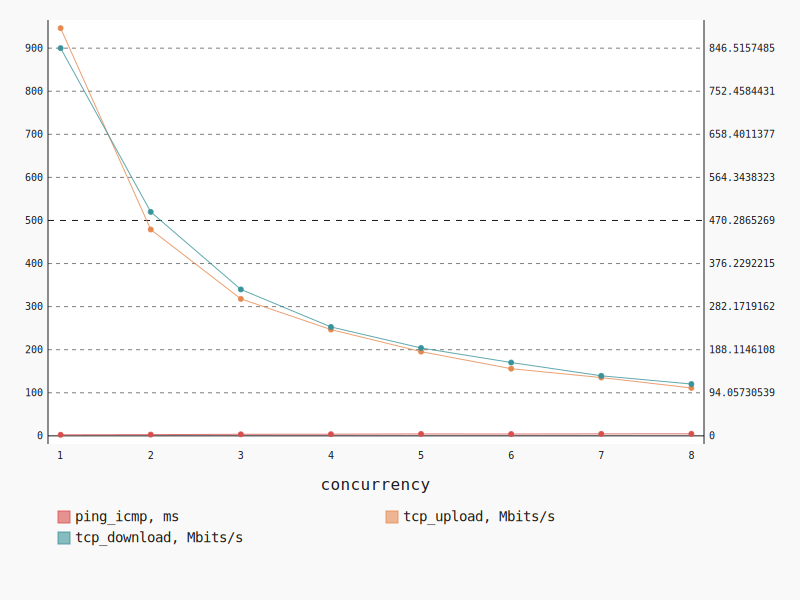
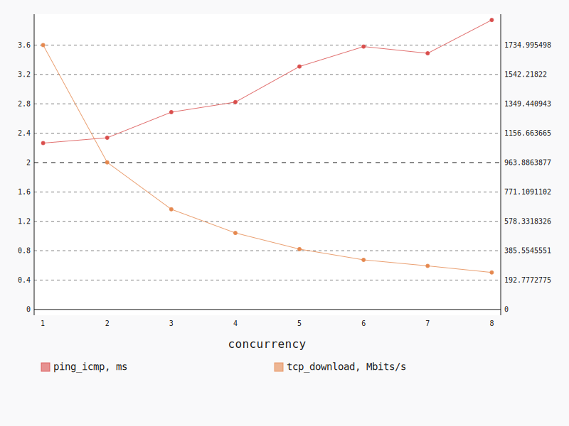
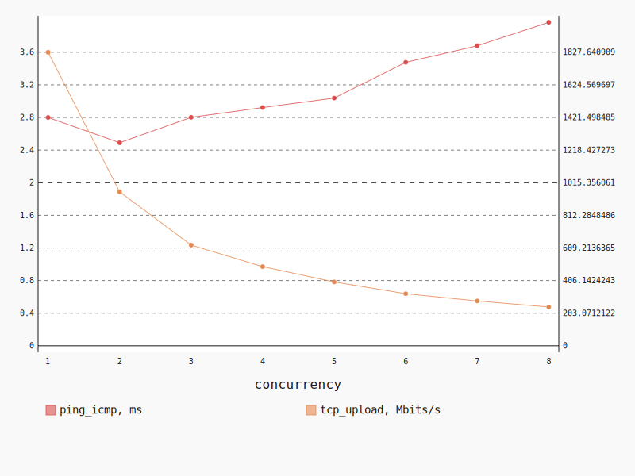

.. _openstack_l3_north_south_dense:

OpenStack L3 North-South Dense
******************************

In this scenario Shaker launches pairs of instances on the same compute node.
Instances are connected to different tenant networks, each connected to own
router. Instances in one of networks have floating IPs. The traffic goes from
one network via external network to the other network.

**Scenario**:

.. code-block:: yaml

    deployment:
      accommodation:
      - pair
      - double_room
      - density: 8
      - compute_nodes: 1
      template: l3_north_south.hot
    description: In this scenario Shaker launches pairs of instances on the same compute
      node. Instances are connected to different tenant networks, each connected to own
      router. Instances in one of networks have floating IPs. The traffic goes from one
      network via external network to the other network.
    execution:
      progression: linear
      tests:
      - class: flent
        method: tcp_download
        title: Download
      - class: flent
        method: tcp_upload
        title: Upload
      - class: flent
        method: tcp_bidirectional
        title: Bi-directional
    file_name: /root/shaker/lib/python2.7/site-packages/shaker/scenarios/openstack/dense_l3_north_south.yaml
    title: OpenStack L3 North-South Dense

Bi-directional
==============

**Test Specification**:

.. code-block:: yaml

    class: flent
    method: tcp_bidirectional
    title: Bi-directional

**Stats**:

===========  =============  =====================  ===================
concurrency  ping_icmp, ms  tcp_download, Mbits/s  tcp_upload, Mbits/s
===========  =============  =====================  ===================
          1           2.48                 846.52               946.42
          2           2.91                 488.96               478.92
          3           3.58                 319.71               317.95
          4           3.83                 237.74               246.65
          5           4.40                 191.86               195.41
          6           4.17                 160.08               155.87
          7           4.53                 131.10               135.22
          8           4.72                 113.12               111.16
===========  =============  =====================  ===================

Concurrency 1
-------------

**Stats**:

========  =============  =====================  ===================
node      ping_icmp, ms  tcp_download, Mbits/s  tcp_upload, Mbits/s
========  =============  =====================  ===================
cmp-009            2.48                 846.52               946.42
========  =============  =====================  ===================

Concurrency 2
-------------

**Stats**:

========  =============  =====================  ===================
node      ping_icmp, ms  tcp_download, Mbits/s  tcp_upload, Mbits/s
========  =============  =====================  ===================
cmp-009            3.00                 494.00               475.41
cmp-009            2.81                 483.92               482.43
========  =============  =====================  ===================

Concurrency 3
-------------

**Stats**:

========  =============  =====================  ===================
node      ping_icmp, ms  tcp_download, Mbits/s  tcp_upload, Mbits/s
========  =============  =====================  ===================
cmp-009            3.78                 333.79               307.92
cmp-009            3.60                 301.71               326.47
cmp-009            3.35                 323.61               319.47
========  =============  =====================  ===================

Concurrency 4
-------------

**Stats**:

========  =============  =====================  ===================
node      ping_icmp, ms  tcp_download, Mbits/s  tcp_upload, Mbits/s
========  =============  =====================  ===================
cmp-009            3.99                 220.02               250.04
cmp-009            3.79                 232.18               238.12
cmp-009            3.84                 255.25               254.19
cmp-009            3.70                 243.51               244.24
========  =============  =====================  ===================

Concurrency 5
-------------

**Stats**:

========  =============  =====================  ===================
node      ping_icmp, ms  tcp_download, Mbits/s  tcp_upload, Mbits/s
========  =============  =====================  ===================
cmp-009            4.64                 187.86               189.88
cmp-009            4.26                 194.90               194.07
cmp-009            4.42                 194.29               190.18
cmp-009            4.29                 193.44               205.24
cmp-009            4.39                 188.81               197.69
========  =============  =====================  ===================

Concurrency 6
-------------

**Stats**:

========  =============  =====================  ===================
node      ping_icmp, ms  tcp_download, Mbits/s  tcp_upload, Mbits/s
========  =============  =====================  ===================
cmp-009            4.12                 168.46               152.94
cmp-009            4.05                 156.33               157.73
cmp-009            4.09                 159.40               156.12
cmp-009            4.35                 152.82               154.50
cmp-009            4.34                 155.74               158.49
cmp-009            4.09                 167.74               155.46
========  =============  =====================  ===================

Concurrency 7
-------------

**Stats**:

========  =============  =====================  ===================
node      ping_icmp, ms  tcp_download, Mbits/s  tcp_upload, Mbits/s
========  =============  =====================  ===================
cmp-009            4.57                 135.37               127.33
cmp-009            4.54                 119.56               141.14
cmp-009            4.36                 130.60               132.45
cmp-009            4.63                 132.54               132.07
cmp-009            4.53                 135.60               141.90
cmp-009            4.56                 137.69               133.97
cmp-009            4.53                 126.31               137.70
========  =============  =====================  ===================

Concurrency 8
-------------

**Stats**:

========  =============  =====================  ===================
node      ping_icmp, ms  tcp_download, Mbits/s  tcp_upload, Mbits/s
========  =============  =====================  ===================
cmp-009            4.49                 114.30               110.15
cmp-009            4.94                 111.46               113.84
cmp-009            5.02                 110.72               111.97
cmp-009            4.70                 116.65               106.67
cmp-009            4.81                 119.23               108.31
cmp-009            4.61                 117.63               116.75
cmp-009            4.57                 109.48               111.26
cmp-009            4.64                 105.50               110.37
========  =============  =====================  ===================

Download
========

**Test Specification**:

.. code-block:: yaml

    class: flent
    method: tcp_download
    title: Download

**Stats**:

===========  =============  =====================
concurrency  ping_icmp, ms  tcp_download, Mbits/s
===========  =============  =====================
          1           2.27                1735.00
          2           2.34                 965.15
          3           2.69                 657.36
          4           2.82                 501.98
          5           3.31                 395.86
          6           3.58                 325.45
          7           3.49                 285.86
          8           3.94                 242.80
===========  =============  =====================

Concurrency 1
-------------

**Stats**:

========  =============  =====================
node      ping_icmp, ms  tcp_download, Mbits/s
========  =============  =====================
cmp-009            2.27                1735.00
========  =============  =====================

Concurrency 2
-------------

**Stats**:

========  =============  =====================
node      ping_icmp, ms  tcp_download, Mbits/s
========  =============  =====================
cmp-009            2.51                 954.79
cmp-009            2.17                 975.51
========  =============  =====================

Concurrency 3
-------------

**Stats**:

========  =============  =====================
node      ping_icmp, ms  tcp_download, Mbits/s
========  =============  =====================
cmp-009            2.62                 662.37
cmp-009            2.67                 680.41
cmp-009            2.77                 629.30
========  =============  =====================

Concurrency 4
-------------

**Stats**:

========  =============  =====================
node      ping_icmp, ms  tcp_download, Mbits/s
========  =============  =====================
cmp-009            2.90                 505.97
cmp-009            2.74                 496.66
cmp-009            2.82                 528.07
cmp-009            2.84                 477.21
========  =============  =====================

Concurrency 5
-------------

**Stats**:

========  =============  =====================
node      ping_icmp, ms  tcp_download, Mbits/s
========  =============  =====================
cmp-009            3.33                 389.89
cmp-009            3.26                 366.48
cmp-009            3.39                 425.30
cmp-009            3.28                 405.96
cmp-009            3.28                 391.68
========  =============  =====================

Concurrency 6
-------------

**Stats**:

========  =============  =====================
node      ping_icmp, ms  tcp_download, Mbits/s
========  =============  =====================
cmp-009            3.78                 315.68
cmp-009            3.36                 317.33
cmp-009            3.49                 330.47
cmp-009            3.51                 319.10
cmp-009            3.87                 340.22
cmp-009            3.46                 329.90
========  =============  =====================

Concurrency 7
-------------

**Stats**:

========  =============  =====================
node      ping_icmp, ms  tcp_download, Mbits/s
========  =============  =====================
cmp-009            3.48                 271.35
cmp-009            3.41                 264.31
cmp-009            3.52                 293.34
cmp-009            3.48                 286.51
cmp-009            3.53                 276.19
cmp-009            3.60                 311.78
cmp-009            3.39                 297.56
========  =============  =====================

Concurrency 8
-------------

**Stats**:

========  =============  =====================
node      ping_icmp, ms  tcp_download, Mbits/s
========  =============  =====================
cmp-009            3.98                 230.02
cmp-009            3.84                 266.88
cmp-009            3.94                 217.37
cmp-009            4.10                 249.70
cmp-009            3.93                 253.24
cmp-009            3.88                 237.95
cmp-009            3.93                 244.47
cmp-009            3.93                 242.79
========  =============  =====================

Upload
======

**Test Specification**:

.. code-block:: yaml

    class: flent
    method: tcp_upload
    title: Upload

**Stats**:

===========  =============  ===================
concurrency  ping_icmp, ms  tcp_upload, Mbits/s
===========  =============  ===================
          1           2.80              1827.64
          2           2.49               958.44
          3           2.80               626.94
          4           2.92               492.78
          5           3.04               397.40
          6           3.48               324.18
          7           3.68               279.04
          8           3.97               241.51
===========  =============  ===================

Concurrency 1
-------------

**Stats**:

========  =============  ===================
node      ping_icmp, ms  tcp_upload, Mbits/s
========  =============  ===================
cmp-009            2.80              1827.64
========  =============  ===================

Concurrency 2
-------------

**Stats**:

========  =============  ===================
node      ping_icmp, ms  tcp_upload, Mbits/s
========  =============  ===================
cmp-009            2.58               968.23
cmp-009            2.40               948.66
========  =============  ===================

Concurrency 3
-------------

**Stats**:

========  =============  ===================
node      ping_icmp, ms  tcp_upload, Mbits/s
========  =============  ===================
cmp-009            2.77               612.02
cmp-009            2.78               621.54
cmp-009            2.86               647.24
========  =============  ===================

Concurrency 4
-------------

**Stats**:

========  =============  ===================
node      ping_icmp, ms  tcp_upload, Mbits/s
========  =============  ===================
cmp-009            3.14               472.28
cmp-009            2.85               496.03
cmp-009            2.84               478.96
cmp-009            2.86               523.82
========  =============  ===================

Concurrency 5
-------------

**Stats**:

========  =============  ===================
node      ping_icmp, ms  tcp_upload, Mbits/s
========  =============  ===================
cmp-009            3.04               409.71
cmp-009            2.95               388.96
cmp-009            3.07               398.17
cmp-009            3.03               405.84
cmp-009            3.10               384.32
========  =============  ===================

Concurrency 6
-------------

**Stats**:

========  =============  ===================
node      ping_icmp, ms  tcp_upload, Mbits/s
========  =============  ===================
cmp-009            3.48               323.07
cmp-009            3.37               308.18
cmp-009            3.51               337.42
cmp-009            3.40               305.02
cmp-009            3.50               347.90
cmp-009            3.58               323.52
========  =============  ===================

Concurrency 7
-------------

**Stats**:

========  =============  ===================
node      ping_icmp, ms  tcp_upload, Mbits/s
========  =============  ===================
cmp-009            3.72               286.71
cmp-009            3.55               260.78
cmp-009            3.71               279.80
cmp-009            3.72               275.10
cmp-009            3.65               293.16
cmp-009            3.68               263.18
cmp-009            3.73               294.51
========  =============  ===================

Concurrency 8
-------------

**Stats**:

========  =============  ===================
node      ping_icmp, ms  tcp_upload, Mbits/s
========  =============  ===================
cmp-009            4.02               247.75
cmp-009            4.02               234.63
cmp-009            3.97               239.06
cmp-009            4.06               244.02
cmp-009            3.92               234.12
cmp-009            3.88               240.60
cmp-009            3.96               240.16
cmp-009            3.88               251.77
========  =============  ===================

