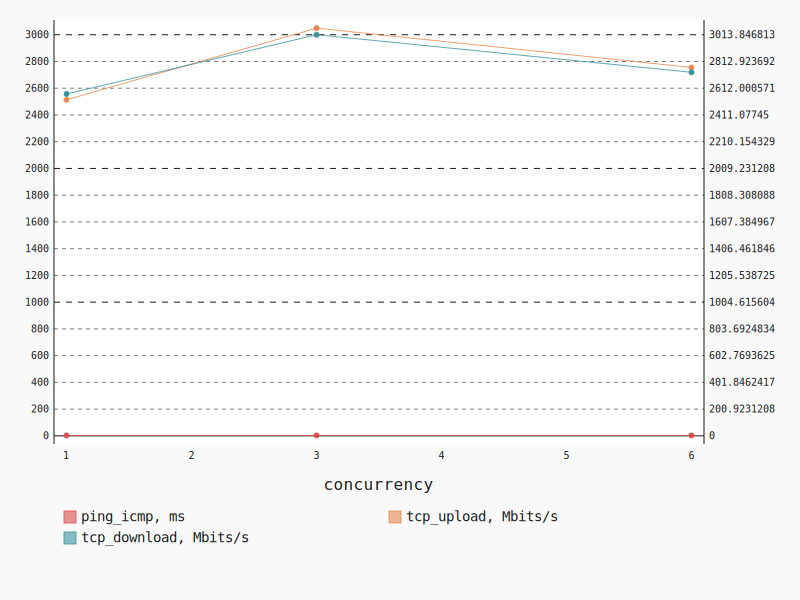
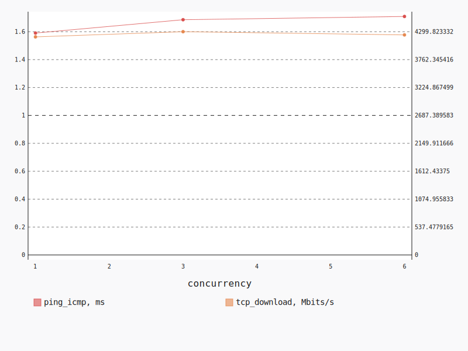
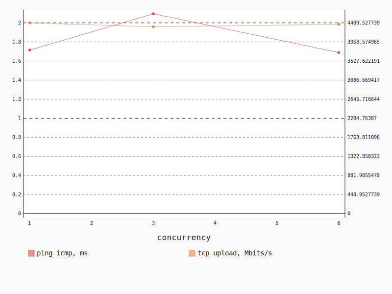

.. _openstack_l2:

OpenStack L2
************

In this scenario Shaker launches pairs of instances in the same tenant network.
Every instance is hosted on a separate compute node, all available compute
nodes are utilized. The traffic goes within the tenant network (L2 domain).

**Scenario**:

.. code-block:: yaml

    deployment:
      accommodation:
      - pair
      - single_room
      template: l2.hot
    description: In this scenario Shaker launches pairs of instances in the same tenant
      network. Every instance is hosted on a separate compute node, all available compute
      nodes are utilized. The traffic goes within the tenant network (L2 domain).
    execution:
      progression: quadratic
      tests:
      - class: flent
        method: tcp_download
        title: Download
      - class: flent
        method: tcp_upload
        title: Upload
      - class: flent
        method: tcp_bidirectional
        title: Bi-directional
    file_name: /root/shaker/lib/python2.7/site-packages/shaker/scenarios/openstack/full_l2.yaml
    title: OpenStack L2

Bi-directional
==============

**Test Specification**:

.. code-block:: yaml

    class: flent
    method: tcp_bidirectional
    title: Bi-directional

**Stats**:

===========  =============  =====================  ===================
concurrency  ping_icmp, ms  tcp_download, Mbits/s  tcp_upload, Mbits/s
===========  =============  =====================  ===================
          1           3.00                2568.70              2513.43
          3           3.02                3013.85              3049.12
          6           3.02                2731.25              2755.04
===========  =============  =====================  ===================

Concurrency 1
-------------

**Stats**:

========  =============  =====================  ===================
node      ping_icmp, ms  tcp_download, Mbits/s  tcp_upload, Mbits/s
========  =============  =====================  ===================
cmp-007            3.00                2568.70              2513.43
========  =============  =====================  ===================

Concurrency 3
-------------

**Stats**:

========  =============  =====================  ===================
node      ping_icmp, ms  tcp_download, Mbits/s  tcp_upload, Mbits/s
========  =============  =====================  ===================
cmp-004            2.99                3283.15              3532.50
cmp-006            3.06                3165.85              2899.98
cmp-007            3.00                2592.53              2714.88
========  =============  =====================  ===================

Concurrency 6
-------------

**Stats**:

========  =============  =====================  ===================
node      ping_icmp, ms  tcp_download, Mbits/s  tcp_upload, Mbits/s
========  =============  =====================  ===================
cmp-001            3.08                2529.33              2581.16
cmp-002            3.07                2632.49              2640.95
cmp-004            2.84                3051.96              3219.79
cmp-005            3.12                2418.37              2477.16
cmp-006            2.98                3123.86              2842.86
cmp-007            3.03                2631.48              2768.29
========  =============  =====================  ===================

Download
========

**Test Specification**:

.. code-block:: yaml

    class: flent
    method: tcp_download
    title: Download

**Stats**:

===========  =============  =====================
concurrency  ping_icmp, ms  tcp_download, Mbits/s
===========  =============  =====================
          1           1.59                4200.05
          3           1.69                4299.82
          6           1.71                4238.15
===========  =============  =====================

Concurrency 1
-------------

**Stats**:

========  =============  =====================
node      ping_icmp, ms  tcp_download, Mbits/s
========  =============  =====================
cmp-007            1.59                4200.05
========  =============  =====================

Concurrency 3
-------------

**Stats**:

========  =============  =====================
node      ping_icmp, ms  tcp_download, Mbits/s
========  =============  =====================
cmp-004            1.70                4079.46
cmp-006            1.67                4591.56
cmp-007            1.69                4228.45
========  =============  =====================

Concurrency 6
-------------

**Stats**:

========  =============  =====================
node      ping_icmp, ms  tcp_download, Mbits/s
========  =============  =====================
cmp-001            1.74                4228.74
cmp-002            1.73                4325.65
cmp-004            1.63                3863.69
cmp-005            1.74                4213.03
cmp-006            1.64                4573.49
cmp-007            1.76                4224.29
========  =============  =====================

Upload
======

**Test Specification**:

.. code-block:: yaml

    class: flent
    method: tcp_upload
    title: Upload

**Stats**:

===========  =============  ===================
concurrency  ping_icmp, ms  tcp_upload, Mbits/s
===========  =============  ===================
          1           1.71              4409.53
          3           2.10              4319.30
          6           1.69              4376.31
===========  =============  ===================

Concurrency 1
-------------

**Stats**:

========  =============  ===================
node      ping_icmp, ms  tcp_upload, Mbits/s
========  =============  ===================
cmp-007            1.71              4409.53
========  =============  ===================

Concurrency 3
-------------

**Stats**:

========  =============  ===================
node      ping_icmp, ms  tcp_upload, Mbits/s
========  =============  ===================
cmp-004            2.83              4290.00
cmp-006            1.76              4268.42
cmp-007            1.70              4399.47
========  =============  ===================

Concurrency 6
-------------

**Stats**:

========  =============  ===================
node      ping_icmp, ms  tcp_upload, Mbits/s
========  =============  ===================
cmp-001            1.71              4397.74
cmp-002            1.65              4548.42
cmp-004            1.66              4390.66
cmp-005            1.74              4242.32
cmp-006            1.76              4209.85
cmp-007            1.62              4468.85
========  =============  ===================

