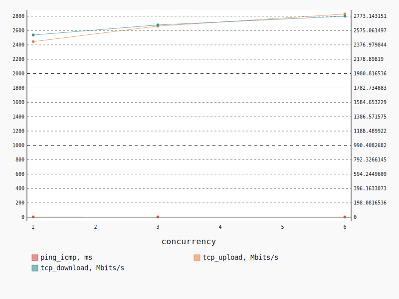
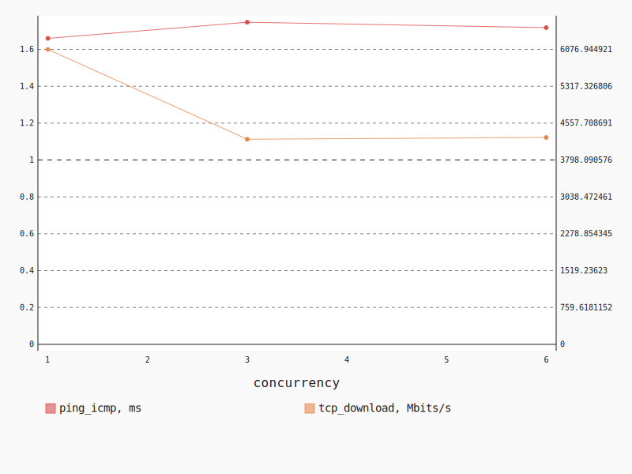
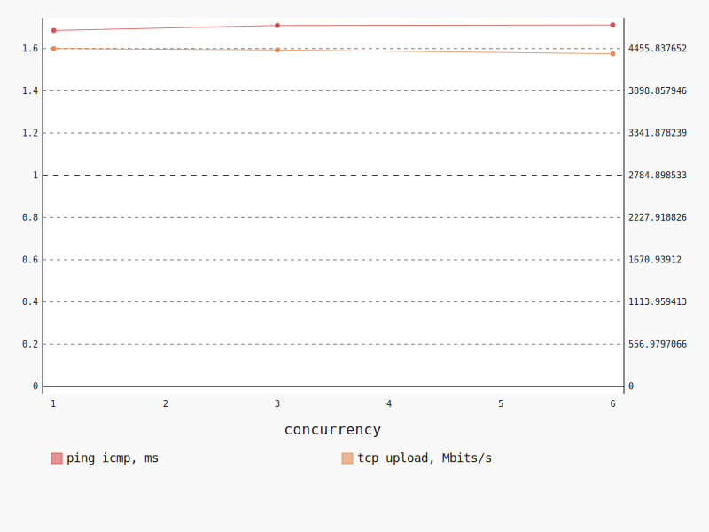

.. _openstack_l2:

OpenStack L2
************

In this scenario Shaker launches pairs of instances in the same tenant network.
Every instance is hosted on a separate compute node, all available compute
nodes are utilized. The traffic goes within the tenant network (L2 domain).

**Scenario**:

.. code-block:: yaml

    deployment:
      accommodation:
      - pair
      - single_room
      template: l2.hot
    description: In this scenario Shaker launches pairs of instances in the same tenant
      network. Every instance is hosted on a separate compute node, all available compute
      nodes are utilized. The traffic goes within the tenant network (L2 domain).
    execution:
      progression: quadratic
      tests:
      - class: flent
        method: tcp_download
        title: Download
      - class: flent
        method: tcp_upload
        title: Upload
      - class: flent
        method: tcp_bidirectional
        title: Bi-directional
    file_name: /root/shaker/lib/python2.7/site-packages/shaker/scenarios/openstack/full_l2.yaml
    title: OpenStack L2

Bi-directional
==============

**Test Specification**:

.. code-block:: yaml

    class: flent
    method: tcp_bidirectional
    title: Bi-directional

**Stats**:

===========  =============  =====================  ===================
concurrency  ping_icmp, ms  tcp_download, Mbits/s  tcp_upload, Mbits/s
===========  =============  =====================  ===================
          1           3.11                2513.28              2445.09
          3           3.09                2651.73              2661.56
          6           2.89                2773.14              2829.64
===========  =============  =====================  ===================

Concurrency 1
-------------

**Stats**:

========  =============  =====================  ===================
node      ping_icmp, ms  tcp_download, Mbits/s  tcp_upload, Mbits/s
========  =============  =====================  ===================
cmp-001            3.11                2513.28              2445.09
========  =============  =====================  ===================

Concurrency 3
-------------

**Stats**:

========  =============  =====================  ===================
node      ping_icmp, ms  tcp_download, Mbits/s  tcp_upload, Mbits/s
========  =============  =====================  ===================
cmp-001            3.20                2471.54              2503.93
cmp-002            3.07                2955.02              2977.51
cmp-005            2.98                2528.62              2503.25
========  =============  =====================  ===================

Concurrency 6
-------------

**Stats**:

========  =============  =====================  ===================
node      ping_icmp, ms  tcp_download, Mbits/s  tcp_upload, Mbits/s
========  =============  =====================  ===================
cmp-001            2.97                2634.10              2569.14
cmp-002            2.91                2690.97              2618.22
cmp-004            2.93                3026.21              3477.84
cmp-005            2.93                2821.78              2922.70
cmp-006            2.78                3013.77              2795.34
cmp-007            2.84                2452.03              2594.64
========  =============  =====================  ===================

Download
========

**Test Specification**:

.. code-block:: yaml

    class: flent
    method: tcp_download
    title: Download

**Stats**:

===========  =============  =====================
concurrency  ping_icmp, ms  tcp_download, Mbits/s
===========  =============  =====================
          1           1.66                6076.94
          3           1.75                4225.83
          6           1.72                4262.13
===========  =============  =====================

Concurrency 1
-------------

**Stats**:

========  =============  =====================
node      ping_icmp, ms  tcp_download, Mbits/s
========  =============  =====================
cmp-001            1.66                6076.94
========  =============  =====================

Concurrency 3
-------------

**Stats**:

========  =============  =====================
node      ping_icmp, ms  tcp_download, Mbits/s
========  =============  =====================
cmp-001            1.81                4124.10
cmp-002            1.69                4295.01
cmp-005            1.74                4258.38
========  =============  =====================

Concurrency 6
-------------

**Stats**:

========  =============  =====================
node      ping_icmp, ms  tcp_download, Mbits/s
========  =============  =====================
cmp-001            1.69                4181.48
cmp-002            1.72                4308.70
cmp-004            1.79                4087.73
cmp-005            1.74                4186.84
cmp-006            1.64                4588.02
cmp-007            1.73                4219.99
========  =============  =====================

Upload
======

**Test Specification**:

.. code-block:: yaml

    class: flent
    method: tcp_upload
    title: Upload

**Stats**:

===========  =============  ===================
concurrency  ping_icmp, ms  tcp_upload, Mbits/s
===========  =============  ===================
          1           1.69              4455.84
          3           1.71              4437.97
          6           1.71              4387.61
===========  =============  ===================

Concurrency 1
-------------

**Stats**:

========  =============  ===================
node      ping_icmp, ms  tcp_upload, Mbits/s
========  =============  ===================
cmp-001            1.69              4455.84
========  =============  ===================

Concurrency 3
-------------

**Stats**:

========  =============  ===================
node      ping_icmp, ms  tcp_upload, Mbits/s
========  =============  ===================
cmp-001            1.73              4457.52
cmp-002            1.68              4574.53
cmp-005            1.71              4281.85
========  =============  ===================

Concurrency 6
-------------

**Stats**:

========  =============  ===================
node      ping_icmp, ms  tcp_upload, Mbits/s
========  =============  ===================
cmp-001            1.70              4406.46
cmp-002            1.66              4525.19
cmp-004            1.71              4383.04
cmp-005            1.74              4266.06
cmp-006            1.77              4266.71
cmp-007            1.69              4478.23
========  =============  ===================

