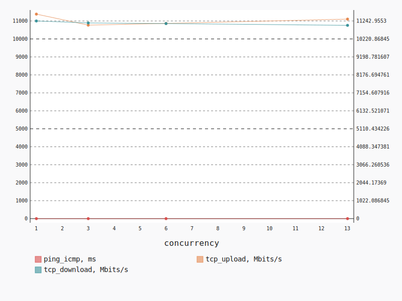
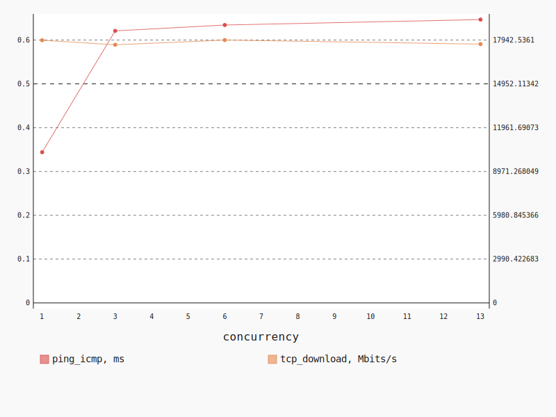
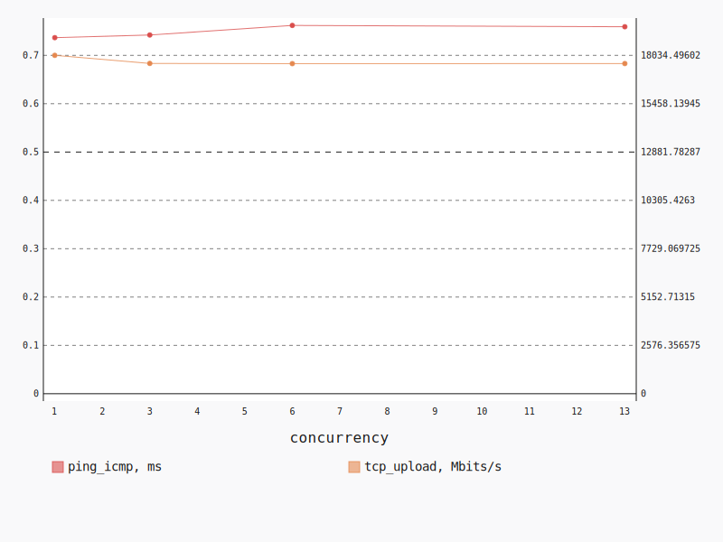

.. _openstack_l2:

OpenStack L2
************

In this scenario Shaker launches pairs of instances in the same tenant network.
Every instance is hosted on a separate compute node, all available compute
nodes are utilized. The traffic goes within the tenant network (L2 domain).

**Scenario**:

.. code-block:: yaml

    deployment:
      accommodation:
      - pair
      - double_room
      template: l2.hot
    description: In this scenario Shaker launches pairs of instances in the same tenant
      network. Every instance is hosted on a separate compute node, all available compute
      nodes are utilized. The traffic goes within the tenant network (L2 domain).
    execution:
      progression: quadratic
      tests:
      - class: flent
        method: tcp_download
        title: Download
      - class: flent
        method: tcp_upload
        title: Upload
      - class: flent
        method: tcp_bidirectional
        title: Bi-directional
    file_name: /root/shaker/lib/python2.7/site-packages/shaker/scenarios/openstack/full_l2.yaml
    title: OpenStack L2

Bi-directional
==============

**Test Specification**:

.. code-block:: yaml

    class: flent
    method: tcp_bidirectional
    title: Bi-directional

**Stats**:

===========  =============  =====================  ===================
concurrency  ping_icmp, ms  tcp_download, Mbits/s  tcp_upload, Mbits/s
===========  =============  =====================  ===================
          1           0.98               11242.96             11381.23
          3           0.96               11131.25             10768.84
          6           0.97               11095.03             10865.03
         13           0.99               10994.55             11103.07
===========  =============  =====================  ===================

Concurrency 1
-------------

**Stats**:

========  =============  =====================  ===================
node      ping_icmp, ms  tcp_download, Mbits/s  tcp_upload, Mbits/s
========  =============  =====================  ===================
cmp-010            0.98               11242.96             11381.23
========  =============  =====================  ===================

Concurrency 3
-------------

**Stats**:

========  =============  =====================  ===================
node      ping_icmp, ms  tcp_download, Mbits/s  tcp_upload, Mbits/s
========  =============  =====================  ===================
cmp-003            0.95               11003.15             11115.93
cmp-007            1.00               10906.20             10770.29
cmp-010            0.93               11484.41             10420.31
========  =============  =====================  ===================

Concurrency 6
-------------

**Stats**:

========  =============  =====================  ===================
node      ping_icmp, ms  tcp_download, Mbits/s  tcp_upload, Mbits/s
========  =============  =====================  ===================
cmp-003            0.87               11154.91             11408.04
cmp-004            0.93               11723.82             10912.27
cmp-005            0.94               11644.88             11183.95
cmp-007            1.05               10649.65             10825.51
cmp-008            1.01               10813.24             10039.24
cmp-010            1.02               10583.69             10821.18
========  =============  =====================  ===================

Concurrency 13
--------------

**Stats**:

========  =============  =====================  ===================
node      ping_icmp, ms  tcp_download, Mbits/s  tcp_upload, Mbits/s
========  =============  =====================  ===================
cmp-001            0.95               11256.20             11683.36
cmp-002            0.91               11284.32             11638.93
cmp-003            0.90               11980.40             10631.73
cmp-004            0.96               11100.54             11467.48
cmp-005            1.00               11073.90             11131.06
cmp-006            0.87               11263.48             11492.44
cmp-007            1.06               10686.65             10477.10
cmp-008            1.06               10924.79             10214.61
cmp-009            1.02               11038.54             11066.00
cmp-010            1.07               10382.83             11107.70
cmp-011            1.03               10718.15             11371.07
cmp-012            1.08               10181.56             10793.45
cmp-013            0.96               11037.82             11264.96
========  =============  =====================  ===================

Download
========

**Test Specification**:

.. code-block:: yaml

    class: flent
    method: tcp_download
    title: Download

**Stats**:

===========  =============  =====================
concurrency  ping_icmp, ms  tcp_download, Mbits/s
===========  =============  =====================
          1           0.34               17930.09
          3           0.62               17620.42
          6           0.63               17942.54
         13           0.65               17665.79
===========  =============  =====================

Concurrency 1
-------------

**Stats**:

========  =============  =====================
node      ping_icmp, ms  tcp_download, Mbits/s
========  =============  =====================
cmp-010            0.34               17930.09
========  =============  =====================

Concurrency 3
-------------

**Stats**:

========  =============  =====================
node      ping_icmp, ms  tcp_download, Mbits/s
========  =============  =====================
cmp-003            0.65               17623.15
cmp-007            0.66               16911.98
cmp-010            0.55               18326.12
========  =============  =====================

Concurrency 6
-------------

**Stats**:

========  =============  =====================
node      ping_icmp, ms  tcp_download, Mbits/s
========  =============  =====================
cmp-003            0.59               18244.27
cmp-004            0.63               17098.88
cmp-005            0.65               18175.92
cmp-007            0.65               17657.62
cmp-008            0.65               18282.14
cmp-010            0.63               18196.39
========  =============  =====================

Concurrency 13
--------------

**Stats**:

========  =============  =====================
node      ping_icmp, ms  tcp_download, Mbits/s
========  =============  =====================
cmp-001            0.67               17219.10
cmp-002            0.64               18395.48
cmp-003            0.64               17843.81
cmp-004            0.64               17596.52
cmp-005            0.59               18438.84
cmp-006            0.74               16684.67
cmp-007            0.71               17066.21
cmp-008            0.62               18363.24
cmp-009            0.62               17944.02
cmp-010            0.64               17810.70
cmp-011            0.66               16681.45
cmp-012            0.63               17080.73
cmp-013            0.61               18530.52
========  =============  =====================

Upload
======

**Test Specification**:

.. code-block:: yaml

    class: flent
    method: tcp_upload
    title: Upload

**Stats**:

===========  =============  ===================
concurrency  ping_icmp, ms  tcp_upload, Mbits/s
===========  =============  ===================
          1           0.74             18034.50
          3           0.74             17604.10
          6           0.76             17593.28
         13           0.76             17597.14
===========  =============  ===================

Concurrency 1
-------------

**Stats**:

========  =============  ===================
node      ping_icmp, ms  tcp_upload, Mbits/s
========  =============  ===================
cmp-010            0.74             18034.50
========  =============  ===================

Concurrency 3
-------------

**Stats**:

========  =============  ===================
node      ping_icmp, ms  tcp_upload, Mbits/s
========  =============  ===================
cmp-003            0.72             18154.77
cmp-007            0.79             17070.12
cmp-010            0.72             17587.42
========  =============  ===================

Concurrency 6
-------------

**Stats**:

========  =============  ===================
node      ping_icmp, ms  tcp_upload, Mbits/s
========  =============  ===================
cmp-003            0.78             17706.89
cmp-004            0.77             17404.62
cmp-005            0.67             18652.87
cmp-007            0.79             17268.60
cmp-008            0.84             16645.08
cmp-010            0.73             17881.58
========  =============  ===================

Concurrency 13
--------------

**Stats**:

========  =============  ===================
node      ping_icmp, ms  tcp_upload, Mbits/s
========  =============  ===================
cmp-001            0.74             17974.58
cmp-002            0.70             18135.42
cmp-003            0.74             17724.67
cmp-004            0.76             17515.57
cmp-005            0.78             17875.75
cmp-006            0.73             18125.60
cmp-007            0.77             16653.25
cmp-008            0.81             17074.14
cmp-009            0.74             18167.32
cmp-010            0.75             17828.84
cmp-011            0.81             17388.70
cmp-012            0.80             16459.14
cmp-013            0.75             17839.83
========  =============  ===================

