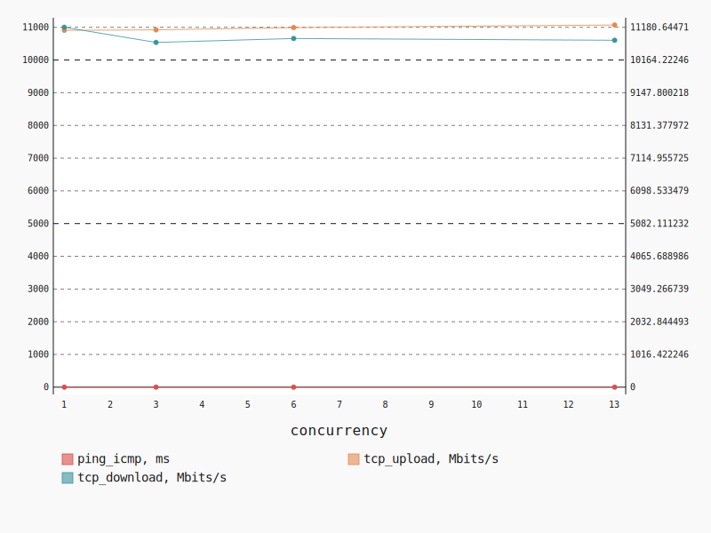
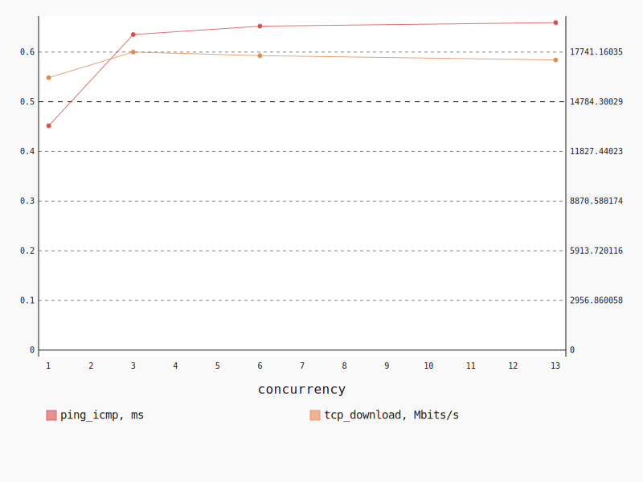
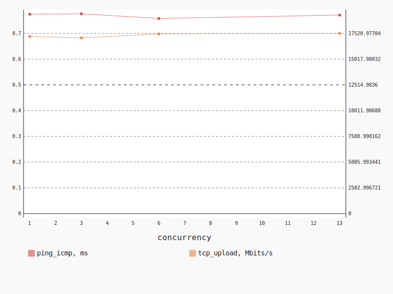

.. _openstack_l2:

OpenStack L2
************

In this scenario Shaker launches pairs of instances in the same tenant network.
Every instance is hosted on a separate compute node, all available compute
nodes are utilized. The traffic goes within the tenant network (L2 domain).

**Scenario**:

.. code-block:: yaml

    deployment:
      accommodation:
      - pair
      - double_room
      template: l2.hot
    description: In this scenario Shaker launches pairs of instances in the same tenant
      network. Every instance is hosted on a separate compute node, all available compute
      nodes are utilized. The traffic goes within the tenant network (L2 domain).
    execution:
      progression: quadratic
      tests:
      - class: flent
        method: tcp_download
        title: Download
      - class: flent
        method: tcp_upload
        title: Upload
      - class: flent
        method: tcp_bidirectional
        title: Bi-directional
    file_name: /root/shaker/lib/python2.7/site-packages/shaker/scenarios/openstack/full_l2.yaml
    title: OpenStack L2

Bi-directional
==============

**Test Specification**:

.. code-block:: yaml

    class: flent
    method: tcp_bidirectional
    title: Bi-directional

**Stats**:

===========  =============  =====================  ===================
concurrency  ping_icmp, ms  tcp_download, Mbits/s  tcp_upload, Mbits/s
===========  =============  =====================  ===================
          1           0.97               11180.64             10907.83
          3           1.02               10710.89             10921.96
          6           1.03               10832.43             10991.87
         13           1.05               10777.66             11069.79
===========  =============  =====================  ===================

Concurrency 1
-------------

**Stats**:

========  =============  =====================  ===================
node      ping_icmp, ms  tcp_download, Mbits/s  tcp_upload, Mbits/s
========  =============  =====================  ===================
cmp-007            0.97               11180.64             10907.83
========  =============  =====================  ===================

Concurrency 3
-------------

**Stats**:

========  =============  =====================  ===================
node      ping_icmp, ms  tcp_download, Mbits/s  tcp_upload, Mbits/s
========  =============  =====================  ===================
cmp-003            1.06               10648.57             10869.80
cmp-007            1.02               11207.14             10726.24
cmp-010            0.98               10276.95             11169.84
========  =============  =====================  ===================

Concurrency 6
-------------

**Stats**:

========  =============  =====================  ===================
node      ping_icmp, ms  tcp_download, Mbits/s  tcp_upload, Mbits/s
========  =============  =====================  ===================
cmp-003            1.10               11024.08             10444.94
cmp-005            0.95               10714.42             11494.00
cmp-006            0.97               10701.31             10811.60
cmp-007            1.10               10819.82             10936.48
cmp-010            1.13               10454.12             10946.74
cmp-013            0.94               11280.82             11317.45
========  =============  =====================  ===================

Concurrency 13
--------------

**Stats**:

========  =============  =====================  ===================
node      ping_icmp, ms  tcp_download, Mbits/s  tcp_upload, Mbits/s
========  =============  =====================  ===================
cmp-001            1.12               10624.72             11238.35
cmp-002            0.97               11286.64             11185.28
cmp-003            1.08               10725.79             10843.79
cmp-004            1.03               11063.30             11327.46
cmp-005            1.17               10621.66             11077.42
cmp-006            1.11               10400.00             10792.43
cmp-007            1.07               11030.49             10903.16
cmp-008            1.00               10846.97             11385.18
cmp-009            0.93               11007.12             11226.18
cmp-010            1.00               10760.00             10813.05
cmp-011            1.08               10381.64             10765.87
cmp-012            1.10               10426.40             10899.82
cmp-013            1.00               10934.80             11449.34
========  =============  =====================  ===================

Download
========

**Test Specification**:

.. code-block:: yaml

    class: flent
    method: tcp_download
    title: Download

**Stats**:

===========  =============  =====================
concurrency  ping_icmp, ms  tcp_download, Mbits/s
===========  =============  =====================
          1           0.45               16216.30
          3           0.64               17741.16
          6           0.65               17525.67
         13           0.66               17269.84
===========  =============  =====================

Concurrency 1
-------------

**Stats**:

========  =============  =====================
node      ping_icmp, ms  tcp_download, Mbits/s
========  =============  =====================
cmp-007            0.45               16216.30
========  =============  =====================

Concurrency 3
-------------

**Stats**:

========  =============  =====================
node      ping_icmp, ms  tcp_download, Mbits/s
========  =============  =====================
cmp-003            0.65               17758.11
cmp-007            0.63               17398.78
cmp-010            0.63               18066.59
========  =============  =====================

Concurrency 6
-------------

**Stats**:

========  =============  =====================
node      ping_icmp, ms  tcp_download, Mbits/s
========  =============  =====================
cmp-003            0.70               17166.78
cmp-005            0.66               17426.86
cmp-006            0.65               17623.19
cmp-007            0.65               17244.63
cmp-010            0.60               18133.32
cmp-013            0.66               17559.27
========  =============  =====================

Concurrency 13
--------------

**Stats**:

========  =============  =====================
node      ping_icmp, ms  tcp_download, Mbits/s
========  =============  =====================
cmp-001            0.66               17096.36
cmp-002            0.65               18191.27
cmp-003            0.64               17488.74
cmp-004            0.66               17159.33
cmp-005            0.67               17348.79
cmp-006            0.68               16508.23
cmp-007            0.68               17041.30
cmp-008            0.65               17468.19
cmp-009            0.70               16831.28
cmp-010            0.62               17601.28
cmp-011            0.64               17925.26
cmp-012            0.66               16611.93
cmp-013            0.65               17235.92
========  =============  =====================

Upload
======

**Test Specification**:

.. code-block:: yaml

    class: flent
    method: tcp_upload
    title: Upload

**Stats**:

===========  =============  ===================
concurrency  ping_icmp, ms  tcp_upload, Mbits/s
===========  =============  ===================
          1           0.77             17218.23
          3           0.78             17086.81
          6           0.76             17472.74
         13           0.77             17520.98
===========  =============  ===================

Concurrency 1
-------------

**Stats**:

========  =============  ===================
node      ping_icmp, ms  tcp_upload, Mbits/s
========  =============  ===================
cmp-007            0.77             17218.23
========  =============  ===================

Concurrency 3
-------------

**Stats**:

========  =============  ===================
node      ping_icmp, ms  tcp_upload, Mbits/s
========  =============  ===================
cmp-003            0.78             17045.80
cmp-007            0.78             17135.39
cmp-010            0.77             17079.24
========  =============  ===================

Concurrency 6
-------------

**Stats**:

========  =============  ===================
node      ping_icmp, ms  tcp_upload, Mbits/s
========  =============  ===================
cmp-003            0.81             17424.19
cmp-005            0.77             17161.00
cmp-006            0.74             17743.40
cmp-007            0.77             17247.83
cmp-010            0.74             16900.09
cmp-013            0.72             18359.92
========  =============  ===================

Concurrency 13
--------------

**Stats**:

========  =============  ===================
node      ping_icmp, ms  tcp_upload, Mbits/s
========  =============  ===================
cmp-001            0.79             17364.70
cmp-002            0.79             18075.37
cmp-003            0.76             17180.61
cmp-004            0.77             17573.48
cmp-005            0.80             17476.58
cmp-006            0.76             17968.80
cmp-007            0.78             17123.27
cmp-008            0.74             18135.54
cmp-009            0.78             17526.19
cmp-010            0.76             17047.57
cmp-011            0.76             17592.97
cmp-012            0.83             16263.20
cmp-013            0.71             18444.42
========  =============  ===================

