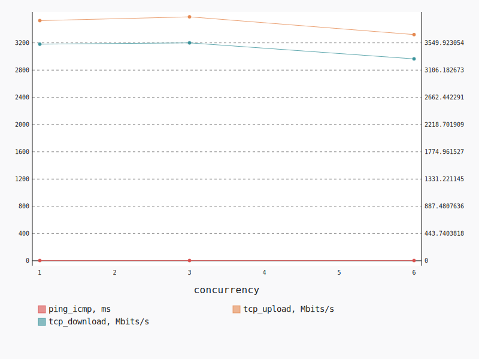
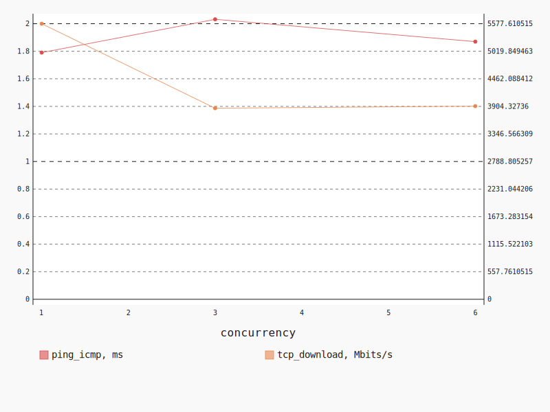
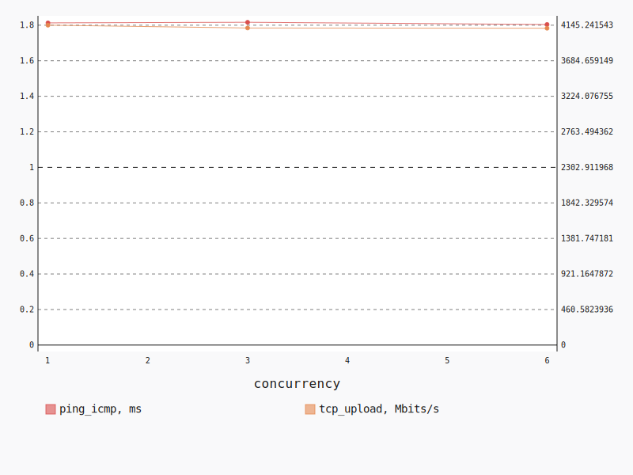

.. _openstack_l2:

OpenStack L2
************

In this scenario Shaker launches pairs of instances in the same tenant network.
Every instance is hosted on a separate compute node, all available compute
nodes are utilized. The traffic goes within the tenant network (L2 domain).

**Scenario**:

.. code-block:: yaml

    deployment:
      accommodation:
      - pair
      - single_room
      template: l2.hot
    description: In this scenario Shaker launches pairs of instances in the same tenant
      network. Every instance is hosted on a separate compute node, all available compute
      nodes are utilized. The traffic goes within the tenant network (L2 domain).
    execution:
      progression: quadratic
      tests:
      - class: flent
        method: tcp_download
        title: Download
      - class: flent
        method: tcp_upload
        title: Upload
      - class: flent
        method: tcp_bidirectional
        title: Bi-directional
    file_name: /root/shaker/lib/python2.7/site-packages/shaker/scenarios/openstack/full_l2_single.yaml
    title: OpenStack L2

Bi-directional
==============

**Test Specification**:

.. code-block:: yaml

    class: flent
    method: tcp_bidirectional
    title: Bi-directional

**Stats**:

===========  =============  =====================  ===================
concurrency  ping_icmp, ms  tcp_download, Mbits/s  tcp_upload, Mbits/s
===========  =============  =====================  ===================
          1           3.17                3529.06              3526.87
          3           3.27                3549.92              3582.21
          6           3.24                3289.19              3321.73
===========  =============  =====================  ===================

Concurrency 1
-------------

**Stats**:

========  =============  =====================  ===================
node      ping_icmp, ms  tcp_download, Mbits/s  tcp_upload, Mbits/s
========  =============  =====================  ===================
cmp-004            3.17                3529.06              3526.87
========  =============  =====================  ===================

Concurrency 3
-------------

**Stats**:

========  =============  =====================  ===================
node      ping_icmp, ms  tcp_download, Mbits/s  tcp_upload, Mbits/s
========  =============  =====================  ===================
cmp-004            3.17                3536.29              3510.17
cmp-005            3.38                3597.04              3590.21
cmp-007            3.27                3516.44              3646.25
========  =============  =====================  ===================

Concurrency 6
-------------

**Stats**:

========  =============  =====================  ===================
node      ping_icmp, ms  tcp_download, Mbits/s  tcp_upload, Mbits/s
========  =============  =====================  ===================
cmp-001            3.39                2908.28              3014.84
cmp-002            3.27                3380.70              3360.96
cmp-004            3.19                3308.41              3423.08
cmp-005            3.30                3336.36              3313.32
cmp-006            3.07                3428.83              3372.69
cmp-007            3.19                3372.58              3445.51
========  =============  =====================  ===================

Download
========

**Test Specification**:

.. code-block:: yaml

    class: flent
    method: tcp_download
    title: Download

**Stats**:

===========  =============  =====================
concurrency  ping_icmp, ms  tcp_download, Mbits/s
===========  =============  =====================
          1           1.79                5577.61
          3           2.03                3866.88
          6           1.87                3909.19
===========  =============  =====================

Concurrency 1
-------------

**Stats**:

========  =============  =====================
node      ping_icmp, ms  tcp_download, Mbits/s
========  =============  =====================
cmp-004            1.79                5577.61
========  =============  =====================

Concurrency 3
-------------

**Stats**:

========  =============  =====================
node      ping_icmp, ms  tcp_download, Mbits/s
========  =============  =====================
cmp-004            2.31                3841.91
cmp-005            1.86                3915.78
cmp-007            1.92                3842.94
========  =============  =====================

Concurrency 6
-------------

**Stats**:

========  =============  =====================
node      ping_icmp, ms  tcp_download, Mbits/s
========  =============  =====================
cmp-001            2.02                3698.51
cmp-002            1.84                3965.49
cmp-004            1.75                3864.82
cmp-005            1.90                3920.75
cmp-006            1.77                4173.29
cmp-007            1.94                3832.28
========  =============  =====================

Upload
======

**Test Specification**:

.. code-block:: yaml

    class: flent
    method: tcp_upload
    title: Upload

**Stats**:

===========  =============  ===================
concurrency  ping_icmp, ms  tcp_upload, Mbits/s
===========  =============  ===================
          1           1.81              4145.24
          3           1.82              4109.04
          6           1.80              4105.77
===========  =============  ===================

Concurrency 1
-------------

**Stats**:

========  =============  ===================
node      ping_icmp, ms  tcp_upload, Mbits/s
========  =============  ===================
cmp-004            1.81              4145.24
========  =============  ===================

Concurrency 3
-------------

**Stats**:

========  =============  ===================
node      ping_icmp, ms  tcp_upload, Mbits/s
========  =============  ===================
cmp-004            1.79              4162.46
cmp-005            1.89              3941.11
cmp-007            1.77              4223.54
========  =============  ===================

Concurrency 6
-------------

**Stats**:

========  =============  ===================
node      ping_icmp, ms  tcp_upload, Mbits/s
========  =============  ===================
cmp-001            1.86              4087.67
cmp-002            1.77              4256.05
cmp-004            1.72              4022.59
cmp-005            1.90              3893.79
cmp-006            1.79              4194.40
cmp-007            1.79              4180.11
========  =============  ===================

