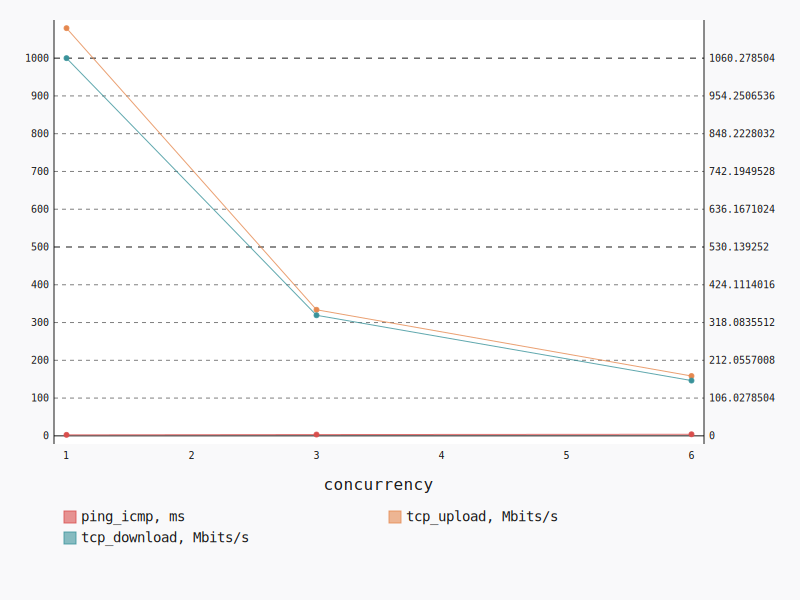
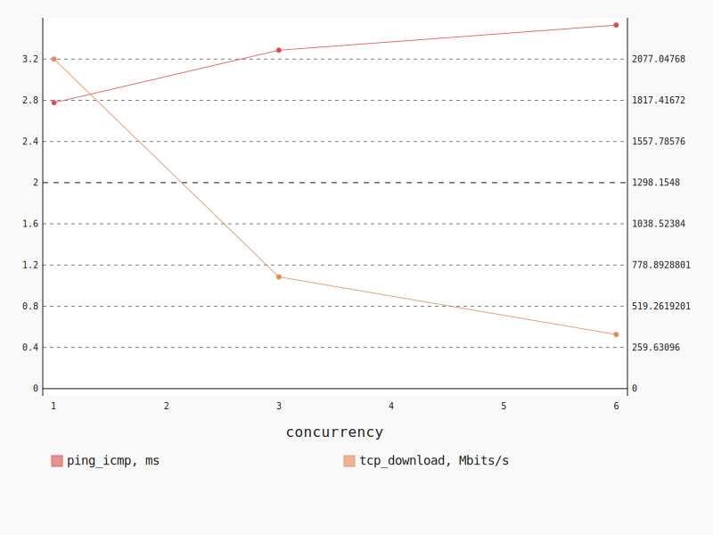
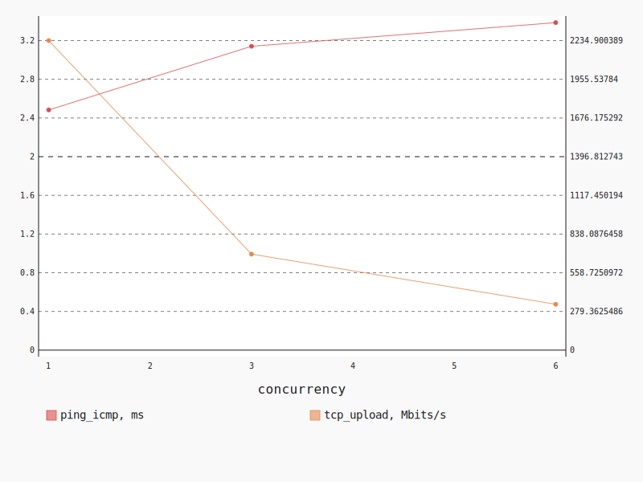

.. _openstack_l3_east_west:

OpenStack L3 East-West
**********************

In this scenario Shaker launches pairs of instances, each instance on its own
compute node. All available compute nodes are utilized. Instances are connected
to one of 2 tenant networks, which plugged into single router. The traffic goes
from one network to the other (L3 east-west).

**Scenario**:

.. code-block:: yaml

    deployment:
      accommodation:
      - pair
      - single_room
      template: l3_east_west.hot
    description: In this scenario Shaker launches pairs of instances, each instance on
      its own compute node. All available compute nodes are utilized. Instances are connected
      to one of 2 tenant networks, which plugged into single router. The traffic goes
      from one network to the other (L3 east-west).
    execution:
      progression: quadratic
      tests:
      - class: flent
        method: tcp_download
        title: Download
      - class: flent
        method: tcp_upload
        title: Upload
      - class: flent
        method: tcp_bidirectional
        title: Bi-directional
    file_name: /root/shaker/lib/python2.7/site-packages/shaker/scenarios/openstack/full_l3_east_west.yaml
    title: OpenStack L3 East-West

Bi-directional
==============

**Test Specification**:

.. code-block:: yaml

    class: flent
    method: tcp_bidirectional
    title: Bi-directional

**Stats**:

===========  =============  =====================  ===================
concurrency  ping_icmp, ms  tcp_download, Mbits/s  tcp_upload, Mbits/s
===========  =============  =====================  ===================
          1           2.64                1060.28              1079.40
          3           3.43                 338.43               333.79
          6           4.14                 155.15               158.43
===========  =============  =====================  ===================

Concurrency 1
-------------

**Stats**:

========  =============  =====================  ===================
node      ping_icmp, ms  tcp_download, Mbits/s  tcp_upload, Mbits/s
========  =============  =====================  ===================
cmp-004            2.64                1060.28              1079.40
========  =============  =====================  ===================

Concurrency 3
-------------

**Stats**:

========  =============  =====================  ===================
node      ping_icmp, ms  tcp_download, Mbits/s  tcp_upload, Mbits/s
========  =============  =====================  ===================
cmp-001            3.33                 338.85               330.20
cmp-004            3.46                 346.08               349.89
cmp-007            3.50                 330.38               321.28
========  =============  =====================  ===================

Concurrency 6
-------------

**Stats**:

========  =============  =====================  ===================
node      ping_icmp, ms  tcp_download, Mbits/s  tcp_upload, Mbits/s
========  =============  =====================  ===================
cmp-001            4.18                 133.94               159.90
cmp-002            4.16                 151.93               170.73
cmp-004            4.09                 164.14               178.18
cmp-005            4.15                 161.21               137.25
cmp-006            4.13                 147.60               157.07
cmp-007            4.12                 172.07               147.47
========  =============  =====================  ===================

Download
========

**Test Specification**:

.. code-block:: yaml

    class: flent
    method: tcp_download
    title: Download

**Stats**:

===========  =============  =====================
concurrency  ping_icmp, ms  tcp_download, Mbits/s
===========  =============  =====================
          1           2.78                2077.05
          3           3.29                 704.15
          6           3.53                 341.03
===========  =============  =====================

Concurrency 1
-------------

**Stats**:

========  =============  =====================
node      ping_icmp, ms  tcp_download, Mbits/s
========  =============  =====================
cmp-004            2.78                2077.05
========  =============  =====================

Concurrency 3
-------------

**Stats**:

========  =============  =====================
node      ping_icmp, ms  tcp_download, Mbits/s
========  =============  =====================
cmp-001            3.32                 616.30
cmp-004            3.30                 760.05
cmp-007            3.24                 736.09
========  =============  =====================

Concurrency 6
-------------

**Stats**:

========  =============  =====================
node      ping_icmp, ms  tcp_download, Mbits/s
========  =============  =====================
cmp-001            3.47                 334.82
cmp-002            3.61                 330.62
cmp-004            3.45                 340.38
cmp-005            3.59                 346.85
cmp-006            3.60                 358.85
cmp-007            3.46                 334.66
========  =============  =====================

Upload
======

**Test Specification**:

.. code-block:: yaml

    class: flent
    method: tcp_upload
    title: Upload

**Stats**:

===========  =============  ===================
concurrency  ping_icmp, ms  tcp_upload, Mbits/s
===========  =============  ===================
          1           2.48              2234.90
          3           3.14               693.16
          6           3.39               331.22
===========  =============  ===================

Concurrency 1
-------------

**Stats**:

========  =============  ===================
node      ping_icmp, ms  tcp_upload, Mbits/s
========  =============  ===================
cmp-004            2.48              2234.90
========  =============  ===================

Concurrency 3
-------------

**Stats**:

========  =============  ===================
node      ping_icmp, ms  tcp_upload, Mbits/s
========  =============  ===================
cmp-001            3.24               713.85
cmp-004            3.14               702.43
cmp-007            3.05               663.19
========  =============  ===================

Concurrency 6
-------------

**Stats**:

========  =============  ===================
node      ping_icmp, ms  tcp_upload, Mbits/s
========  =============  ===================
cmp-001            3.47               333.41
cmp-002            3.45               352.29
cmp-004            3.28               332.42
cmp-005            3.39               307.32
cmp-006            3.35               356.55
cmp-007            3.37               305.31
========  =============  ===================

