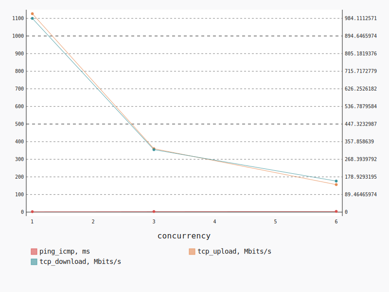
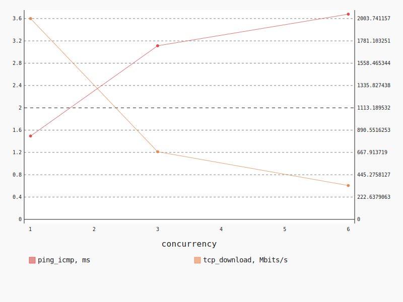
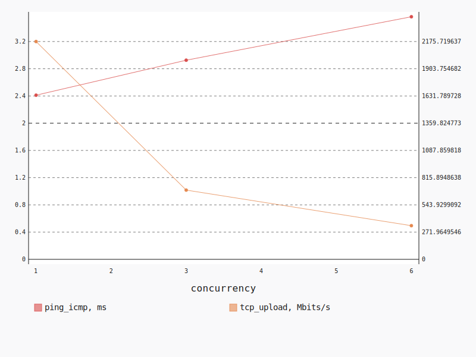

.. _openstack_l3_east_west:

OpenStack L3 East-West
**********************

In this scenario Shaker launches pairs of instances, each instance on its own
compute node. All available compute nodes are utilized. Instances are connected
to one of 2 tenant networks, which plugged into single router. The traffic goes
from one network to the other (L3 east-west).

**Scenario**:

.. code-block:: yaml

    deployment:
      accommodation:
      - pair
      - single_room
      template: l3_east_west.hot
    description: In this scenario Shaker launches pairs of instances, each instance on
      its own compute node. All available compute nodes are utilized. Instances are connected
      to one of 2 tenant networks, which plugged into single router. The traffic goes
      from one network to the other (L3 east-west).
    execution:
      progression: quadratic
      tests:
      - class: flent
        method: tcp_download
        title: Download
      - class: flent
        method: tcp_upload
        title: Upload
      - class: flent
        method: tcp_bidirectional
        title: Bi-directional
    file_name: /root/shaker/lib/python2.7/site-packages/shaker/scenarios/openstack/full_l3_east_west.yaml
    title: OpenStack L3 East-West

Bi-directional
==============

**Test Specification**:

.. code-block:: yaml

    class: flent
    method: tcp_bidirectional
    title: Bi-directional

**Stats**:

===========  =============  =====================  ===================
concurrency  ping_icmp, ms  tcp_download, Mbits/s  tcp_upload, Mbits/s
===========  =============  =====================  ===================
          1           2.43                 984.11              1126.54
          3           3.31                 317.18               359.98
          6           4.10                 157.68               156.16
===========  =============  =====================  ===================

Concurrency 1
-------------

**Stats**:

========  =============  =====================  ===================
node      ping_icmp, ms  tcp_download, Mbits/s  tcp_upload, Mbits/s
========  =============  =====================  ===================
cmp-002            2.43                 984.11              1126.54
========  =============  =====================  ===================

Concurrency 3
-------------

**Stats**:

========  =============  =====================  ===================
node      ping_icmp, ms  tcp_download, Mbits/s  tcp_upload, Mbits/s
========  =============  =====================  ===================
cmp-001            3.32                 320.02               339.77
cmp-002            3.35                 317.72               370.03
cmp-006            3.24                 313.80               370.14
========  =============  =====================  ===================

Concurrency 6
-------------

**Stats**:

========  =============  =====================  ===================
node      ping_icmp, ms  tcp_download, Mbits/s  tcp_upload, Mbits/s
========  =============  =====================  ===================
cmp-001            4.16                 160.41               148.60
cmp-002            4.13                 148.32               168.65
cmp-004            4.07                 164.80               160.59
cmp-005            4.03                 161.67               157.40
cmp-006            4.05                 157.36               153.77
cmp-007            4.14                 153.52               147.96
========  =============  =====================  ===================

Download
========

**Test Specification**:

.. code-block:: yaml

    class: flent
    method: tcp_download
    title: Download

**Stats**:

===========  =============  =====================
concurrency  ping_icmp, ms  tcp_download, Mbits/s
===========  =============  =====================
          1           1.49                2003.74
          3           3.11                 674.78
          6           3.68                 337.66
===========  =============  =====================

Concurrency 1
-------------

**Stats**:

========  =============  =====================
node      ping_icmp, ms  tcp_download, Mbits/s
========  =============  =====================
cmp-002            1.49                2003.74
========  =============  =====================

Concurrency 3
-------------

**Stats**:

========  =============  =====================
node      ping_icmp, ms  tcp_download, Mbits/s
========  =============  =====================
cmp-001            3.15                 651.52
cmp-002            3.02                 668.05
cmp-006            3.16                 704.78
========  =============  =====================

Concurrency 6
-------------

**Stats**:

========  =============  =====================
node      ping_icmp, ms  tcp_download, Mbits/s
========  =============  =====================
cmp-001            3.69                 317.60
cmp-002            3.67                 322.32
cmp-004            3.68                 342.70
cmp-005            3.64                 372.46
cmp-006            3.65                 345.49
cmp-007            3.75                 325.40
========  =============  =====================

Upload
======

**Test Specification**:

.. code-block:: yaml

    class: flent
    method: tcp_upload
    title: Upload

**Stats**:

===========  =============  ===================
concurrency  ping_icmp, ms  tcp_upload, Mbits/s
===========  =============  ===================
          1           2.41              2175.72
          3           2.93               691.59
          6           3.56               336.15
===========  =============  ===================

Concurrency 1
-------------

**Stats**:

========  =============  ===================
node      ping_icmp, ms  tcp_upload, Mbits/s
========  =============  ===================
cmp-002            2.41              2175.72
========  =============  ===================

Concurrency 3
-------------

**Stats**:

========  =============  ===================
node      ping_icmp, ms  tcp_upload, Mbits/s
========  =============  ===================
cmp-001            2.87               694.63
cmp-002            2.93               673.11
cmp-006            2.98               707.04
========  =============  ===================

Concurrency 6
-------------

**Stats**:

========  =============  ===================
node      ping_icmp, ms  tcp_upload, Mbits/s
========  =============  ===================
cmp-001            3.59               311.73
cmp-002            3.60               333.18
cmp-004            3.64               358.44
cmp-005            3.62               325.65
cmp-006            3.40               334.43
cmp-007            3.54               353.44
========  =============  ===================

