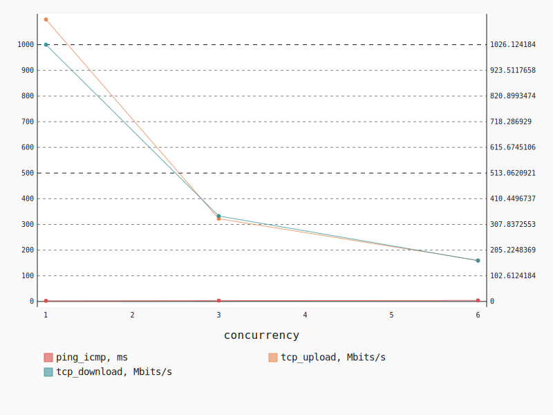
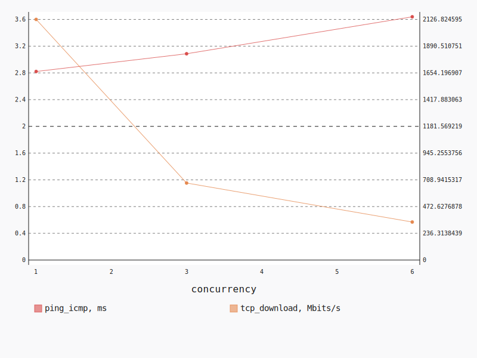
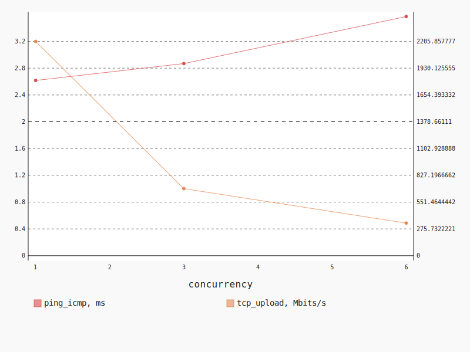

.. _openstack_l3_east_west:

OpenStack L3 East-West
**********************

In this scenario Shaker launches pairs of instances, each instance on its own
compute node. All available compute nodes are utilized. Instances are connected
to one of 2 tenant networks, which plugged into single router. The traffic goes
from one network to the other (L3 east-west).

**Scenario**:

.. code-block:: yaml

    deployment:
      accommodation:
      - pair
      - single_room
      template: l3_east_west.hot
    description: In this scenario Shaker launches pairs of instances, each instance on
      its own compute node. All available compute nodes are utilized. Instances are connected
      to one of 2 tenant networks, which plugged into single router. The traffic goes
      from one network to the other (L3 east-west).
    execution:
      progression: quadratic
      tests:
      - class: flent
        method: tcp_download
        title: Download
      - class: flent
        method: tcp_upload
        title: Upload
      - class: flent
        method: tcp_bidirectional
        title: Bi-directional
    file_name: /root/shaker/lib/python2.7/site-packages/shaker/scenarios/openstack/full_l3_east_west.yaml
    title: OpenStack L3 East-West

Bi-directional
==============

**Test Specification**:

.. code-block:: yaml

    class: flent
    method: tcp_bidirectional
    title: Bi-directional

**Stats**:

===========  =============  =====================  ===================
concurrency  ping_icmp, ms  tcp_download, Mbits/s  tcp_upload, Mbits/s
===========  =============  =====================  ===================
          1           2.61                1026.12              1098.15
          3           3.49                 341.38               322.13
          6           4.15                 163.10               159.88
===========  =============  =====================  ===================

Concurrency 1
-------------

**Stats**:

========  =============  =====================  ===================
node      ping_icmp, ms  tcp_download, Mbits/s  tcp_upload, Mbits/s
========  =============  =====================  ===================
cmp-004            2.61                1026.12              1098.15
========  =============  =====================  ===================

Concurrency 3
-------------

**Stats**:

========  =============  =====================  ===================
node      ping_icmp, ms  tcp_download, Mbits/s  tcp_upload, Mbits/s
========  =============  =====================  ===================
cmp-004            3.47                 326.29               365.54
cmp-005            3.54                 347.11               291.61
cmp-007            3.47                 350.73               309.24
========  =============  =====================  ===================

Concurrency 6
-------------

**Stats**:

========  =============  =====================  ===================
node      ping_icmp, ms  tcp_download, Mbits/s  tcp_upload, Mbits/s
========  =============  =====================  ===================
cmp-001            4.17                 154.90               156.80
cmp-002            4.19                 158.18               157.36
cmp-004            4.14                 173.86               178.07
cmp-005            4.15                 183.87               145.18
cmp-006            4.13                 154.22               167.59
cmp-007            4.13                 153.55               154.27
========  =============  =====================  ===================

Download
========

**Test Specification**:

.. code-block:: yaml

    class: flent
    method: tcp_download
    title: Download

**Stats**:

===========  =============  =====================
concurrency  ping_icmp, ms  tcp_download, Mbits/s
===========  =============  =====================
          1           2.82                2126.82
          3           3.09                 680.84
          6           3.64                 336.09
===========  =============  =====================

Concurrency 1
-------------

**Stats**:

========  =============  =====================
node      ping_icmp, ms  tcp_download, Mbits/s
========  =============  =====================
cmp-004            2.82                2126.82
========  =============  =====================

Concurrency 3
-------------

**Stats**:

========  =============  =====================
node      ping_icmp, ms  tcp_download, Mbits/s
========  =============  =====================
cmp-004            3.13                 701.88
cmp-005            3.05                 678.69
cmp-007            3.07                 661.94
========  =============  =====================

Concurrency 6
-------------

**Stats**:

========  =============  =====================
node      ping_icmp, ms  tcp_download, Mbits/s
========  =============  =====================
cmp-001            3.74                 327.23
cmp-002            3.73                 326.34
cmp-004            3.51                 344.19
cmp-005            3.61                 340.80
cmp-006            3.74                 321.10
cmp-007            3.51                 356.90
========  =============  =====================

Upload
======

**Test Specification**:

.. code-block:: yaml

    class: flent
    method: tcp_upload
    title: Upload

**Stats**:

===========  =============  ===================
concurrency  ping_icmp, ms  tcp_upload, Mbits/s
===========  =============  ===================
          1           2.62              2205.86
          3           2.87               690.18
          6           3.57               335.43
===========  =============  ===================

Concurrency 1
-------------

**Stats**:

========  =============  ===================
node      ping_icmp, ms  tcp_upload, Mbits/s
========  =============  ===================
cmp-004            2.62              2205.86
========  =============  ===================

Concurrency 3
-------------

**Stats**:

========  =============  ===================
node      ping_icmp, ms  tcp_upload, Mbits/s
========  =============  ===================
cmp-004            2.81               821.70
cmp-005            2.88               635.49
cmp-007            2.92               613.36
========  =============  ===================

Concurrency 6
-------------

**Stats**:

========  =============  ===================
node      ping_icmp, ms  tcp_upload, Mbits/s
========  =============  ===================
cmp-001            3.59               323.70
cmp-002            3.61               359.26
cmp-004            3.54               343.44
cmp-005            3.60               313.44
cmp-006            3.57               365.05
cmp-007            3.52               307.66
========  =============  ===================

