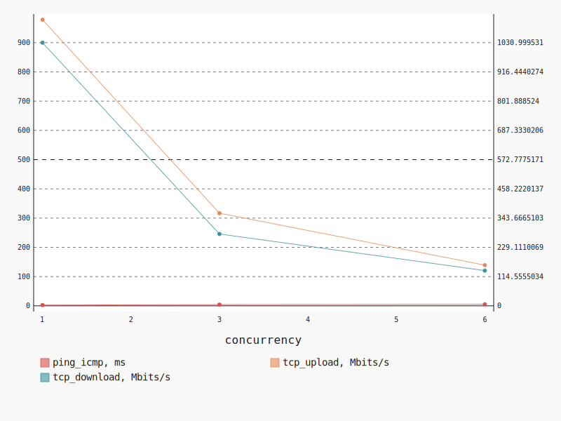
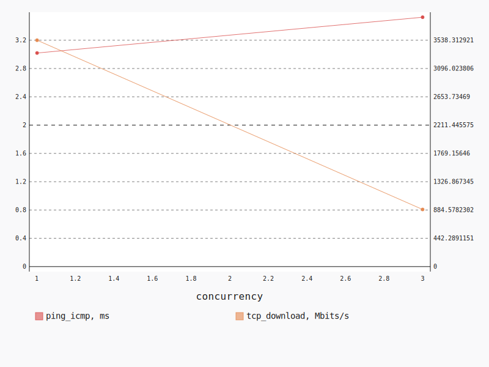
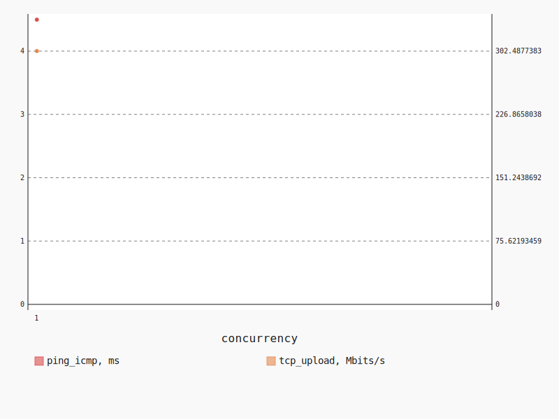

.. _openstack_l3_north_south:

OpenStack L3 North-South
************************

In this scenario Shaker launches pairs of instances on different compute nodes.
All available compute nodes are utilized. Instances are in different networks
connected to different routers, master accesses slave by floating ip. The
traffic goes from one network via external network to the other network.

**Scenario**:

.. code-block:: yaml

    deployment:
      accommodation:
      - pair
      - single_room
      template: l3_north_south.hot
    description: In this scenario Shaker launches pairs of instances on different compute
      nodes. All available compute nodes are utilized. Instances are in different networks
      connected to different routers, master accesses slave by floating ip. The traffic
      goes from one network via external network to the other network.
    execution:
      progression: quadratic
      tests:
      - class: flent
        method: tcp_download
        title: Download
      - class: flent
        method: tcp_upload
        title: Upload
      - class: flent
        method: tcp_bidirectional
        title: Bi-directional
    file_name: /root/shaker/lib/python2.7/site-packages/shaker/scenarios/openstack/full_l3_north_south.yaml
    title: OpenStack L3 North-South

**Errors**:

.. code-block:: yaml

    agent: shaker_dsekti_master_1
    command:
      data: zcat `flent -H 10.12.1.23 -l 60 -s 1 tcp_upload 2>&1 | grep "file written"
        | grep -Po "\./\S+gz"`
      type: script
    concurrency: 3
    executor: flent
    id: 5ec9ef5a-2f34-4d09-b13d-ac0c58dcf825
    node: cmp-002
    scenario: OpenStack L3 North-South
    schedule: 1527913500.987938
    stats: {}
    status: lost
    test: Upload
    type: agent

.. code-block:: yaml

    agent: shaker_dsekti_master_1
    command:
      data: zcat `flent -H 10.12.1.23 -l 60 -s 1 tcp_download 2>&1 | grep "file written"
        | grep -Po "\./\S+gz"`
      type: script
    concurrency: 6
    executor: flent
    id: 3de31512-601f-4ccd-aa57-7410a572829d
    node: cmp-002
    scenario: OpenStack L3 North-South
    schedule: 1527913318.670581
    stats: {}
    status: lost
    test: Download
    type: agent

.. code-block:: yaml

    agent: shaker_dsekti_master_5
    command:
      data: zcat `flent -H 10.12.1.15 -l 60 -s 1 tcp_upload 2>&1 | grep "file written"
        | grep -Po "\./\S+gz"`
      type: script
    concurrency: 3
    executor: flent
    id: 79005d97-f107-4594-ac95-aa84ad7d0b75
    node: cmp-007
    scenario: OpenStack L3 North-South
    schedule: 1527913500.987938
    stats: {}
    status: lost
    test: Upload
    type: agent

.. code-block:: yaml

    agent: shaker_dsekti_master_4
    command:
      data: zcat `flent -H 10.12.1.12 -l 60 -s 1 tcp_upload 2>&1 | grep "file written"
        | grep -Po "\./\S+gz"`
      type: script
    concurrency: 3
    executor: flent
    id: 4d73d702-2bef-4857-be03-35d8e9bc2ec8
    node: cmp-004
    scenario: OpenStack L3 North-South
    schedule: 1527913500.987938
    stats: {}
    status: lost
    test: Upload
    type: agent

.. code-block:: yaml

    agent: shaker_dsekti_master_2
    command:
      data: zcat `flent -H 10.12.1.19 -l 60 -s 1 tcp_download 2>&1 | grep "file written"
        | grep -Po "\./\S+gz"`
      type: script
    concurrency: 6
    executor: flent
    id: 59c0543c-ef44-4588-a629-b10ab9ad1cc5
    node: cmp-005
    scenario: OpenStack L3 North-South
    schedule: 1527913318.670581
    stats: {}
    status: lost
    test: Download
    type: agent

.. code-block:: yaml

    agent: shaker_dsekti_master_5
    command:
      data: zcat `flent -H 10.12.1.15 -l 60 -s 1 tcp_download 2>&1 | grep "file written"
        | grep -Po "\./\S+gz"`
      type: script
    concurrency: 6
    executor: flent
    id: 539b6b58-df80-4121-88cd-3fea2a17f8c5
    node: cmp-007
    scenario: OpenStack L3 North-South
    schedule: 1527913318.670581
    stats: {}
    status: lost
    test: Download
    type: agent

.. code-block:: yaml

    agent: shaker_dsekti_master_3
    command:
      data: zcat `flent -H 10.12.1.8 -l 60 -s 1 tcp_download 2>&1 | grep "file written"
        | grep -Po "\./\S+gz"`
      type: script
    concurrency: 6
    executor: flent
    id: e5b0bea7-0bfa-4723-9316-d27c3570b80a
    node: cmp-006
    scenario: OpenStack L3 North-South
    schedule: 1527913318.670581
    stats: {}
    status: lost
    test: Download
    type: agent

.. code-block:: yaml

    agent: shaker_dsekti_master_4
    command:
      data: zcat `flent -H 10.12.1.12 -l 60 -s 1 tcp_download 2>&1 | grep "file written"
        | grep -Po "\./\S+gz"`
      type: script
    concurrency: 6
    executor: flent
    id: b86d634e-e768-48c8-ad85-689f7fae1f9c
    node: cmp-004
    scenario: OpenStack L3 North-South
    schedule: 1527913318.670581
    stats: {}
    status: lost
    test: Download
    type: agent

.. code-block:: yaml

    agent: shaker_dsekti_master_5
    command:
      data: zcat `flent -H 10.12.1.15 -l 60 -s 1 tcp_upload 2>&1 | grep "file written"
        | grep -Po "\./\S+gz"`
      type: script
    concurrency: 1
    executor: flent
    id: fca802e4-a195-4756-ba48-32b0cc41a068
    node: cmp-007
    scenario: OpenStack L3 North-South
    schedule: 1527913480.96597
    stats: {}
    status: lost
    test: Upload
    type: agent

.. code-block:: yaml

    agent: shaker_dsekti_master_0
    command:
      data: zcat `flent -H 10.12.1.3 -l 60 -s 1 tcp_download 2>&1 | grep "file written"
        | grep -Po "\./\S+gz"`
      type: script
    concurrency: 6
    executor: flent
    id: 0bbb0f66-e721-4f9c-bd62-c5fc159ee2a8
    node: cmp-001
    scenario: OpenStack L3 North-South
    schedule: 1527913318.670581
    stats: {}
    status: lost
    test: Download
    type: agent

Bi-directional
==============

**Test Specification**:

.. code-block:: yaml

    class: flent
    method: tcp_bidirectional
    title: Bi-directional

**Stats**:

===========  =============  =====================  ===================
concurrency  ping_icmp, ms  tcp_download, Mbits/s  tcp_upload, Mbits/s
===========  =============  =====================  ===================
          1           2.66                1031.00               978.35
          3           4.18                 281.45               316.74
          6           5.27                 137.97               139.13
===========  =============  =====================  ===================

Concurrency 1
-------------

**Stats**:

========  =============  =====================  ===================
node      ping_icmp, ms  tcp_download, Mbits/s  tcp_upload, Mbits/s
========  =============  =====================  ===================
cmp-007            2.66                1031.00               978.35
========  =============  =====================  ===================

Concurrency 3
-------------

**Stats**:

========  =============  =====================  ===================
node      ping_icmp, ms  tcp_download, Mbits/s  tcp_upload, Mbits/s
========  =============  =====================  ===================
cmp-002            4.16                 269.29               304.09
cmp-004            4.20                 297.85               331.36
cmp-007            4.17                 277.20               314.76
========  =============  =====================  ===================

Concurrency 6
-------------

**Stats**:

========  =============  =====================  ===================
node      ping_icmp, ms  tcp_download, Mbits/s  tcp_upload, Mbits/s
========  =============  =====================  ===================
cmp-001            5.32                 136.32               137.38
cmp-002            5.20                 135.68               139.38
cmp-004            5.27                 147.44               142.29
cmp-005            5.34                 143.80               144.03
cmp-006            5.20                 130.37               143.15
cmp-007            5.31                 134.22               128.57
========  =============  =====================  ===================

Download
========

**Test Specification**:

.. code-block:: yaml

    class: flent
    method: tcp_download
    title: Download

**Stats**:

===========  =============  =====================
concurrency  ping_icmp, ms  tcp_download, Mbits/s
===========  =============  =====================
          1           3.02                3538.31
          3           3.52                 892.88
          6  n/a            n/a
===========  =============  =====================

Concurrency 1
-------------

**Stats**:

========  =============  =====================
node      ping_icmp, ms  tcp_download, Mbits/s
========  =============  =====================
cmp-007            3.02                3538.31
========  =============  =====================

Concurrency 3
-------------

**Stats**:

========  =============  =====================
node      ping_icmp, ms  tcp_download, Mbits/s
========  =============  =====================
cmp-002            3.50                 827.42
cmp-004            3.70                1186.88
cmp-007            3.37                 664.34
========  =============  =====================

Concurrency 6
-------------

**Errors**:

.. code-block:: yaml

    agent: shaker_dsekti_master_1
    command:
      data: zcat `flent -H 10.12.1.23 -l 60 -s 1 tcp_download 2>&1 | grep "file written"
        | grep -Po "\./\S+gz"`
      type: script
    concurrency: 6
    executor: flent
    id: 3de31512-601f-4ccd-aa57-7410a572829d
    node: cmp-002
    scenario: OpenStack L3 North-South
    schedule: 1527913318.670581
    stats: {}
    status: lost
    test: Download
    type: agent

.. code-block:: yaml

    agent: shaker_dsekti_master_2
    command:
      data: zcat `flent -H 10.12.1.19 -l 60 -s 1 tcp_download 2>&1 | grep "file written"
        | grep -Po "\./\S+gz"`
      type: script
    concurrency: 6
    executor: flent
    id: 59c0543c-ef44-4588-a629-b10ab9ad1cc5
    node: cmp-005
    scenario: OpenStack L3 North-South
    schedule: 1527913318.670581
    stats: {}
    status: lost
    test: Download
    type: agent

.. code-block:: yaml

    agent: shaker_dsekti_master_5
    command:
      data: zcat `flent -H 10.12.1.15 -l 60 -s 1 tcp_download 2>&1 | grep "file written"
        | grep -Po "\./\S+gz"`
      type: script
    concurrency: 6
    executor: flent
    id: 539b6b58-df80-4121-88cd-3fea2a17f8c5
    node: cmp-007
    scenario: OpenStack L3 North-South
    schedule: 1527913318.670581
    stats: {}
    status: lost
    test: Download
    type: agent

.. code-block:: yaml

    agent: shaker_dsekti_master_3
    command:
      data: zcat `flent -H 10.12.1.8 -l 60 -s 1 tcp_download 2>&1 | grep "file written"
        | grep -Po "\./\S+gz"`
      type: script
    concurrency: 6
    executor: flent
    id: e5b0bea7-0bfa-4723-9316-d27c3570b80a
    node: cmp-006
    scenario: OpenStack L3 North-South
    schedule: 1527913318.670581
    stats: {}
    status: lost
    test: Download
    type: agent

.. code-block:: yaml

    agent: shaker_dsekti_master_4
    command:
      data: zcat `flent -H 10.12.1.12 -l 60 -s 1 tcp_download 2>&1 | grep "file written"
        | grep -Po "\./\S+gz"`
      type: script
    concurrency: 6
    executor: flent
    id: b86d634e-e768-48c8-ad85-689f7fae1f9c
    node: cmp-004
    scenario: OpenStack L3 North-South
    schedule: 1527913318.670581
    stats: {}
    status: lost
    test: Download
    type: agent

.. code-block:: yaml

    agent: shaker_dsekti_master_0
    command:
      data: zcat `flent -H 10.12.1.3 -l 60 -s 1 tcp_download 2>&1 | grep "file written"
        | grep -Po "\./\S+gz"`
      type: script
    concurrency: 6
    executor: flent
    id: 0bbb0f66-e721-4f9c-bd62-c5fc159ee2a8
    node: cmp-001
    scenario: OpenStack L3 North-South
    schedule: 1527913318.670581
    stats: {}
    status: lost
    test: Download
    type: agent

Upload
======

**Test Specification**:

.. code-block:: yaml

    class: flent
    method: tcp_upload
    title: Upload

**Stats**:

===========
concurrency
===========
          1
          3
          6
===========

Concurrency 1
-------------

**Errors**:

.. code-block:: yaml

    agent: shaker_dsekti_master_5
    command:
      data: zcat `flent -H 10.12.1.15 -l 60 -s 1 tcp_upload 2>&1 | grep "file written"
        | grep -Po "\./\S+gz"`
      type: script
    concurrency: 1
    executor: flent
    id: fca802e4-a195-4756-ba48-32b0cc41a068
    node: cmp-007
    scenario: OpenStack L3 North-South
    schedule: 1527913480.96597
    stats: {}
    status: lost
    test: Upload
    type: agent

Concurrency 3
-------------

**Errors**:

.. code-block:: yaml

    agent: shaker_dsekti_master_1
    command:
      data: zcat `flent -H 10.12.1.23 -l 60 -s 1 tcp_upload 2>&1 | grep "file written"
        | grep -Po "\./\S+gz"`
      type: script
    concurrency: 3
    executor: flent
    id: 5ec9ef5a-2f34-4d09-b13d-ac0c58dcf825
    node: cmp-002
    scenario: OpenStack L3 North-South
    schedule: 1527913500.987938
    stats: {}
    status: lost
    test: Upload
    type: agent

.. code-block:: yaml

    agent: shaker_dsekti_master_5
    command:
      data: zcat `flent -H 10.12.1.15 -l 60 -s 1 tcp_upload 2>&1 | grep "file written"
        | grep -Po "\./\S+gz"`
      type: script
    concurrency: 3
    executor: flent
    id: 79005d97-f107-4594-ac95-aa84ad7d0b75
    node: cmp-007
    scenario: OpenStack L3 North-South
    schedule: 1527913500.987938
    stats: {}
    status: lost
    test: Upload
    type: agent

.. code-block:: yaml

    agent: shaker_dsekti_master_4
    command:
      data: zcat `flent -H 10.12.1.12 -l 60 -s 1 tcp_upload 2>&1 | grep "file written"
        | grep -Po "\./\S+gz"`
      type: script
    concurrency: 3
    executor: flent
    id: 4d73d702-2bef-4857-be03-35d8e9bc2ec8
    node: cmp-004
    scenario: OpenStack L3 North-South
    schedule: 1527913500.987938
    stats: {}
    status: lost
    test: Upload
    type: agent

Concurrency 6
-------------

**Stats**:

========  =============  ===================
node      ping_icmp, ms  tcp_upload, Mbits/s
========  =============  ===================
cmp-001            4.35               287.46
cmp-002            4.59               313.31
cmp-004            4.42               301.15
cmp-005            4.93               293.34
cmp-006            4.47               313.66
cmp-007            4.21               306.01
========  =============  ===================

