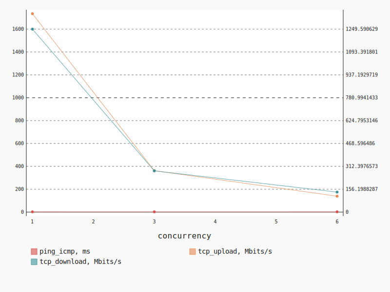
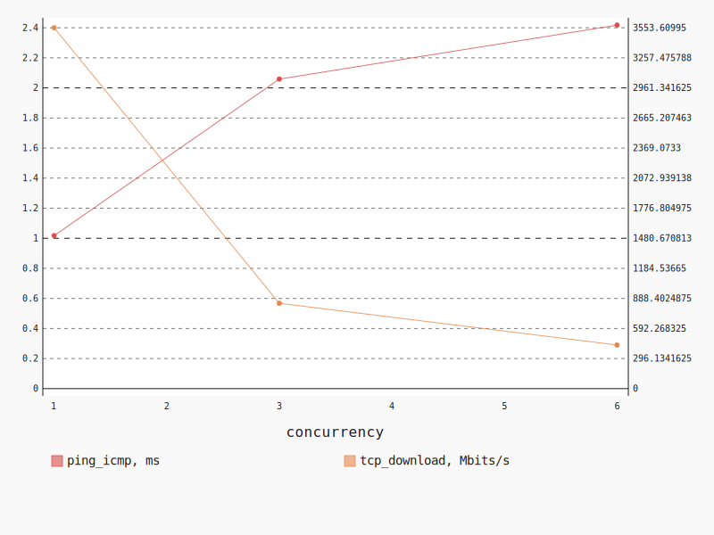
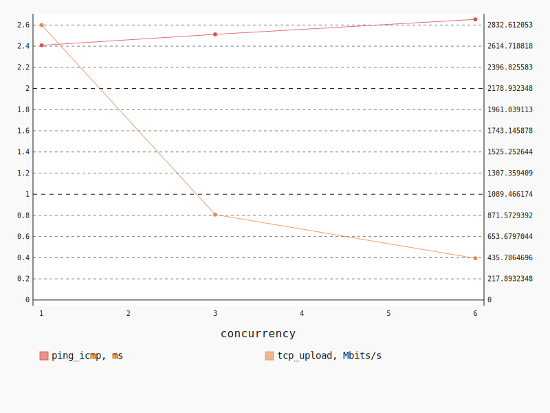

.. _openstack_l3_north_south:

OpenStack L3 North-South
************************

In this scenario Shaker launches pairs of instances on different compute nodes.
All available compute nodes are utilized. Instances are in different networks
connected to different routers, master accesses slave by floating ip. The
traffic goes from one network via external network to the other network.

**Scenario**:

.. code-block:: yaml

    deployment:
      accommodation:
      - pair
      - single_room
      template: l3_north_south.hot
    description: In this scenario Shaker launches pairs of instances on different compute
      nodes. All available compute nodes are utilized. Instances are in different networks
      connected to different routers, master accesses slave by floating ip. The traffic
      goes from one network via external network to the other network.
    execution:
      progression: quadratic
      tests:
      - class: flent
        method: tcp_download
        title: Download
      - class: flent
        method: tcp_upload
        title: Upload
      - class: flent
        method: tcp_bidirectional
        title: Bi-directional
    file_name: /root/shaker/lib/python2.7/site-packages/shaker/scenarios/openstack/full_l3_north_south.yaml
    title: OpenStack L3 North-South

Bi-directional
==============

**Test Specification**:

.. code-block:: yaml

    class: flent
    method: tcp_bidirectional
    title: Bi-directional

**Stats**:

===========  =============  =====================  ===================
concurrency  ping_icmp, ms  tcp_download, Mbits/s  tcp_upload, Mbits/s
===========  =============  =====================  ===================
          1           2.53                1249.59              1734.90
          3           2.33                 281.77               362.53
          6           2.53                 136.76               139.27
===========  =============  =====================  ===================

Concurrency 1
-------------

**Stats**:

========  =============  =====================  ===================
node      ping_icmp, ms  tcp_download, Mbits/s  tcp_upload, Mbits/s
========  =============  =====================  ===================
cmp-004            2.53                1249.59              1734.90
========  =============  =====================  ===================

Concurrency 3
-------------

**Stats**:

========  =============  =====================  ===================
node      ping_icmp, ms  tcp_download, Mbits/s  tcp_upload, Mbits/s
========  =============  =====================  ===================
cmp-004            2.39                 300.62               638.70
cmp-005            2.18                 309.03               200.53
cmp-007            2.41                 235.67               248.36
========  =============  =====================  ===================

Concurrency 6
-------------

**Stats**:

========  =============  =====================  ===================
node      ping_icmp, ms  tcp_download, Mbits/s  tcp_upload, Mbits/s
========  =============  =====================  ===================
cmp-001            2.81                 104.31               104.90
cmp-002            2.54                 111.62               204.48
cmp-004            2.35                 229.74               177.09
cmp-005            2.42                 168.11                98.69
cmp-006            2.59                 101.40               162.77
cmp-007            2.46                 105.39                87.68
========  =============  =====================  ===================

Download
========

**Test Specification**:

.. code-block:: yaml

    class: flent
    method: tcp_download
    title: Download

**Stats**:

===========  =============  =====================
concurrency  ping_icmp, ms  tcp_download, Mbits/s
===========  =============  =====================
          1           1.02                3553.61
          3           2.06                 840.24
          6           2.42                 429.53
===========  =============  =====================

Concurrency 1
-------------

**Stats**:

========  =============  =====================
node      ping_icmp, ms  tcp_download, Mbits/s
========  =============  =====================
cmp-004            1.02                3553.61
========  =============  =====================

Concurrency 3
-------------

**Stats**:

========  =============  =====================
node      ping_icmp, ms  tcp_download, Mbits/s
========  =============  =====================
cmp-004            1.84                 710.42
cmp-005            2.22                 683.69
cmp-007            2.11                1126.60
========  =============  =====================

Concurrency 6
-------------

**Stats**:

========  =============  =====================
node      ping_icmp, ms  tcp_download, Mbits/s
========  =============  =====================
cmp-001            2.28                 397.57
cmp-002            2.46                 424.88
cmp-004            2.34                 423.49
cmp-005            2.36                 425.55
cmp-006            2.41                 461.41
cmp-007            2.65                 444.26
========  =============  =====================

Upload
======

**Test Specification**:

.. code-block:: yaml

    class: flent
    method: tcp_upload
    title: Upload

**Stats**:

===========  =============  ===================
concurrency  ping_icmp, ms  tcp_upload, Mbits/s
===========  =============  ===================
          1           2.41              2832.61
          3           2.51               879.79
          6           2.65               429.82
===========  =============  ===================

Concurrency 1
-------------

**Stats**:

========  =============  ===================
node      ping_icmp, ms  tcp_upload, Mbits/s
========  =============  ===================
cmp-004            2.41              2832.61
========  =============  ===================

Concurrency 3
-------------

**Stats**:

========  =============  ===================
node      ping_icmp, ms  tcp_upload, Mbits/s
========  =============  ===================
cmp-004            2.71               852.65
cmp-005            2.21               914.80
cmp-007            2.62               871.91
========  =============  ===================

Concurrency 6
-------------

**Stats**:

========  =============  ===================
node      ping_icmp, ms  tcp_upload, Mbits/s
========  =============  ===================
cmp-001            2.54               425.61
cmp-002            2.72               418.22
cmp-004            2.45               485.61
cmp-005            2.48               418.24
cmp-006            3.12               417.53
cmp-007            2.61               413.68
========  =============  ===================

