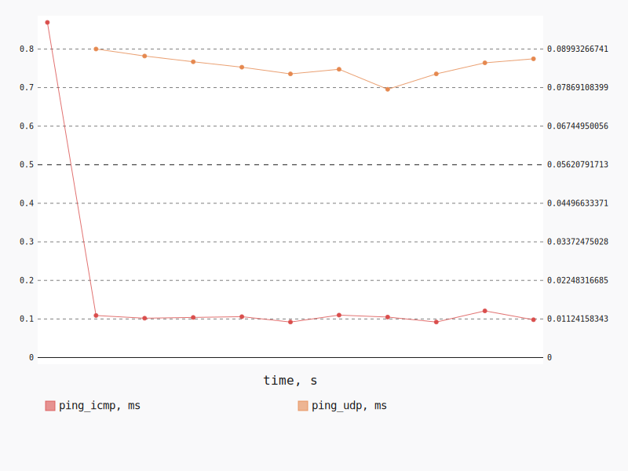
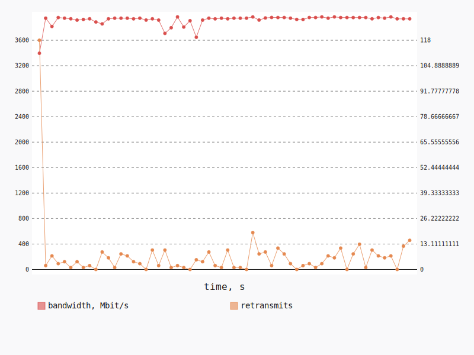
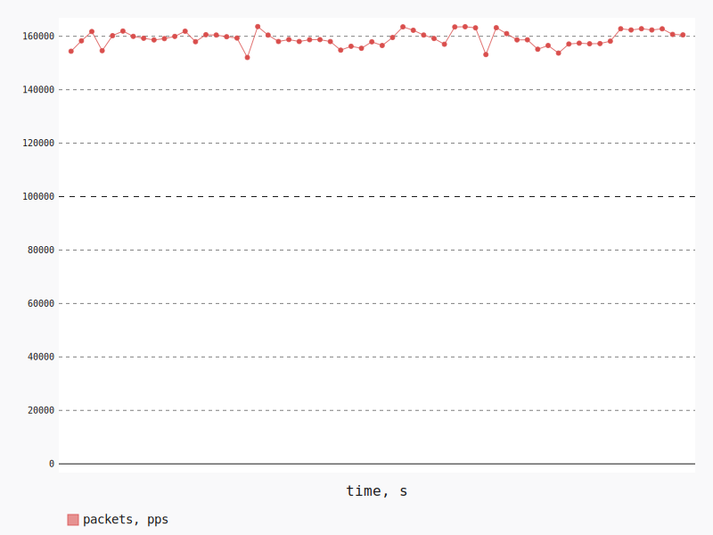

.. _openstack_l2_performance:

OpenStack L2 Performance
************************

In this scenario Shaker launches 1 pair of instances in the same tenant
network. Each instance is hosted on a separate compute node. The traffic goes
within the tenant network (L2 domain).

**Scenario**:

.. code-block:: yaml

    deployment:
      accommodation:
      - pair
      - single_room
      - compute_nodes: 2
      template: l2.hot
    description: In this scenario Shaker launches 1 pair of instances in the same tenant
      network. Each instance is hosted on a separate compute node. The traffic goes within
      the tenant network (L2 domain).
    execution:
      tests:
      - class: flent
        method: ping
        sla:
        - '[type == ''agent''] >> (stats.ping_icmp.avg < 2.0)'
        time: 10
        title: Ping
      - class: iperf3
        sla:
        - '[type == ''agent''] >> (stats.bandwidth.avg > 5000)'
        - '[type == ''agent''] >> (stats.retransmits.max < 10)'
        title: TCP
      - bandwidth: 0
        class: iperf3
        datagram_size: 32
        sla:
        - '[type == ''agent''] >> (stats.packets.avg > 100000)'
        title: UDP
        udp: true
    file_name: /root/shaker/lib/python2.7/site-packages/shaker/scenarios/openstack/perf_l2.yaml
    title: OpenStack L2 Performance

Ping
====

**Test Specification**:

.. code-block:: yaml

    class: flent
    method: ping
    sla:
    - '[type == ''agent''] >> (stats.ping_icmp.avg < 2.0)'
    time: 10
    title: Ping

**Stats**:

=============  ========  ========  ========
Metric         Min       Avg       Max     
=============  ========  ========  ========
ping_icmp, ms      0.09      0.17      0.87
ping_udp, ms       0.08      0.08      0.09
=============  ========  ========  ========

**SLA**:

=========================  ===========  ========  ========
Expression                 Concurrency  Node      Result  
=========================  ===========  ========  ========
stats.ping_icmp.avg < 2.0            1  cmp-002   OK
=========================  ===========  ========  ========

TCP
===

**Test Specification**:

.. code-block:: yaml

    class: iperf3
    interval: 1
    sla:
    - '[type == ''agent''] >> (stats.bandwidth.avg > 5000)'
    - '[type == ''agent''] >> (stats.retransmits.max < 10)'
    title: TCP

**Stats**:

=================  ========  ========  ========
Metric             Min       Avg       Max     
=================  ========  ========  ========
bandwidth, Mbit/s   3395.90   3916.73   3966.92
retransmits                         6       118
=================  ========  ========  ========

**SLA**:

==========================  ===========  ========  ========
Expression                  Concurrency  Node      Result  
==========================  ===========  ========  ========
stats.bandwidth.avg > 5000            1  cmp-002   FAIL
stats.retransmits.max < 10            1  cmp-002   FAIL
==========================  ===========  ========  ========

UDP
===

**Test Specification**:

.. code-block:: yaml

    bandwidth: 0
    class: iperf3
    datagram_size: 32
    interval: 1
    sla:
    - '[type == ''agent''] >> (stats.packets.avg > 100000)'
    title: UDP
    udp: true

**Stats**:

============  ========  ========  ========
Metric        Min       Avg       Max     
============  ========  ========  ========
loss, %                     0.39
jitter, ms                  0.06
packets, pps    152060    159161    163630
============  ========  ========  ========

**SLA**:

==========================  ===========  ========  ========
Expression                  Concurrency  Node      Result  
==========================  ===========  ========  ========
stats.packets.avg > 100000            1  cmp-002   OK
==========================  ===========  ========  ========

