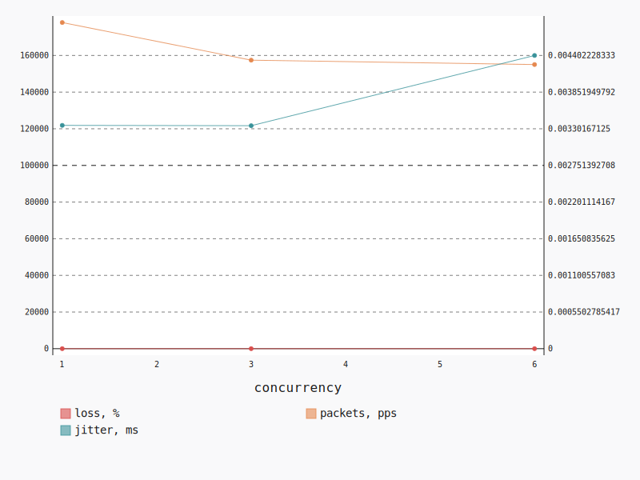

.. _openstack_l2_udp:

OpenStack L2 UDP
****************

In this scenario Shaker launches pairs of instances in the same tenant network.
Every instance is hosted on a separate compute node. The traffic goes within
the tenant network (L2 domain). The load is generated by UDP traffic.

**Scenario**:

.. code-block:: yaml

    deployment:
      accommodation:
      - pair
      - single_room
      template: l2.hot
    description: In this scenario Shaker launches pairs of instances in the same tenant
      network. Every instance is hosted on a separate compute node. The traffic goes within
      the tenant network (L2 domain). The load is generated by UDP traffic.
    execution:
      progression: quadratic
      tests:
      - bandwidth: 1000M
        class: iperf3
        datagram_size: 32
        title: UDP
        udp: true
    file_name: /root/shaker/lib/python2.7/site-packages/shaker/scenarios/openstack/udp_l2.yaml
    title: OpenStack L2 UDP

UDP
===

**Test Specification**:

.. code-block:: yaml

    bandwidth: 1000M
    class: iperf3
    datagram_size: 32
    interval: 1
    title: UDP
    udp: true

**Stats**:

===========  ========  ==========  ============
concurrency  loss, %   jitter, ms  packets, pps
===========  ========  ==========  ============
          1      5.66        0.00        177977
          3      0.49        0.00        157432
          6      0.41        0.00        155044
===========  ========  ==========  ============

Concurrency 1
-------------

**Stats**:

========  ========  ==========  ============
node      loss, %   jitter, ms  packets, pps
========  ========  ==========  ============
cmp-001       5.66        0.00        177977
========  ========  ==========  ============

Concurrency 3
-------------

**Stats**:

========  ========  ==========  ============
node      loss, %   jitter, ms  packets, pps
========  ========  ==========  ============
cmp-001       0.29        0.00        158190
cmp-002       0.02        0.00        155540
cmp-005       1.16        0.00        158566
========  ========  ==========  ============

Concurrency 6
-------------

**Stats**:

========  ========  ==========  ============
node      loss, %   jitter, ms  packets, pps
========  ========  ==========  ============
cmp-001       0.45        0.01        156514
cmp-002       0.07        0.00        155650
cmp-004       0.54        0.00        154883
cmp-005       1.33        0.00        159895
cmp-006       0.05        0.00        163440
cmp-007       0.00        0.01        139887
========  ========  ==========  ============

