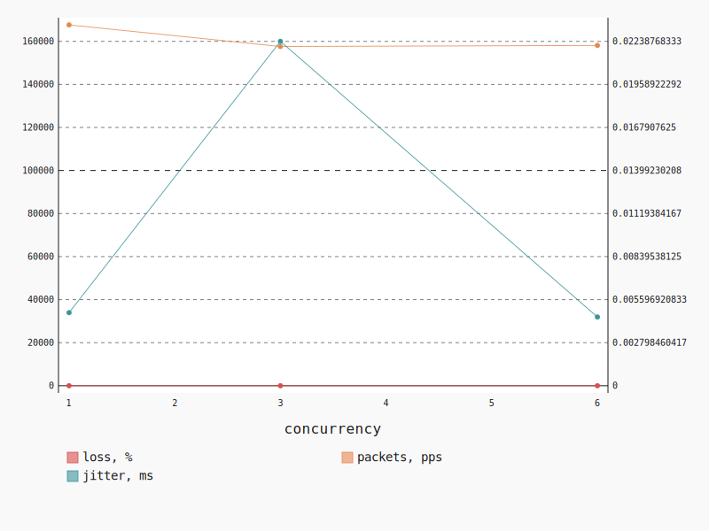

.. _openstack_l2_udp:

OpenStack L2 UDP
****************

In this scenario Shaker launches pairs of instances in the same tenant network.
Every instance is hosted on a separate compute node. The traffic goes within
the tenant network (L2 domain). The load is generated by UDP traffic.

**Scenario**:

.. code-block:: yaml

    deployment:
      accommodation:
      - pair
      - single_room
      template: l2.hot
    description: In this scenario Shaker launches pairs of instances in the same tenant
      network. Every instance is hosted on a separate compute node. The traffic goes within
      the tenant network (L2 domain). The load is generated by UDP traffic.
    execution:
      progression: quadratic
      tests:
      - bandwidth: 1000M
        class: iperf3
        datagram_size: 32
        title: UDP
        udp: true
    file_name: /root/shaker/lib/python2.7/site-packages/shaker/scenarios/openstack/udp_l2.yaml
    title: OpenStack L2 UDP

UDP
===

**Test Specification**:

.. code-block:: yaml

    bandwidth: 1000M
    class: iperf3
    datagram_size: 32
    interval: 1
    title: UDP
    udp: true

**Stats**:

===========  ========  ==========  ============
concurrency  loss, %   jitter, ms  packets, pps
===========  ========  ==========  ============
          1      1.87        0.00        167639
          3      0.09        0.02        157607
          6      0.16        0.00        158107
===========  ========  ==========  ============

Concurrency 1
-------------

**Stats**:

========  ========  ==========  ============
node      loss, %   jitter, ms  packets, pps
========  ========  ==========  ============
cmp-007       1.87        0.00        167639
========  ========  ==========  ============

Concurrency 3
-------------

**Stats**:

========  ========  ==========  ============
node      loss, %   jitter, ms  packets, pps
========  ========  ==========  ============
cmp-004       0.04        0.00        157057
cmp-006       0.22        0.00        168716
cmp-007       0.01        0.06        147050
========  ========  ==========  ============

Concurrency 6
-------------

**Stats**:

========  ========  ==========  ============
node      loss, %   jitter, ms  packets, pps
========  ========  ==========  ============
cmp-001       0.01        0.01        153572
cmp-002       0.01        0.00        159109
cmp-004       0.02        0.00        156109
cmp-005       0.68        0.01        164298
cmp-006       0.22        0.00        168495
cmp-007       0.00        0.00        147063
========  ========  ==========  ============

