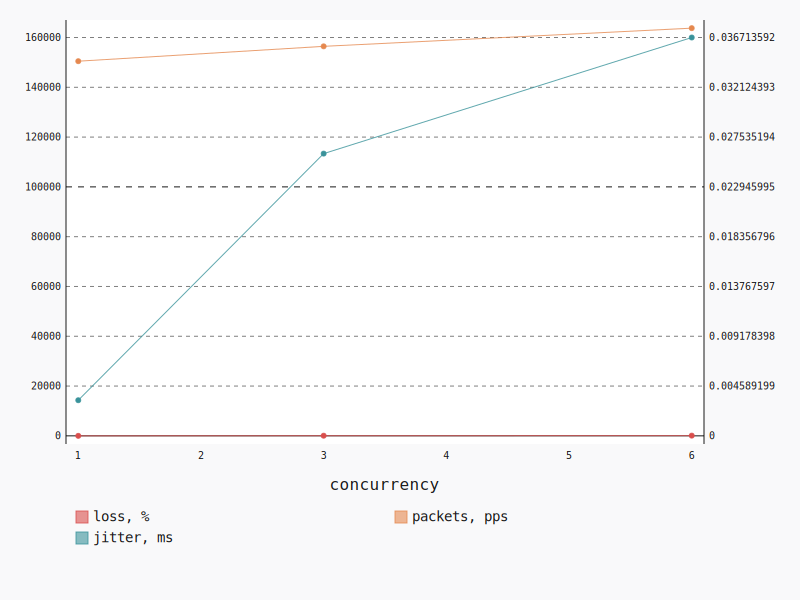

.. _openstack_l3_east_west_udp:

OpenStack L3 East-West UDP
**************************

In this scenario Shaker launches pairs of instances, each instance on its own
compute node. Instances are connected to one of 2 tenant networks, which
plugged into single router. The traffic goes from one network to the other (L3
east-west). The load is generated by UDP traffic.

**Scenario**:

.. code-block:: yaml

    deployment:
      accommodation:
      - pair
      - single_room
      template: l3_east_west.hot
    description: In this scenario Shaker launches pairs of instances, each instance on
      its own compute node. Instances are connected to one of 2 tenant networks, which
      plugged into single router. The traffic goes from one network to the other (L3 east-west).
      The load is generated by UDP traffic.
    execution:
      progression: quadratic
      tests:
      - bandwidth: 1000M
        class: iperf3
        datagram_size: 32
        title: UDP
        udp: true
    file_name: /root/shaker/lib/python2.7/site-packages/shaker/scenarios/openstack/udp_l3_east_west.yaml
    title: OpenStack L3 East-West UDP

**Errors**:

.. code-block:: yaml

    agent: shaker_sdfzio_master_2
    command:
      data: iperf3 --client 11.2.0.8 --format m --udp --len 32 --bandwidth 1000M --time
        60 --parallel 1 --interval 1 --json
      type: program
    concurrency: 6
    executor: iperf3
    id: 47d03544-515a-418f-871a-23c84659427a
    node: cmp-005
    scenario: OpenStack L3 East-West UDP
    schedule: 1527941527.854541
    stats: {}
    status: lost
    test: UDP
    type: agent

.. code-block:: yaml

    agent: shaker_sdfzio_master_0
    command:
      data: iperf3 --client 11.2.0.16 --format m --udp --len 32 --bandwidth 1000M --time
        60 --parallel 1 --interval 1 --json
      type: program
    concurrency: 3
    executor: iperf3
    finish: 1527941477.533852
    id: 94941e47-3cee-424d-a026-0e2aa777861b
    info: 'error - unable to read from stream socket: Resource temporarily unavailable'
    node: cmp-001
    scenario: OpenStack L3 East-West UDP
    schedule: 1527941447.460338
    start: 1527941447.480375
    stats: {}
    status: error
    stderr: ''
    test: UDP
    traceback: "Traceback (most recent call last):\n  File \"/root/shaker/lib/python2.7/site-packages/shaker/engine/quorum.py\"\
      , line 95, in process_reply\n    reply = self.executors[agent_id].process_reply(message)\n\
      \  File \"/root/shaker/lib/python2.7/site-packages/shaker/engine/executors/iperf.py\"\
      , line 113, in process_reply\n    raise base.ExecutorException(result, data['error'])\n\
      ExecutorException: error - unable to read from stream socket: Resource temporarily\
      \ unavailable\n"
    type: agent
    verbose: "end: {}\nstart:\n  connected: []\n  connecting_to:\n    host: 11.2.0.16\n\
      \    port: 5201\n  cookie: shaker-sdfzio-master-0.1527941447.48\n  system_info:\
      \ 'Linux shaker-sdfzio-master-0 4.4.0-127-generic #153-Ubuntu SMP Sat\n    May 19\
      \ 10:58:46 UTC 2018 x86_64 x86_64 x86_64 GNU/Linux\n\n    '\n  timestamp:\n    time:\
      \ Sat, 02 Jun 2018 12:10:47 GMT\n    timesecs: 1527941447\n  version: iperf 3.0.11\n"

UDP
===

**Test Specification**:

.. code-block:: yaml

    bandwidth: 1000M
    class: iperf3
    datagram_size: 32
    interval: 1
    title: UDP
    udp: true

**Stats**:

===========  ========  ==========  ============
concurrency  loss, %   jitter, ms  packets, pps
===========  ========  ==========  ============
          1      3.19        0.00        150484
          3     57.19        0.03        156451
          6     85.56        0.04        163756
===========  ========  ==========  ============

Concurrency 1
-------------

**Stats**:

========  ========  ==========  ============
node      loss, %   jitter, ms  packets, pps
========  ========  ==========  ============
cmp-004       3.19        0.00        150484
========  ========  ==========  ============

Concurrency 3
-------------

**Errors**:

.. code-block:: yaml

    agent: shaker_sdfzio_master_0
    command:
      data: iperf3 --client 11.2.0.16 --format m --udp --len 32 --bandwidth 1000M --time
        60 --parallel 1 --interval 1 --json
      type: program
    concurrency: 3
    executor: iperf3
    finish: 1527941477.533852
    id: 94941e47-3cee-424d-a026-0e2aa777861b
    info: 'error - unable to read from stream socket: Resource temporarily unavailable'
    node: cmp-001
    scenario: OpenStack L3 East-West UDP
    schedule: 1527941447.460338
    start: 1527941447.480375
    stats: {}
    status: error
    stderr: ''
    test: UDP
    traceback: "Traceback (most recent call last):\n  File \"/root/shaker/lib/python2.7/site-packages/shaker/engine/quorum.py\"\
      , line 95, in process_reply\n    reply = self.executors[agent_id].process_reply(message)\n\
      \  File \"/root/shaker/lib/python2.7/site-packages/shaker/engine/executors/iperf.py\"\
      , line 113, in process_reply\n    raise base.ExecutorException(result, data['error'])\n\
      ExecutorException: error - unable to read from stream socket: Resource temporarily\
      \ unavailable\n"
    type: agent
    verbose: "end: {}\nstart:\n  connected: []\n  connecting_to:\n    host: 11.2.0.16\n\
      \    port: 5201\n  cookie: shaker-sdfzio-master-0.1527941447.48\n  system_info:\
      \ 'Linux shaker-sdfzio-master-0 4.4.0-127-generic #153-Ubuntu SMP Sat\n    May 19\
      \ 10:58:46 UTC 2018 x86_64 x86_64 x86_64 GNU/Linux\n\n    '\n  timestamp:\n    time:\
      \ Sat, 02 Jun 2018 12:10:47 GMT\n    timesecs: 1527941447\n  version: iperf 3.0.11\n"

**Stats**:

========  ========  ==========  ============
node      loss, %   jitter, ms  packets, pps
========  ========  ==========  ============
cmp-003      57.22        0.05        162275
cmp-004      57.16        0.00        150628
========  ========  ==========  ============

Concurrency 6
-------------

**Errors**:

.. code-block:: yaml

    agent: shaker_sdfzio_master_2
    command:
      data: iperf3 --client 11.2.0.8 --format m --udp --len 32 --bandwidth 1000M --time
        60 --parallel 1 --interval 1 --json
      type: program
    concurrency: 6
    executor: iperf3
    id: 47d03544-515a-418f-871a-23c84659427a
    node: cmp-005
    scenario: OpenStack L3 East-West UDP
    schedule: 1527941527.854541
    stats: {}
    status: lost
    test: UDP
    type: agent

**Stats**:

========  ========  ==========  ============
node      loss, %   jitter, ms  packets, pps
========  ========  ==========  ============
cmp-001      80.51        0.01        153735
cmp-002      84.05        0.03        153556
cmp-003      94.35        0.05        213339
cmp-004      85.23        0.07        145110
cmp-006      83.68        0.03        153041
========  ========  ==========  ============

