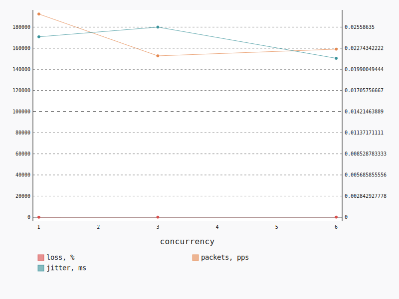

.. _openstack_l3_east_west_udp:

OpenStack L3 East-West UDP
**************************

In this scenario Shaker launches pairs of instances, each instance on its own
compute node. Instances are connected to one of 2 tenant networks, which
plugged into single router. The traffic goes from one network to the other (L3
east-west). The load is generated by UDP traffic.

**Scenario**:

.. code-block:: yaml

    deployment:
      accommodation:
      - pair
      - single_room
      template: l3_east_west.hot
    description: In this scenario Shaker launches pairs of instances, each instance on
      its own compute node. Instances are connected to one of 2 tenant networks, which
      plugged into single router. The traffic goes from one network to the other (L3 east-west).
      The load is generated by UDP traffic.
    execution:
      progression: quadratic
      tests:
      - bandwidth: 1000M
        class: iperf3
        datagram_size: 32
        title: UDP
        udp: true
    file_name: /root/shaker/lib/python2.7/site-packages/shaker/scenarios/openstack/udp_l3_east_west.yaml
    title: OpenStack L3 East-West UDP

**Errors**:

.. code-block:: yaml

    agent: shaker_urmioe_master_3
    command:
      data: iperf3 --client 11.2.0.17 --format m --udp --len 32 --bandwidth 1000M --time
        60 --parallel 1 --interval 1 --json
      type: program
    concurrency: 6
    executor: iperf3
    id: 083c0fe2-d39b-4be1-8595-542db1427a72
    node: cmp-006
    scenario: OpenStack L3 East-West UDP
    schedule: 1528079925.368745
    stats: {}
    status: lost
    test: UDP
    type: agent

UDP
===

**Test Specification**:

.. code-block:: yaml

    bandwidth: 1000M
    class: iperf3
    datagram_size: 32
    interval: 1
    title: UDP
    udp: true

**Stats**:

===========  ========  ==========  ============
concurrency  loss, %   jitter, ms  packets, pps
===========  ========  ==========  ============
          1     11.21        0.02        192383
          3     73.22        0.03        152769
          6     82.67        0.02        159130
===========  ========  ==========  ============

Concurrency 1
-------------

**Stats**:

========  ========  ==========  ============
node      loss, %   jitter, ms  packets, pps
========  ========  ==========  ============
cmp-004      11.21        0.02        192383
========  ========  ==========  ============

Concurrency 3
-------------

**Stats**:

========  ========  ==========  ============
node      loss, %   jitter, ms  packets, pps
========  ========  ==========  ============
cmp-004      72.04        0.02        150918
cmp-005      73.87        0.05        158248
cmp-007      73.76        0.01        149141
========  ========  ==========  ============

Concurrency 6
-------------

**Errors**:

.. code-block:: yaml

    agent: shaker_urmioe_master_3
    command:
      data: iperf3 --client 11.2.0.17 --format m --udp --len 32 --bandwidth 1000M --time
        60 --parallel 1 --interval 1 --json
      type: program
    concurrency: 6
    executor: iperf3
    id: 083c0fe2-d39b-4be1-8595-542db1427a72
    node: cmp-006
    scenario: OpenStack L3 East-West UDP
    schedule: 1528079925.368745
    stats: {}
    status: lost
    test: UDP
    type: agent

**Stats**:

========  ========  ==========  ============
node      loss, %   jitter, ms  packets, pps
========  ========  ==========  ============
cmp-001      85.17        0.01        165373
cmp-002      84.67        0.04        156828
cmp-004      81.56        0.03        144247
cmp-005      85.44        0.02        171811
cmp-007      76.51        0.01        157395
========  ========  ==========  ============

