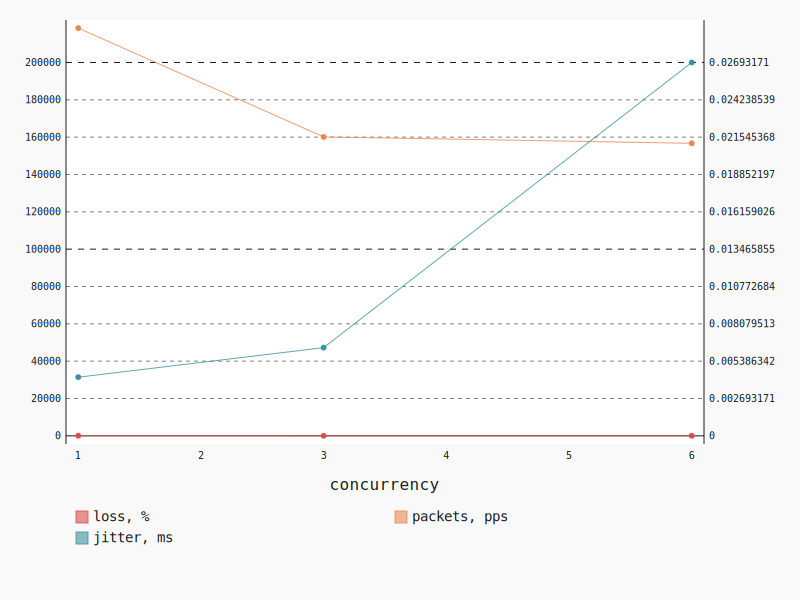

.. _openstack_l3_north_south_udp:

OpenStack L3 North-South UDP
****************************

In this scenario Shaker launches pairs of instances on different compute nodes.
Instances are in different networks connected to different routers, master
accesses slave by floating ip. The traffic goes from one network via external
network to the other network. The load is generated by UDP traffic.

**Scenario**:

.. code-block:: yaml

    deployment:
      accommodation:
      - pair
      - single_room
      template: l3_north_south.hot
    description: In this scenario Shaker launches pairs of instances on different compute
      nodes. Instances are in different networks connected to different routers, master
      accesses slave by floating ip. The traffic goes from one network via external network
      to the other network. The load is generated by UDP traffic.
    execution:
      progression: quadratic
      tests:
      - bandwidth: 1000M
        class: iperf3
        datagram_size: 32
        title: UDP
        udp: true
    file_name: /root/shaker/lib/python2.7/site-packages/shaker/scenarios/openstack/udp_l3_north_south.yaml
    title: OpenStack L3 North-South UDP

**Errors**:

.. code-block:: yaml

    agent: shaker_fpotuk_master_0
    command:
      data: iperf3 --client 10.12.1.23 --format m --udp --len 32 --bandwidth 1000M --time
        60 --parallel 1 --interval 1 --json
      type: program
    concurrency: 6
    executor: iperf3
    finish: 1527942163.562946
    id: 52ffaace-6264-4a46-bcb7-9fe1679cf3ac
    info: 'error - unable to read from stream socket: Resource temporarily unavailable'
    node: cmp-001
    scenario: OpenStack L3 North-South UDP
    schedule: 1527942021.622582
    start: 1527942068.272196
    stats: {}
    status: error
    stderr: ''
    test: UDP
    traceback: "Traceback (most recent call last):\n  File \"/root/shaker/lib/python2.7/site-packages/shaker/engine/quorum.py\"\
      , line 95, in process_reply\n    reply = self.executors[agent_id].process_reply(message)\n\
      \  File \"/root/shaker/lib/python2.7/site-packages/shaker/engine/executors/iperf.py\"\
      , line 113, in process_reply\n    raise base.ExecutorException(result, data['error'])\n\
      ExecutorException: error - unable to read from stream socket: Resource temporarily\
      \ unavailable\n"
    type: agent
    verbose: "end: {}\nstart:\n  connected: []\n  connecting_to:\n    host: 10.12.1.23\n\
      \    port: 5201\n  cookie: shaker-fpotuk-master-0.1527942068.27\n  system_info:\
      \ 'Linux shaker-fpotuk-master-0 4.4.0-127-generic #153-Ubuntu SMP Sat\n    May 19\
      \ 10:58:46 UTC 2018 x86_64 x86_64 x86_64 GNU/Linux\n\n    '\n  timestamp:\n    time:\
      \ Sat, 02 Jun 2018 12:21:45 GMT\n    timesecs: 1527942105\n  version: iperf 3.0.11\n"

.. code-block:: yaml

    agent: shaker_fpotuk_master_1
    command:
      data: iperf3 --client 10.12.1.1 --format m --udp --len 32 --bandwidth 1000M --time
        60 --parallel 1 --interval 1 --json
      type: program
    concurrency: 6
    executor: iperf3
    id: 2076bcfe-50a8-4a20-ba2a-8335beea1d01
    node: cmp-002
    scenario: OpenStack L3 North-South UDP
    schedule: 1527942021.622582
    stats: {}
    status: lost
    test: UDP
    type: agent

.. code-block:: yaml

    agent: shaker_fpotuk_master_3
    command:
      data: iperf3 --client 10.12.1.20 --format m --udp --len 32 --bandwidth 1000M --time
        60 --parallel 1 --interval 1 --json
      type: program
    concurrency: 6
    executor: iperf3
    finish: 1527942143.275292
    id: 02ee04d0-5ff3-4958-8262-8f9da52deccf
    info: 'error - unable to read from stream socket: Resource temporarily unavailable'
    node: cmp-006
    scenario: OpenStack L3 North-South UDP
    schedule: 1527942021.622582
    start: 1527942021.638005
    stats: {}
    status: error
    stderr: ''
    test: UDP
    traceback: "Traceback (most recent call last):\n  File \"/root/shaker/lib/python2.7/site-packages/shaker/engine/quorum.py\"\
      , line 95, in process_reply\n    reply = self.executors[agent_id].process_reply(message)\n\
      \  File \"/root/shaker/lib/python2.7/site-packages/shaker/engine/executors/iperf.py\"\
      , line 113, in process_reply\n    raise base.ExecutorException(result, data['error'])\n\
      ExecutorException: error - unable to read from stream socket: Resource temporarily\
      \ unavailable\n"
    type: agent
    verbose: "end: {}\nstart:\n  connected: []\n  connecting_to:\n    host: 10.12.1.20\n\
      \    port: 5201\n  cookie: shaker-fpotuk-master-3.1527942021.64\n  system_info:\
      \ 'Linux shaker-fpotuk-master-3 4.4.0-127-generic #153-Ubuntu SMP Sat\n    May 19\
      \ 10:58:46 UTC 2018 x86_64 x86_64 x86_64 GNU/Linux\n\n    '\n  timestamp:\n    time:\
      \ Sat, 02 Jun 2018 12:21:40 GMT\n    timesecs: 1527942100\n  version: iperf 3.0.11\n"

.. code-block:: yaml

    agent: shaker_fpotuk_master_0
    command:
      data: iperf3 --client 10.12.1.23 --format m --udp --len 32 --bandwidth 1000M --time
        60 --parallel 1 --interval 1 --json
      type: program
    concurrency: 3
    executor: iperf3
    id: f99e2560-2ffa-4efb-a50a-6a982f23a6b3
    node: cmp-001
    scenario: OpenStack L3 North-South UDP
    schedule: 1527941874.806337
    stats: {}
    status: lost
    test: UDP
    type: agent

.. code-block:: yaml

    agent: shaker_fpotuk_master_4
    command:
      data: iperf3 --client 10.12.1.29 --format m --udp --len 32 --bandwidth 1000M --time
        60 --parallel 1 --interval 1 --json
      type: program
    concurrency: 6
    executor: iperf3
    id: f5592adf-e75a-42b3-8f1b-53e88e4530dc
    node: cmp-004
    scenario: OpenStack L3 North-South UDP
    schedule: 1527942021.622582
    stats: {}
    status: lost
    test: UDP
    type: agent

.. code-block:: yaml

    agent: shaker_fpotuk_master_2
    command:
      data: iperf3 --client 10.12.1.12 --format m --udp --len 32 --bandwidth 1000M --time
        60 --parallel 1 --interval 1 --json
      type: program
    concurrency: 3
    executor: iperf3
    finish: 1527941955.868566
    id: 5aabf2bb-5e92-42db-9aae-181b6e19cff9
    info: 'error - unable to read from stream socket: Resource temporarily unavailable'
    node: cmp-005
    scenario: OpenStack L3 North-South UDP
    schedule: 1527941874.806337
    start: 1527941874.818746
    stats: {}
    status: error
    stderr: ''
    test: UDP
    traceback: "Traceback (most recent call last):\n  File \"/root/shaker/lib/python2.7/site-packages/shaker/engine/quorum.py\"\
      , line 95, in process_reply\n    reply = self.executors[agent_id].process_reply(message)\n\
      \  File \"/root/shaker/lib/python2.7/site-packages/shaker/engine/executors/iperf.py\"\
      , line 113, in process_reply\n    raise base.ExecutorException(result, data['error'])\n\
      ExecutorException: error - unable to read from stream socket: Resource temporarily\
      \ unavailable\n"
    type: agent
    verbose: "end: {}\nstart:\n  connected: []\n  connecting_to:\n    host: 10.12.1.12\n\
      \    port: 5201\n  cookie: shaker-fpotuk-master-2.1527941874.82\n  system_info:\
      \ 'Linux shaker-fpotuk-master-2 4.4.0-127-generic #153-Ubuntu SMP Sat\n    May 19\
      \ 10:58:46 UTC 2018 x86_64 x86_64 x86_64 GNU/Linux\n\n    '\n  timestamp:\n    time:\
      \ Sat, 02 Jun 2018 12:18:00 GMT\n    timesecs: 1527941880\n  version: iperf 3.0.11\n"

UDP
===

**Test Specification**:

.. code-block:: yaml

    bandwidth: 1000M
    class: iperf3
    datagram_size: 32
    interval: 1
    title: UDP
    udp: true

**Stats**:

===========  ========  ==========  ============
concurrency  loss, %   jitter, ms  packets, pps
===========  ========  ==========  ============
          1     66.13        0.00        218374
          3     60.13        0.01        160113
          6     58.90        0.03        156689
===========  ========  ==========  ============

Concurrency 1
-------------

**Stats**:

========  ========  ==========  ============
node      loss, %   jitter, ms  packets, pps
========  ========  ==========  ============
cmp-005      66.13        0.00        218374
========  ========  ==========  ============

Concurrency 3
-------------

**Errors**:

.. code-block:: yaml

    agent: shaker_fpotuk_master_0
    command:
      data: iperf3 --client 10.12.1.23 --format m --udp --len 32 --bandwidth 1000M --time
        60 --parallel 1 --interval 1 --json
      type: program
    concurrency: 3
    executor: iperf3
    id: f99e2560-2ffa-4efb-a50a-6a982f23a6b3
    node: cmp-001
    scenario: OpenStack L3 North-South UDP
    schedule: 1527941874.806337
    stats: {}
    status: lost
    test: UDP
    type: agent

.. code-block:: yaml

    agent: shaker_fpotuk_master_2
    command:
      data: iperf3 --client 10.12.1.12 --format m --udp --len 32 --bandwidth 1000M --time
        60 --parallel 1 --interval 1 --json
      type: program
    concurrency: 3
    executor: iperf3
    finish: 1527941955.868566
    id: 5aabf2bb-5e92-42db-9aae-181b6e19cff9
    info: 'error - unable to read from stream socket: Resource temporarily unavailable'
    node: cmp-005
    scenario: OpenStack L3 North-South UDP
    schedule: 1527941874.806337
    start: 1527941874.818746
    stats: {}
    status: error
    stderr: ''
    test: UDP
    traceback: "Traceback (most recent call last):\n  File \"/root/shaker/lib/python2.7/site-packages/shaker/engine/quorum.py\"\
      , line 95, in process_reply\n    reply = self.executors[agent_id].process_reply(message)\n\
      \  File \"/root/shaker/lib/python2.7/site-packages/shaker/engine/executors/iperf.py\"\
      , line 113, in process_reply\n    raise base.ExecutorException(result, data['error'])\n\
      ExecutorException: error - unable to read from stream socket: Resource temporarily\
      \ unavailable\n"
    type: agent
    verbose: "end: {}\nstart:\n  connected: []\n  connecting_to:\n    host: 10.12.1.12\n\
      \    port: 5201\n  cookie: shaker-fpotuk-master-2.1527941874.82\n  system_info:\
      \ 'Linux shaker-fpotuk-master-2 4.4.0-127-generic #153-Ubuntu SMP Sat\n    May 19\
      \ 10:58:46 UTC 2018 x86_64 x86_64 x86_64 GNU/Linux\n\n    '\n  timestamp:\n    time:\
      \ Sat, 02 Jun 2018 12:18:00 GMT\n    timesecs: 1527941880\n  version: iperf 3.0.11\n"

**Stats**:

========  ========  ==========  ============
node      loss, %   jitter, ms  packets, pps
========  ========  ==========  ============
cmp-006      60.13        0.01        160113
========  ========  ==========  ============

Concurrency 6
-------------

**Errors**:

.. code-block:: yaml

    agent: shaker_fpotuk_master_0
    command:
      data: iperf3 --client 10.12.1.23 --format m --udp --len 32 --bandwidth 1000M --time
        60 --parallel 1 --interval 1 --json
      type: program
    concurrency: 6
    executor: iperf3
    finish: 1527942163.562946
    id: 52ffaace-6264-4a46-bcb7-9fe1679cf3ac
    info: 'error - unable to read from stream socket: Resource temporarily unavailable'
    node: cmp-001
    scenario: OpenStack L3 North-South UDP
    schedule: 1527942021.622582
    start: 1527942068.272196
    stats: {}
    status: error
    stderr: ''
    test: UDP
    traceback: "Traceback (most recent call last):\n  File \"/root/shaker/lib/python2.7/site-packages/shaker/engine/quorum.py\"\
      , line 95, in process_reply\n    reply = self.executors[agent_id].process_reply(message)\n\
      \  File \"/root/shaker/lib/python2.7/site-packages/shaker/engine/executors/iperf.py\"\
      , line 113, in process_reply\n    raise base.ExecutorException(result, data['error'])\n\
      ExecutorException: error - unable to read from stream socket: Resource temporarily\
      \ unavailable\n"
    type: agent
    verbose: "end: {}\nstart:\n  connected: []\n  connecting_to:\n    host: 10.12.1.23\n\
      \    port: 5201\n  cookie: shaker-fpotuk-master-0.1527942068.27\n  system_info:\
      \ 'Linux shaker-fpotuk-master-0 4.4.0-127-generic #153-Ubuntu SMP Sat\n    May 19\
      \ 10:58:46 UTC 2018 x86_64 x86_64 x86_64 GNU/Linux\n\n    '\n  timestamp:\n    time:\
      \ Sat, 02 Jun 2018 12:21:45 GMT\n    timesecs: 1527942105\n  version: iperf 3.0.11\n"

.. code-block:: yaml

    agent: shaker_fpotuk_master_1
    command:
      data: iperf3 --client 10.12.1.1 --format m --udp --len 32 --bandwidth 1000M --time
        60 --parallel 1 --interval 1 --json
      type: program
    concurrency: 6
    executor: iperf3
    id: 2076bcfe-50a8-4a20-ba2a-8335beea1d01
    node: cmp-002
    scenario: OpenStack L3 North-South UDP
    schedule: 1527942021.622582
    stats: {}
    status: lost
    test: UDP
    type: agent

.. code-block:: yaml

    agent: shaker_fpotuk_master_3
    command:
      data: iperf3 --client 10.12.1.20 --format m --udp --len 32 --bandwidth 1000M --time
        60 --parallel 1 --interval 1 --json
      type: program
    concurrency: 6
    executor: iperf3
    finish: 1527942143.275292
    id: 02ee04d0-5ff3-4958-8262-8f9da52deccf
    info: 'error - unable to read from stream socket: Resource temporarily unavailable'
    node: cmp-006
    scenario: OpenStack L3 North-South UDP
    schedule: 1527942021.622582
    start: 1527942021.638005
    stats: {}
    status: error
    stderr: ''
    test: UDP
    traceback: "Traceback (most recent call last):\n  File \"/root/shaker/lib/python2.7/site-packages/shaker/engine/quorum.py\"\
      , line 95, in process_reply\n    reply = self.executors[agent_id].process_reply(message)\n\
      \  File \"/root/shaker/lib/python2.7/site-packages/shaker/engine/executors/iperf.py\"\
      , line 113, in process_reply\n    raise base.ExecutorException(result, data['error'])\n\
      ExecutorException: error - unable to read from stream socket: Resource temporarily\
      \ unavailable\n"
    type: agent
    verbose: "end: {}\nstart:\n  connected: []\n  connecting_to:\n    host: 10.12.1.20\n\
      \    port: 5201\n  cookie: shaker-fpotuk-master-3.1527942021.64\n  system_info:\
      \ 'Linux shaker-fpotuk-master-3 4.4.0-127-generic #153-Ubuntu SMP Sat\n    May 19\
      \ 10:58:46 UTC 2018 x86_64 x86_64 x86_64 GNU/Linux\n\n    '\n  timestamp:\n    time:\
      \ Sat, 02 Jun 2018 12:21:40 GMT\n    timesecs: 1527942100\n  version: iperf 3.0.11\n"

.. code-block:: yaml

    agent: shaker_fpotuk_master_4
    command:
      data: iperf3 --client 10.12.1.29 --format m --udp --len 32 --bandwidth 1000M --time
        60 --parallel 1 --interval 1 --json
      type: program
    concurrency: 6
    executor: iperf3
    id: f5592adf-e75a-42b3-8f1b-53e88e4530dc
    node: cmp-004
    scenario: OpenStack L3 North-South UDP
    schedule: 1527942021.622582
    stats: {}
    status: lost
    test: UDP
    type: agent

**Stats**:

========  ========  ==========  ============
node      loss, %   jitter, ms  packets, pps
========  ========  ==========  ============
cmp-005      60.10        0.05        163348
cmp-007      57.69        0.00        150031
========  ========  ==========  ============

