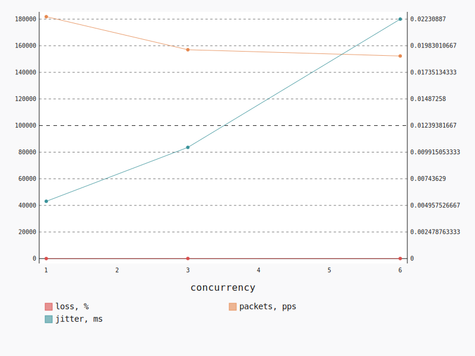

.. _openstack_l3_north_south_udp:

OpenStack L3 North-South UDP
****************************

In this scenario Shaker launches pairs of instances on different compute nodes.
Instances are in different networks connected to different routers, master
accesses slave by floating ip. The traffic goes from one network via external
network to the other network. The load is generated by UDP traffic.

**Scenario**:

.. code-block:: yaml

    deployment:
      accommodation:
      - pair
      - single_room
      template: l3_north_south.hot
    description: In this scenario Shaker launches pairs of instances on different compute
      nodes. Instances are in different networks connected to different routers, master
      accesses slave by floating ip. The traffic goes from one network via external network
      to the other network. The load is generated by UDP traffic.
    execution:
      progression: quadratic
      tests:
      - bandwidth: 1000M
        class: iperf3
        datagram_size: 32
        title: UDP
        udp: true
    file_name: /root/shaker/lib/python2.7/site-packages/shaker/scenarios/openstack/udp_l3_north_south.yaml
    title: OpenStack L3 North-South UDP

**Errors**:

.. code-block:: yaml

    agent: shaker_azorip_master_5
    command:
      data: iperf3 --client 10.12.1.15 --format m --udp --len 32 --bandwidth 1000M --time
        60 --parallel 1 --interval 1 --json
      type: program
    concurrency: 6
    executor: iperf3
    id: 6e67c11d-bfab-45f9-972e-c687e4c28658
    node: cmp-007
    scenario: OpenStack L3 North-South UDP
    schedule: 1528080316.25353
    stats: {}
    status: lost
    test: UDP
    type: agent

.. code-block:: yaml

    agent: shaker_azorip_master_2
    command:
      data: iperf3 --client 10.12.1.29 --format m --udp --len 32 --bandwidth 1000M --time
        60 --parallel 1 --interval 1 --json
      type: program
    concurrency: 6
    executor: iperf3
    finish: 1528080403.472819
    id: 0a922780-8983-4ba3-b967-04fa7dc495b6
    info: 'error - unable to receive results: Connection reset by peer'
    node: cmp-005
    scenario: OpenStack L3 North-South UDP
    schedule: 1528080316.25353
    start: 1528080316.2587
    stats: {}
    status: error
    stderr: ''
    test: UDP
    traceback: "Traceback (most recent call last):\n  File \"/root/shaker/lib/python2.7/site-packages/shaker/engine/quorum.py\"\
      , line 95, in process_reply\n    reply = self.executors[agent_id].process_reply(message)\n\
      \  File \"/root/shaker/lib/python2.7/site-packages/shaker/engine/executors/iperf.py\"\
      , line 113, in process_reply\n    raise base.ExecutorException(result, data['error'])\n\
      ExecutorException: error - unable to receive results: Connection reset by peer\n"
    type: agent
    verbose: "end: {}\nstart:\n  connected:\n  - local_host: 11.1.0.8\n    local_port:\
      \ 54598\n    remote_host: 10.12.1.29\n    remote_port: 5201\n    socket: 4\n  connecting_to:\n\
      \    host: 10.12.1.29\n    port: 5201\n  cookie: shaker-azorip-master-2.1528080316.26\n\
      \  system_info: 'Linux shaker-azorip-master-2 4.4.0-127-generic #153-Ubuntu SMP\
      \ Sat\n    May 19 10:58:46 UTC 2018 x86_64 x86_64 x86_64 GNU/Linux\n\n    '\n  test_start:\n\
      \    blksize: 32\n    blocks: 0\n    bytes: 0\n    duration: 60\n    num_streams:\
      \ 1\n    omit: 0\n    protocol: UDP\n    reverse: 0\n  timestamp:\n    time: Mon,\
      \ 04 Jun 2018 02:45:16 GMT\n    timesecs: 1528080316\n  version: iperf 3.0.11\n"

.. code-block:: yaml

    agent: shaker_azorip_master_1
    command:
      data: iperf3 --client 10.12.1.24 --format m --udp --len 32 --bandwidth 1000M --time
        60 --parallel 1 --interval 1 --json
      type: program
    concurrency: 6
    executor: iperf3
    id: 4651ebac-56c7-4563-addf-e43e412e1e79
    node: cmp-002
    scenario: OpenStack L3 North-South UDP
    schedule: 1528080316.25353
    stats: {}
    status: lost
    test: UDP
    type: agent

.. code-block:: yaml

    agent: shaker_azorip_master_4
    command:
      data: iperf3 --client 10.12.1.18 --format m --udp --len 32 --bandwidth 1000M --time
        60 --parallel 1 --interval 1 --json
      type: program
    concurrency: 6
    executor: iperf3
    id: 57c5a9ed-6278-4b39-9478-a3501d272bf5
    node: cmp-004
    scenario: OpenStack L3 North-South UDP
    schedule: 1528080316.25353
    stats: {}
    status: lost
    test: UDP
    type: agent

UDP
===

**Test Specification**:

.. code-block:: yaml

    bandwidth: 1000M
    class: iperf3
    datagram_size: 32
    interval: 1
    title: UDP
    udp: true

**Stats**:

===========  ========  ==========  ============
concurrency  loss, %   jitter, ms  packets, pps
===========  ========  ==========  ============
          1     28.23        0.01        181810
          3     87.87        0.01        156981
          6     64.51        0.02        152279
===========  ========  ==========  ============

Concurrency 1
-------------

**Stats**:

========  ========  ==========  ============
node      loss, %   jitter, ms  packets, pps
========  ========  ==========  ============
cmp-001      28.23        0.01        181810
========  ========  ==========  ============

Concurrency 3
-------------

**Stats**:

========  ========  ==========  ============
node      loss, %   jitter, ms  packets, pps
========  ========  ==========  ============
cmp-001      88.38        0.00        148786
cmp-002      87.42        0.02        155185
cmp-005      87.80        0.01        166972
========  ========  ==========  ============

Concurrency 6
-------------

**Errors**:

.. code-block:: yaml

    agent: shaker_azorip_master_5
    command:
      data: iperf3 --client 10.12.1.15 --format m --udp --len 32 --bandwidth 1000M --time
        60 --parallel 1 --interval 1 --json
      type: program
    concurrency: 6
    executor: iperf3
    id: 6e67c11d-bfab-45f9-972e-c687e4c28658
    node: cmp-007
    scenario: OpenStack L3 North-South UDP
    schedule: 1528080316.25353
    stats: {}
    status: lost
    test: UDP
    type: agent

.. code-block:: yaml

    agent: shaker_azorip_master_2
    command:
      data: iperf3 --client 10.12.1.29 --format m --udp --len 32 --bandwidth 1000M --time
        60 --parallel 1 --interval 1 --json
      type: program
    concurrency: 6
    executor: iperf3
    finish: 1528080403.472819
    id: 0a922780-8983-4ba3-b967-04fa7dc495b6
    info: 'error - unable to receive results: Connection reset by peer'
    node: cmp-005
    scenario: OpenStack L3 North-South UDP
    schedule: 1528080316.25353
    start: 1528080316.2587
    stats: {}
    status: error
    stderr: ''
    test: UDP
    traceback: "Traceback (most recent call last):\n  File \"/root/shaker/lib/python2.7/site-packages/shaker/engine/quorum.py\"\
      , line 95, in process_reply\n    reply = self.executors[agent_id].process_reply(message)\n\
      \  File \"/root/shaker/lib/python2.7/site-packages/shaker/engine/executors/iperf.py\"\
      , line 113, in process_reply\n    raise base.ExecutorException(result, data['error'])\n\
      ExecutorException: error - unable to receive results: Connection reset by peer\n"
    type: agent
    verbose: "end: {}\nstart:\n  connected:\n  - local_host: 11.1.0.8\n    local_port:\
      \ 54598\n    remote_host: 10.12.1.29\n    remote_port: 5201\n    socket: 4\n  connecting_to:\n\
      \    host: 10.12.1.29\n    port: 5201\n  cookie: shaker-azorip-master-2.1528080316.26\n\
      \  system_info: 'Linux shaker-azorip-master-2 4.4.0-127-generic #153-Ubuntu SMP\
      \ Sat\n    May 19 10:58:46 UTC 2018 x86_64 x86_64 x86_64 GNU/Linux\n\n    '\n  test_start:\n\
      \    blksize: 32\n    blocks: 0\n    bytes: 0\n    duration: 60\n    num_streams:\
      \ 1\n    omit: 0\n    protocol: UDP\n    reverse: 0\n  timestamp:\n    time: Mon,\
      \ 04 Jun 2018 02:45:16 GMT\n    timesecs: 1528080316\n  version: iperf 3.0.11\n"

.. code-block:: yaml

    agent: shaker_azorip_master_1
    command:
      data: iperf3 --client 10.12.1.24 --format m --udp --len 32 --bandwidth 1000M --time
        60 --parallel 1 --interval 1 --json
      type: program
    concurrency: 6
    executor: iperf3
    id: 4651ebac-56c7-4563-addf-e43e412e1e79
    node: cmp-002
    scenario: OpenStack L3 North-South UDP
    schedule: 1528080316.25353
    stats: {}
    status: lost
    test: UDP
    type: agent

.. code-block:: yaml

    agent: shaker_azorip_master_4
    command:
      data: iperf3 --client 10.12.1.18 --format m --udp --len 32 --bandwidth 1000M --time
        60 --parallel 1 --interval 1 --json
      type: program
    concurrency: 6
    executor: iperf3
    id: 57c5a9ed-6278-4b39-9478-a3501d272bf5
    node: cmp-004
    scenario: OpenStack L3 North-South UDP
    schedule: 1528080316.25353
    stats: {}
    status: lost
    test: UDP
    type: agent

**Stats**:

========  ========  ==========  ============
node      loss, %   jitter, ms  packets, pps
========  ========  ==========  ============
cmp-001      91.26        0.04        153228
cmp-006      37.76        0.00        151330
========  ========  ==========  ============

